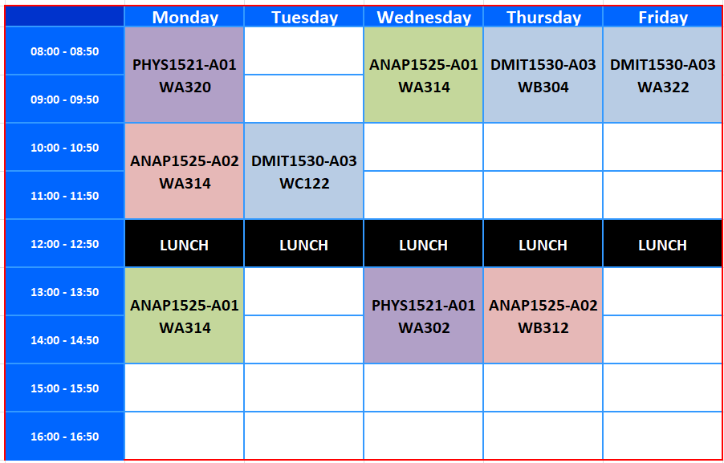

 **About Me**

## Contact Information
 
**Name**: Allan Anderson 
**Email**: aanderson@nait.ca 
**Phone**: 780-378-5275 
**Office Hours**: 08:00 - 16:00 
**Office Location**: W309 - HP Centre

## Fall Teaching Schedule (Sep-Dec 2022)

## Winter Teaching Schedule (Jan-Apr 2023)

## Education & Qualifications
B. Sc. - University of Saskatchewan (1977) 
B. Ed. - University of Saskatchewan (1980) 
Applied Information Technology Certificate - ITI (2002) 
Masters of Information Systems - University of Phoenix (2009) 

## Work Experience
Began teaching at NAIT in 2002; prior to working at NAIT Allan spent 18 years in the Canadian Forces reaching the rank of MCpl. Allan also spent two years teaching High School and Junior High School in rural communities in Saskatchewan.

## Courses I Have Taught in DMIT
* ANAP1525 - Systems Analysis and Design I
* CMIS1014 - Systems Foundations
* COMP1017 - Web Fundamentals I
* CPSC1012 - Programming Fundamentals
* DMIT1001 - Communications for Digital Media & IT
* DMIT1508 - Database Fundamentals
* DMIT1518 - IT System Administration
* DMIT1530 - Web Fundamentals II
* DMIT2000 - Advanced Communication for Digital Media and IT
* DMIT2018 (HUST) - Intermediate Application Development
* DMIT2028 (NAIT and HUST) - Systems Analysis and Design II
* DMIT2501 - Portfolio Development
* PHYS1521 - Math and Physics for Games

## Courses I Have Taught in BTech
* BTM3500 - System Analysis & Design
* BTM3510 - Database Management

#### [Home](../)