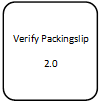

## Introduction
[Data Flow Diagrams](https://www.lucidchart.com/pages/data-flow-diagram){:target="_blank"} are a network representation of a system. Referred to as Bubble Charts, Bubble Diagrams, Process Model, Work Flow Diagrams or Function Models. DFDs are tools for modeling the functions (processes) in a system. Data flow diagrams do not show decisions or timing of events.

The Four symbols used to represent any system at any level of detail are:

### External Entity
Sources or destinations of data outside the specified system boundary
* Only used to describe person, group of people, an outside agency, a department, can be another system with which your system communicates that provides data to the system but do not provide details on how it is acquired, or receives data from the system but do not provide details on how it is used.
* They are also referred to as Sources or Sinks of data.
* Must be outside the control of the system being modeled.
* Connected to processes by flows this represents the interface between the system and the outside world.
* People, organizations or systems that are DOING the work on the data, are part of the system and are NOT DOCUMENTED as External entities for that process.
* Relationships between external entities are not shown. These are not part of the system. If they are, then show the entities as processes.

Symbol: 

### Data Flow
Shows data movement in and out of stores, processes, external entities
* Label on the flow refers to the content moving along the dataflow.
* Do not use verbs when describing the content.
* Can contain multiple pieces of data.
* Label must not describe the data physically.
* All labels MUST be unique within a single diagram and MUST be identical on different diagram levels.
* Represented graphically by an arrow into or out of a process.
* Used to describe the movement of packets of information from one part of the system to another.
* Represents data in motion.
* Name represents the meaning or content of the data that is moving along the flow.
* Carries only one type of data.
* Shows direction; an arrowhead indicated the direction the data is traveling.
* Can diverge - duplicate copies of a packet of data are sent to different parts of the system or a complex packet of data is being split into several more elementary data packets, each being sent to different parts of the system.
* Dataflows can converge -several elementary packets of data are joining together to form a more complex, aggregate packet of data.

Symbol: 

### Data Store 
Data stores document data when it is not being moved or processed. It can be a database, file folder, filing cabinet or shoe box.
* Label is the same as the Entity name given on an ERD.
* Use the singular version of the name.
* Avoid using words like: Folder or File 
* Used to model a collection of data packets at rest.
* Stores are connected by flows to processes.
* Flow from a data store -interpreted as a read.
* Flow to a data store - interpreted as a write or an update, or a delete.
* The store is changed as a result of the flow entering the store. It is the process connected to the other end of the flow that is responsible for making the change to the store.

Symbol: 

### Processes
Transforms incoming data flow(s) to outgoing data flow(s). Common synonyms are: bubble, function, transformation
* Typically, label is given an action (starts with a verb) name that briefly describes what happens to the data.
* Process name describes what the process does.
* Only the Context or top-level process is named after the system.
* Transforms inputs into outputs.
* Shows how one or more inputs are changed into an output.

Symbol: 

## Topics
* [DFD Rules](rules.md)
* [Multi-Level DFDs](multi-level.md)

#### [ANAP1525 Home](../)
