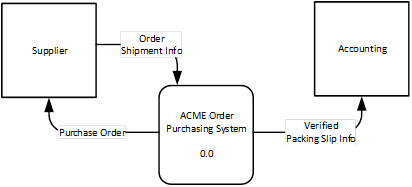

Most dataflow diagrams are too complicated to draw the entire diagram on one page, so what you do is "explode" the diagram into multiple levels (multiple pages).

## Context Level DFD
The highest level is called a context diagram (page one), this diagram contains ONE process symbol (the system) and illustrates the relationship between the system and external entities. The Context level process is always numbered 0.0.  Context level defines the scope of the system. That is, what is to be included in the system design and what is not to be included.

Context Level Example: 

System Level Example: 

## Decomposition
Decomposition is the process by which a higher level DFD is broken into smaller more detailed pieces. It is of extreme importance that when decomposing DFD’s that all **DIAGRAMS MUST BE BALANCED**. Names and labels on different diagrams MUST be exactly the same while names or labels of dataflows on the same diagram MUST be unique.

The Context level process is a view outside of the system.
* The system operations are hidden.
* Only the External entities are documented.
* Is always numbered 0.0.

Context level DFD decomposes to **System level DFD**.
* A Context level process with a number of 0.0 breaks up into several System level processes are numbered (1.0, 2.0, 3.0, etc.).
* The System level DFD is a view inside the system.
* Everything that was known from the Context level is carried forward to the System level DFD. Namely the External Entities.
* Since System level DFD is a view within the system now high-level activities are visible.
  * Processes that act on the data in the system are documented.
  * Data stores are visible that the system has access to retrieve or save data are documented.

If you need to continue breaking down processes eventually you reach **Process Level DFD**. The Decomposition process is the same as it was for breaking down Context level to System Level.
* A single higher-level process is broken into smaller more detailed processes.
* If the process the current process originated from system level for example. Process 1.0 would break down into 1.1, 1.2, 1.3, etc. Process 2.0 would break down into 2.1, 2.2, 2.3, etc.
* Process level does not show any additional External entities or data stores, it only reveals more details of the steps within the process and any decisions it may make.

## Generic Decompostion Example
Context Level DFD defines the scope of the system under review. 

Context level process 0.0 then decomposes to the System level. Note the symbols that are the same and which are new. 

The System level decomposes into multiple diagrams. One for each process. The final step in decomposition is the Process level which shows the separate steps in the previous level process.

Process A decomposition 

Process B decomposition 

*Note the 2.0 and 1.0 symbols on the two diagrams. They connect the same dataflow going out of and into scope of each diagram respectively.*

### [DFD Home](index.md)
### [ANAP1525 Home](../)