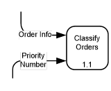
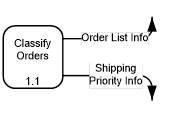
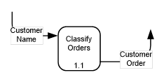
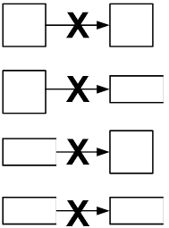
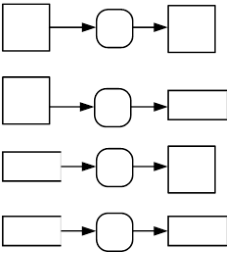

## Rules:
Avoid “Black Holes”, “Miracles” and “Grey Holes”

### Black Holes:
Process has Input but no Output Order Data. 

### White Hole or Miracle:
Process has Output but no Input. 

### Gray Hole:
Process has insufficient Input for the Output it generates. 

**Incorrect Data Flows** | **Correct Data Flows**
-------------------------|-----------------------
 | 

## Guidelines for Constructing DFDs:
1. Choose meaningful names for processes, flows, stores, and entities:
    1. Label the process to identify the function the system is carrying out
    2. Choose an active verb and an appropriate object to form a descriptive phrase
    3. Avoid verbs such as DO, HANDLE, PROCESS
    4. Avoid specific abbreviations and acronyms familiar to the user or to us
2. Number the processes:
    1. Numbering schemes should be consistent
    2. Numbering schemes may imply a certain sequence of operation
    3. Numbers are a convenient way of referencing processes
    4. Numbers become the basis for a hierarchical numbering scheme
3. Avoid overly complex DFDs:
    1. Should be easy to understand, easy to absorb, easy to read and pleasing to the eye
    2. Should fit comfortably on an 8.5 by 11-inch sheet of paper
    3. Generally, not more than 6 - 8 processes per page
    4. Context diagram shows one process that represents the entire system and highlights the interfaces between the system and the external entities
4. Redraw the DFD as many times as necessary for aesthetics:
    1. Draw, redraw, redraw
    2. Should be technically correct
    3. Should be acceptable to the user
    4. Should be neat
5. Make sure your DFD is logically consistent:
    1. Avoid processes that have no outputs - "black holes"
    2. Avoid processes that have no inputs - "miracles"
    3. Beware of unlabeled flows and unlabeled processes
    4. Beware of read-only or write-only stores
    5. Make sure that dataflows coming into and going out of an entire level correspond to the dataflows coming into and going out at the next lower level which describes that process
    6. A store at the highest level serves as an interface between two or more processes; show it at EVERY lower-level that further describes those processes

#### [DFD Home](index.md)
#### [ANAP1525 Home](../)