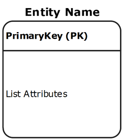
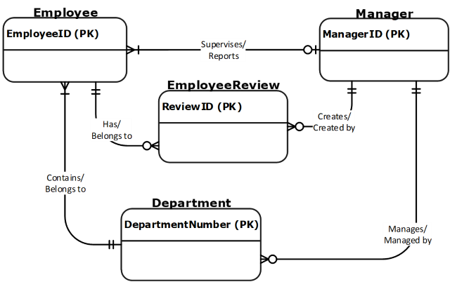

## Definition and Purpose
* An entity-relationship diagram ([ERD](https://www.lucidchart.com/pages/er-diagrams){:target="_blank"}) is a data modeling technique that graphically illustrates an information system’s entities and the relationships between those entities. 
* An ERD is a conceptual and representational model of data used to represent the entity framework infrastructure. 

The Elements of an ERD are:
* Entities
* Relationships
* Attributes

### Entities
* Must balance with other diagrams – same name in system and process DFD
* An entity is a real-world item or concept that exists on its own. 
* Entities are equivalent to database tables in a relational database, each row of the table represents an instance of that entity. 

### Relationships
* A relationship is the association that describes the interaction between entities. 
* **Cardinality** refers to the number of instances of one entity that are associated with an instance of another entity. 
* In general, there may be one-to-one, one-to-many, or many-to-many relationships. 
* **Ordinality** relates to whether an entity is mandatory or optional with another associated entity.

**Symbol** | **Meaning**
-----------|-------------
 | Zero or One an optional relationship
 | One
 | One and Only One
 | Zero or Many an optional relationship
 | One or Many
 | Many

* Description of the relationship between two entities
* Verbs are expected here
* Can either have a label at either end or one with a “/” separating: “Can contain / is on”
* Reads from parent to child (one to many) or left to right, top to bottom

### Attributes
* Also known as a column, an attribute is a **property or characteristic that describes the entity that holds it**. 
* A primary key, also known as PK, is a special kind of entity attribute that **uniquely defines a record in a database table**. In other words, there must not be two (or more) records that share the same value for the primary key attribute.
PK must be Unique, Stable, and NOT NULL.
* A foreign key, also known as FK, is a **reference to a primary key in a table**. It is used to identify the relationships between entities. Note that foreign keys need not be unique. Multiple records can share the same values.
* Must list mentioned ones from specs and need to have at least 3 per entity

## Steps involved in creating an ERD include:
* Identifying and defining the entities
* Determining all interactions between the entities
* Analyzing the nature of interactions/determining the cardinality of the relationships
* Determining the attributes of each entity
* Creating the ERD

## Example
* Employee
  * Is part of one department
  * Must belong to a department
  * May or may not have a manager
  * Can have 0 or many employee reviews – depending on their length of service
* Department
  * Can have many employees
  * Must have at least one employee to be considered a department
  * A department with more than 3 employees must have a manager
* Manager
  * Can manage more than one department
  * Has employees
  * Creates yearly performance review for every employee
* Employee review
  * Must be associated to an employee
  * Is created by a manager

### [ANAP1525 Home](../)
