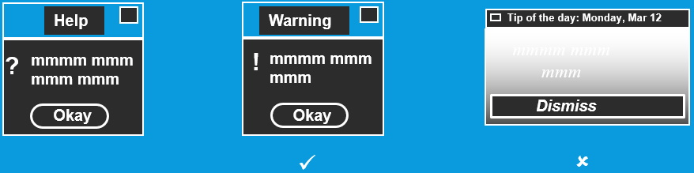
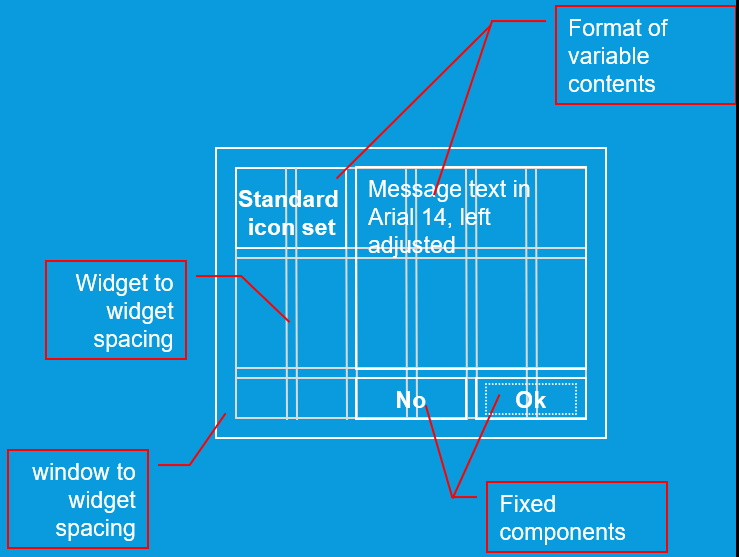
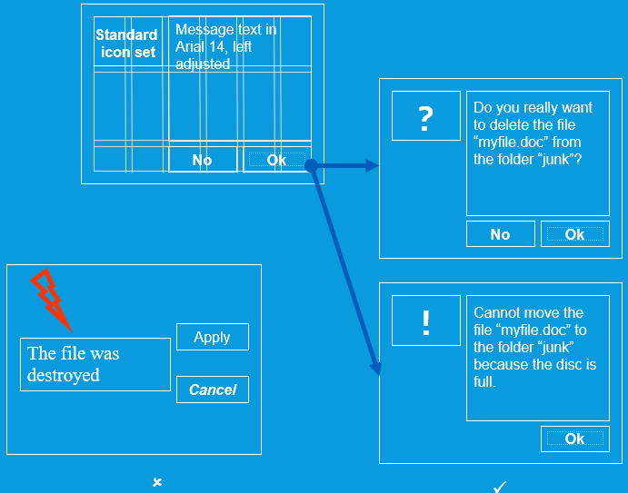
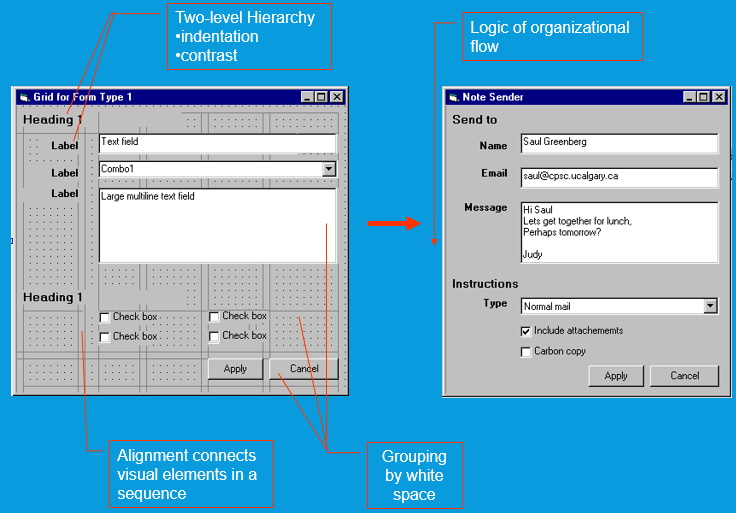
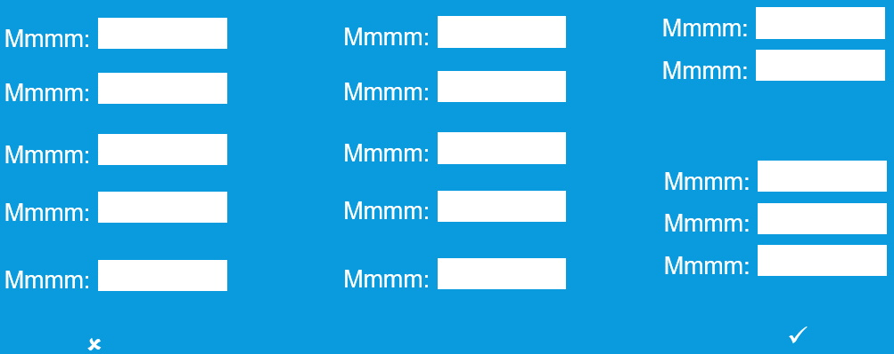
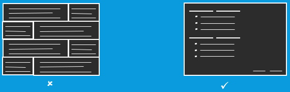
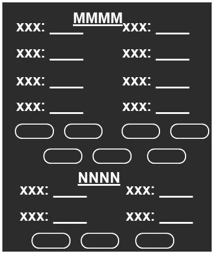
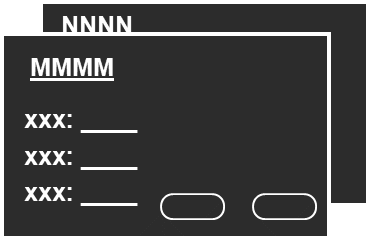

## Contrast
* make different things different
* brings out dominant elements
* mutes lesser elements
* creates dynamism

## Repetition
* repeat design throughout the interface
* consistency
* creates unity 

### Visual Consistency
* Internal consistency
  * elements follow same conventions and rules
  * set of application-specific grids enforce this
* External consistency
  * follow platform and interface style conventions
  * use platform and widget-specific grids
* Deviate only when it provides a clear benefit to user

## Alignment
* visually connects elements
* creates a visual flow

### Grids
* Horizontal and vertical lines to locate window components
  * aligns related components
* Organization
  * contrast for dominant elements
  * element groupings by proximity
  * organizational structure
  * alignment
* Consistency
  * location
  * format
  * element repetition
  * organization

  
  
 

## Proximity
* groups related elements
* separates unrelated ones

### Relating Screen Elements
* proximal clusters 
* alignment
* white (negative) space
* explicit structure

### Navigational Clues
* provide initial focus
* direct attention as appropriate to important  2ndary, or peripheral items as appropriate
* order should follow a user’s conceptual model of sequences

### Economy of Visual Elements
* minimize number of controls
* include only those that are necessary
  * eliminate, or relegate others to secondary windows
* minimize clutter 
  * so information is not hidden

---|---
 | 
 | 

#### [Interfaces Home](index.md)
#### [ANAP1525 Home](../)