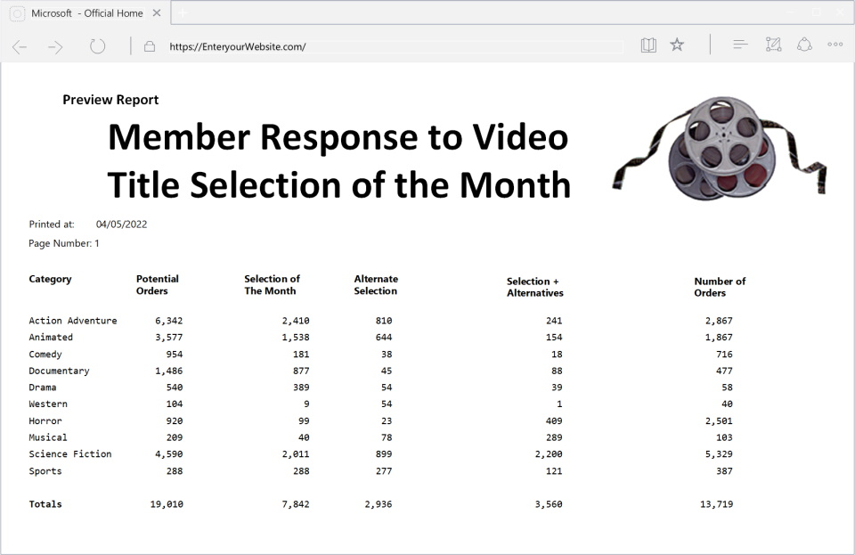

## Principles & Guidelines for Output Design
* Types of computer outputs
* Output Design
* Prototype
* There are two basic types of computer outputs:
  * External
  * Internal

## External Outputs
* External outputs leave the system to trigger actions on the part of their recipients or confirm actions to their recipients.
* Most external outputs are created as preprinted forms that are designed and duplicated by forms manufacturers for use on computer printers. 
* Some external outputs are designed as turnaround documents.
  * Turnaround outputs are those which are typically implemented as a form eventually reenters the system as an input.

**Typical External Output** 

**Typical External Turnaround Output** 

## Internal Outputs
* Internal outputs stay inside the system to support the system's users and managers.
  * Internal outputs fulfill management reporting and decision support requirements. 
* Management information systems typically produce three types of reports: 
  * Detailed
  * Summary
  * Exception
* Present information with little or no filtering or restrictions. 
* Some detailed reports are historical in nature.
* Detailed reports confirm and document the successful processing of transactions and serve as an audit trail for subsequent management inquiry. 
  * These reports assist management planning and controlling by generating schedules and analysis. 
* Other detailed reports are regulatory, that is, required by government.

**Sample Detailed Report** 

### Internal outputs - Summary
* Categorize information for managers who do not want to wade through details.
* The data for summary reports is typically categorized and summarized to indicate trends and potential problems. 
* The use of graphics (charts and graphs) on summary reports is also rapidly gaining acceptance because it more clearly summarizes trends briefly.

**Sample Summary Report** 

### Internal outputs - Exception
* Filter data before it is presented to the manager as information.
* Exception reports only report exceptions to some condition or standard.

**Sample Exception Report** 

## Output Design
The following general principles are important for output design:
* Computer outputs should be simple to read and interpret. These guidelines may enhance readability:
  * Every report or output screen should have a title.
  * Reports and screens should include section headings to segment large amounts of information.
  * Information in columns should have column headings.
  * Section and column headings may be abbreviated. Include legends to interpret those headings.
  * Legends should define all fields on a report. You never know whose hands a report might end up in! 
  * Sorting is done on the first or second column of data
  * NO Computer jargon or error messages

### Prototype The Output for System Users
* The format or layout of an output directly affects the system user's ability to read and interpret it. 
* The best way to lay out outputs is to sketch or, better still, generate a sample of the report or document via prototyping.
* When prototyping outputs, it is important to involve the user to obtain feedback. 
* The user should be allowed to test the screens and recommend changes. 

**Sample Report Customization Prototype Screen** 

**Sample Report Prototype Screen** 

*NOTE: It is preferable to have the totals below the columns and not below the information*

### [Interfaces Home](index.md)
### [ANAP1525 Home](../)