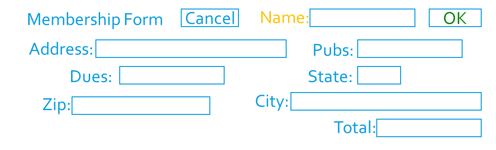
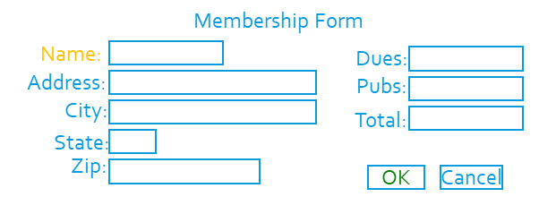

## Visual Processing
* Anything that is seen by our eyes must be processed
* The processing difficulty depends the complexity of the visual scene and on our previous memory of the scene
* Images that we already are familiar with simply match to images stored in our memory
  * The processing time is fast
  * The processing effort is low

## Organization of Screen Elements
There are 10 elements of screen design:
### Balance
* Equal weight of screen elements
  * Left to right, top to bottom

**Balaanced** | **Unstable**
--------------|-------------
 Left column processed - right column  start position noted as same |  Both columns need to be completely processed

### Symmetry
* Replicate elements left and right of the center line

**Symmetric** | **Asymmetric**
--------------|---------------
 Left column processed - right column noted as same |  Both left & right columns processed plus relationship of right to left

### Regularity
* Create standard and consistent spacing on horizontal and vertical alignment points

**Regular** | **Irregular**
------------|--------------
 Left column processed &nbsp;&nbsp;2 right columns noted as same |  Location & size of each object processed

### Predictability
* Put things in predictable locations on the screen

**Predictable** | **Spontaneous**
----------------|----------------
 User expects title and menu bar on top of screen |  Visual scene needs to be completely processed - objects not in expected places

### Sequentiality
* Guide the eye through the task in an obvious way
  * The eye is attracted to:
    * Bright elements over less bright   
    * Isolated elements over grouped
    * Graphics before text
    * Color before monochrome
    * Saturated vs. Less saturated colors
    * Dark areas before light
    * Big vs. Small elements
    * Unusual shapes over usual ones 

**Sequential** | **Random**
---------------|-----------
 | 

### Economy
* Use as few styles, fonts, colors, display techniques, dialog styles, etc., as possible

**Economical** | **Busy**
---------------|---------
 | 

### Unity
* Make items appear as a unified whole (for visual coherence)
  * Use similar shapes, sizes, or colors
  * Leave less space between screen elements than at the margin of the screen

**Unity** | **Fragmentation**
----------|------------------
 | 

### Proportion
* Create groupings of data or text by using aesthetically pleasing proportions

### Simplicity
* Minimize the number of aligned points
  * Use only a few columns to display screen elements

**Simple** | **Complex**
-----------|------------
 Only four alignments need to be processed |  A total of nine alignments need to be processed

### Groupings

### [Interfaces Home](interfaces.md)
### [ANAP1525 Home](../)