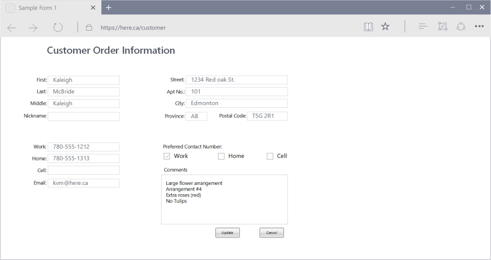
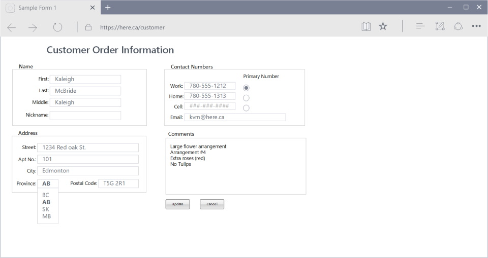
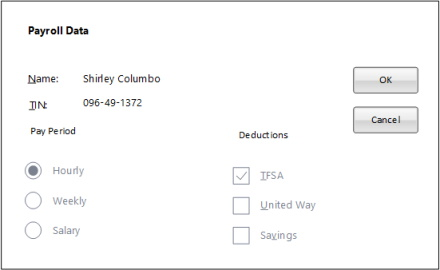
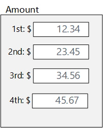

## Visual Processing
* Anything that is seen by our eyes must be processed
* The processing difficulty depends the complexity of the visual scene and on our previous memory of the scene
* Images that we already are familiar with simply match to images stored in our memory
  * The processing time is fast
  * The processing effort is low

## Organization of Screen Elements
There are 10 elements of screen design:
### Balance
* Equal weight of screen elements
  * Left to right, top to bottom

**Balaanced** | **Unstable**
--------------|-------------
 Left column processed - right column  start position noted as same |  Both columns need to be completely processed

### Symmetry
* Replicate elements left and right of the center line

**Symmetric** | **Asymmetric**
--------------|---------------
 Left column processed - right column noted as same |  Both left & right columns processed plus relationship of right to left

### Regularity
* Create standard and consistent spacing on horizontal and vertical alignment points

**Regular** | **Irregular**
------------|--------------
 Left column processed &nbsp;&nbsp;2 right columns noted as same |  Location & size of each object processed

### Predictability
* Put things in predictable locations on the screen

**Predictable** | **Spontaneous**
----------------|----------------
 User expects title and menu bar on top of screen |  Visual scene needs to be completely processed - objects not in expected places

### Sequentiality
* Guide the eye through the task in an obvious way
  * The eye is attracted to:
    * Bright elements over less bright   
    * Isolated elements over grouped
    * Graphics before text
    * Color before monochrome
    * Saturated vs. Less saturated colors
    * Dark areas before light
    * Big vs. Small elements
    * Unusual shapes over usual ones 

**Sequential** | **Random**
---------------|-----------
 | 

### Economy
* Use as few styles, fonts, colors, display techniques, dialog styles, etc., as possible

**Economical** | **Busy**
---------------|---------
 | 

### Unity
* Make items appear as a unified whole (for visual coherence)
  * Use similar shapes, sizes, or colors
  * Leave less space between screen elements than at the margin of the screen

**Unity** | **Fragmentation**
----------|------------------
 | 

### Proportion
* Create groupings of data or text by using aesthetically pleasing proportions

### Simplicity
* Minimize the number of aligned points
  * Use only a few columns to display screen elements

**Simple** | **Complex**
-----------|------------
 Only four alignments need to be processed |  A total of nine alignments need to be processed

### Groupings
* Provide functional groupings by associated elements
  * Create spatial groupings, evenly spaced
  * Allow 1/8 to 1/4 inch between
* Visually reinforcing groupings
  * Provide adequate separation between groupings through white space
  * Provide line borders around groups

#### Simple Grouping
* Similar elements aligned vertically
* Vertical distance between similar objects small

#### Boxed Grouping
* Boxes add additional complexity to form
* Spatial arrangement adequate

#### Background Grouping
* Color adds additional visual complexity
* Spatial arrangement adequate

## Examples
 
**Question**: What is wrong, or can be improved?

**Note**: Notice the improvements make this form easier to use.

## Screen Design
Users want:
* Orderly, clean, clutter-free appearance
* Obvious indication of what is being shown and 	what should be done
* Expected information located where it should be
* Plain, simple English (Language)

### Text
* Fundamental goal is clarity and simplicity
  * Noticeable and disguisable
  * Interpretable and attractive
  * No translations, external references to documents
  * Be consistent

* Guidelines
  * Used mixed-case for:
    * Control captions
    * Data
    * Text
    * Messages
    * Instructional information
    * Menu & button descriptions
  * Use upper-case or capitalization for
    * Title
    * Section & sub-section headings

### Fonts
* Use a sans serif font
  * Easier to read
* Which is easier to read?

* Use simple readable fonts
  * Sans serif (e.g., Arial, Helvetica)
  * Times Roman (serif)
* Use no more than two families
  * Assign separate purpose to each family
  * Allow one to dominate
    * Headings, subheadings, etc.

* Use no more than:
  * Two styles of the same family (e.g., standard and italic)
  * Two weights
    * Regular and bold

* Use no more than three sizes
  * Usually 12 pt. for menus
  * 10 pt. for windows
  * Minimum is 8 pt.
* Never change established type sizes to squeeze in text!
* Always consider the visual capabilities of the users.

**8-point font** | **12-point font**
-----------------|------------------
 | 

### Fonts & Colours
* Avoid using colored fonts
* Use bold for **emphasis**
  * Do not use color: users typically assume color is a cue for text with a different or specific purpose, such as hyperlink.
* Avoid changing font size
  * Does not get attention, is distracting
* Use color to get attention
  * Use when it is critical that users notice a certain part of the screen &nbsp;&nbsp;**STATUS**&nbsp;&nbsp;&nbsp;&nbsp;&nbsp;&nbsp;**STATUS**
* Use color purposefully
  * Use sparingly or it loses its effectiveness
  * Combine color with redundant highlighting

* Be aware of color blindness
  * Blue-green, red-green
  * 9% men, 2% of women
* Use colors consistently
  * Red: always warning (?)
  * Green: always good (?)
* Use cultural color meanings
  * Red, yellow, green, blue, black 
* Use light backgrounds for main areas
  * Off-whites and light grays
  * Increases contrast

 vs. 

* Avoid red and blue combinations
  * Avoid blue text

* Avoid light text on dark

### Choosing Graphics
* Use graphics for a purpose
  * Icons
  * Button Images
  * Descriptive graphics
    * Picture of house in a real estate application
* Use graphics for international use
  * Sometimes better than particular language
  * Meaning same for everyone
* Use standard graphics
  * Already tested with users
    * Know that meaning is understood across user population
  * Guidelines
    * Windows
    * Mac
    * UNIX

### Duplication

-------|------
1st Amount: $12.34 2nd Amount: $23.45 3rd Amount: $34.56 4th Amount: $45.67 | 

### [Interfaces Home](interfaces.md)
### [ANAP1525 Home](../)