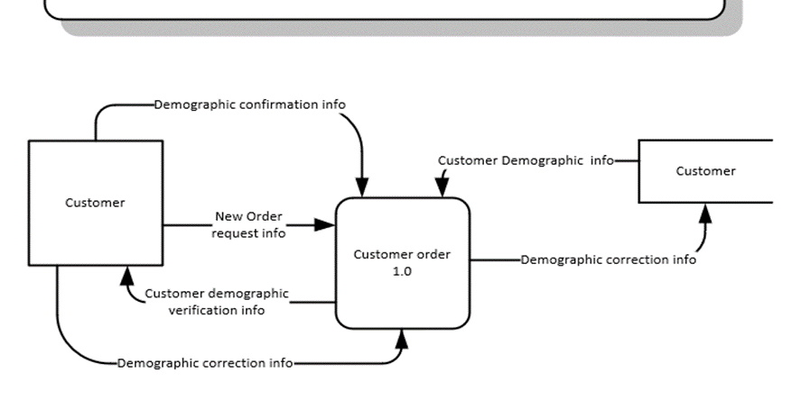
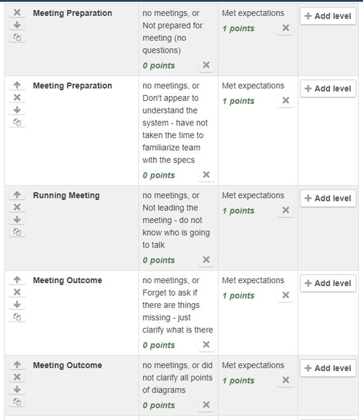
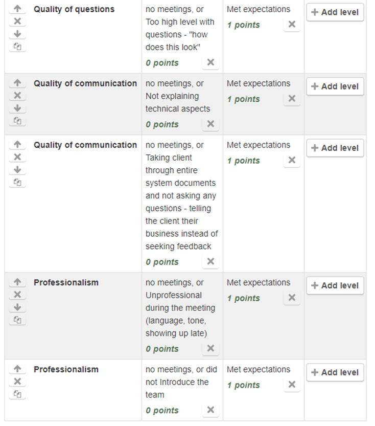

## Introduction
This topic is essential for student project team success at completing the labs for this course

## Requirements Gathering
This is done in the first pahse of SDCL. For analysis, you will be given a list of specifications that form the basis of this process.

[Video](https://www.youtube.com/watch?v=uo98gmTYmxg){:target="_blank"}

In Lab 1 you will be looking at the movement of data and diagramming it. In Lab 2 you are developing a prototype.

The focus of this course is:
* Interviews
* Prototyping
* Role-Play

### 11 Techniuqes
*  Interviews
*  Questionaires
*  User Observation
*  Document analysis
*  Interface analysis
*  Workshops
*  Brainstorming
*  Role-play
*  Use case scenarios
*  Focus group(s)
*  Prototyping

The full article can be found at [link](https://www.jamasoftware.com/requirements-management-guide/requirements-gathering-and-management-processes/11-requirements-gathering-techniques-for-agile-product-teams){:target="_blank"}

## Lab 1 - What Needs to be Verified?
*  Ensure your understanding of the business is correct 
    *  Did you capture all the activities?
    *  Are you clear on what starts an activity?  Time?  Receipt of a document?  Request?
*  Do you understand how the client stores the data?
    *  What files do they have?
    *  Do they have physical documents – e.g. appointment book or list of phone numbers?
    *  What electronic files do they have?
*  Who does the work?
    *  Are they using the system or just getting information from another user?
    *  Do they log in?
*  Details about the business – what equipment do they have?  When are they open (year round, seasonal)?  Who are they in competition with?

## Lab 2 - What Needs to be Verified? 
*  Do we have everything they need to do the jobs specified in the requirements?  Break it down by each activity.
*  Do they like the layout?
*  Do we have enough information on the screen?
*  Does the layout make sense?

## How to Talk to the Client
There are several things that can interfere with communication with a client:
*  Have a limited view of the system and not see the big picture
*  Resistant to the project so not forthcoming with requirements
*  Not understand the technical document you are using to do your analysis
*  Not paying attention to the details, only looking high level

## Client's Limited View
Make sure you do a thourough Client Analysis:
*  What is their job?
*  Were they a part of the requirements gathering?
*  How will the new system impact them?
*  Who do they report to?
*  Do they use all parts of the system we are diagramming

## Resistant to the Project
Through client analysis, you may know if this is the case with your client. When you find they are resistant:
*  Interview in groups instead of one on one
*  Include a supervisor in group
*  Record sessions
*  Be very specific in your questions and assume details will not be offered, but will have to be asked for directly

## Not Understanding the Technical Document(s)
*  If you choose to show your DFD’s make sure you are explaining all parts to them.
*  "The updating customer membership is started because the customer phones in to place an order and a verification of information is your first step" instead of  "Does this look correct?" 

## Not Paying Attention to Details
Avoid the following scenario:

**Question**: "How does the screen look?"
**Client**: "Looks great"

Instead, be very specific:

**Question**: "In the initial search function you see at the top of the screen, is there enough choices for filtering and selection?  Is there more that is needed here for you to be effective in your initial search?"

## Evaluation on the Lab

#### [ANAP1525 Home](../)