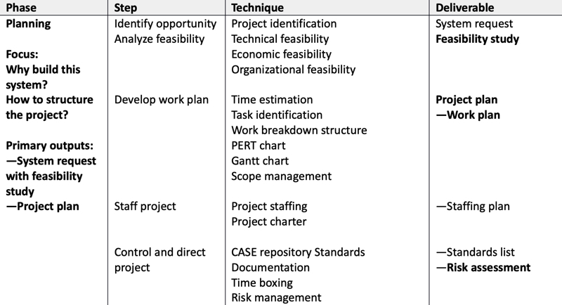
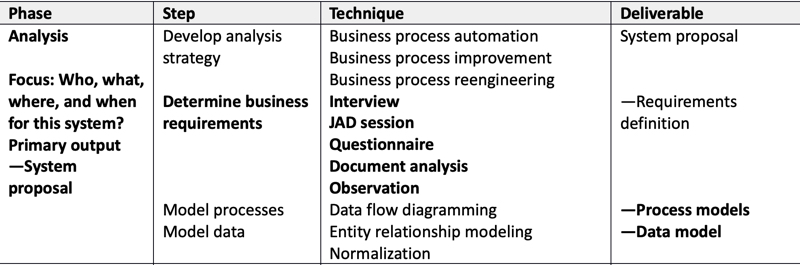
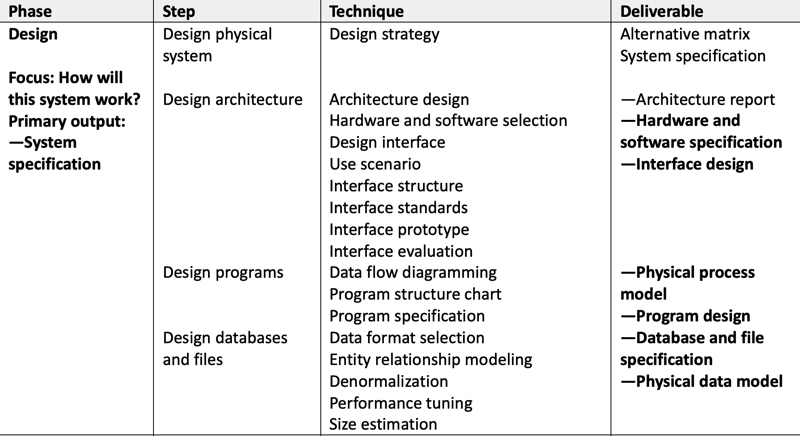
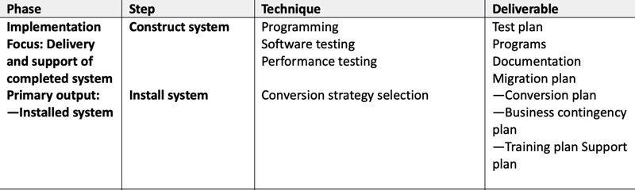
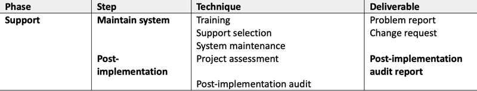

## Why do we Model?
* Provide structure for problem solving
* Experiment to explore multiple solutions
* Furnish abstractions to manage complexity
* Reduce time-to-market for business problem solutions
* Decrease development costs
* Manage the risk of mistakes

## System Development Life Cycle (SDLC)
* Waterfall effect
  * Each phase flows into the next
  * Plan – Analyze – Design – Implement – Support

### System Planning
* Identify and prioritize proposed system
* Define scope and boundary of problem

### System Analysis
* Build a logical model of the system
* Analyze current problems, causes and effects
* Define business requirements
* Inputs: Facts and requirements
* Outputs: Business requirements document

### System Design
* Design the solution that meets business requirements:
  * Create a physical model of the system.
  * User interfaces
  * Internal and external controls
  * Security
* Inputs: Business requirements document
* Outputs: Technical design document

### System Implementation
* Create new improved information system
* Input – technical design document
* Output – system delivered, end user training and documentation
* Develop conversion strategy
  * Parallel, direct cutover, phased, pilot

### System Operation and Support
* Review implementation, refine design, implement improvements
* Maintenance of system for remainder of useful life

## Systems Development Guidelines
 * Follow your overall development plan
* Ensure that the users are involved from the beginning so that you get “buy in” and you fully understand their system requirements
* Listen, listen and listen!!
* Identify your major milestones for project review and assessment.
* Establish interim checkpoints between the major milestones to ensure that your project remains on schedule.
* Keep flexible with the parameters of your plan
* Provide reliable cost and benefit information.

## System Development Tools/Techniques
### 1. Modeling (DFD, ERD, UML)
* Graphical representation
* Business model
* Object model
* Data model
* Network model
* Process model

### 2. Prototyping
* Purpose to test system concepts before implementation
  * Feasibility
  * Requirements
  * Design (Behavioral)
  * Implementation (Production)
* Benefits
* Disadvantages

### 3. CASE Tools (Computer Aided Systems Engineering)
* Powerful software to assist systems analysts to develop and maintain information systems
* Benefits
  * Easier to build software
  * Increased IT productivity
  * Methodologies that work

### 4. Other Tools/Techniques
* Structured Analysis
* Object Oriented Analysis
* Joint Application Development

### [Theory Home](index.md)
### [ANAP1525 Home](../)