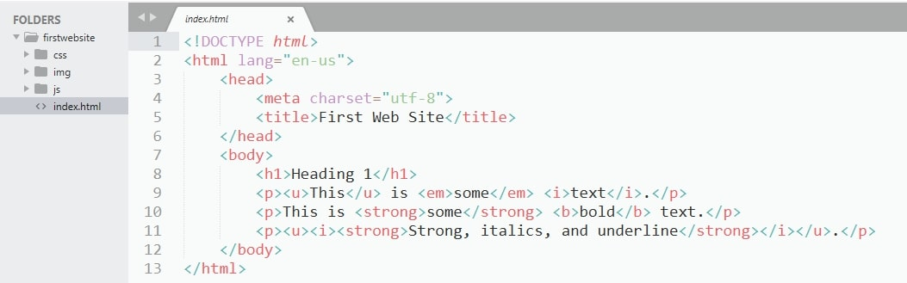
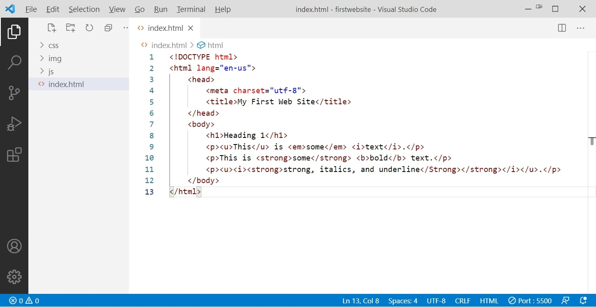
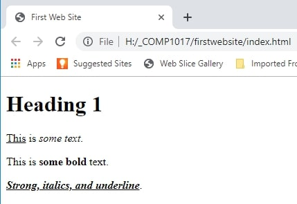

# 02 - Setting up Web Development Framework
The following is a walkthrough of setting up your web development framework.

## Setting Up Local Development Environment
By the end of this lesson, you will be able to create a basic framework folder that is shown below. This is a relatively simple process.

1. Create a folder called framework.
2. Open the folder and create three sub folders
   1. css
   2. img 
   3. js

Throughout the course for your web site examples we will be using the same file structure.
1. **<code>css</code> folder**: This folder will contain the CSS code used to style your content (for example, setting text and background colors). Create a folder called <code>css</code>, inside your <code>framework</code> folder.
2. **<code>img</code> folder**: This folder will contain all the images that you use on your site. Create a folder called <code>img</code>, inside your <code>framework</code> folder.
3. **<code>js</code> folder**: This folder will contain all the JavaScript code used to add interactive functionality to your site (e.g., buttons that load data when clicked). Create a folder called <code>js<.code>, inside your <code>framework</code> folder.
4. Open Sublime Text and create a new file and save it to your framework folder and call the file index and give it the <code>.html</code> extension. It is the <code>.html</code> extension that triggers sublime text into becoming an html editor.
5. **<code>index.html</code>**: This file will generally contain your web site landing/homepage content, including all the text and images that you want your design to have. It is the first page people see when they first go to your site. To create the index.html page use your text editor. Create a new file called index.html and save it just inside your <code>framework</code> folder.
6. Modify the <code>index.html</code> by adding the code shown in the screenshot below.
7. Sublime Text: 
8. Visual Studio Code: 

Your framework is now complete.

Throughout the course we will be adding to your framework folder so that when you want to build a site you will take a copy of the framework folder, rename it to the project you are working on, open the index.html in the browser, the folder in Visual Studio Code or Sublime Text, and you can start building your site.

Running your web page in the browser shuould look like:
   

**There are two recommended editing tools for this course, Visual Studio Code and Sublime Text.**

### [Module Home](../README.md)

### [Home](../../comp1017.md)
