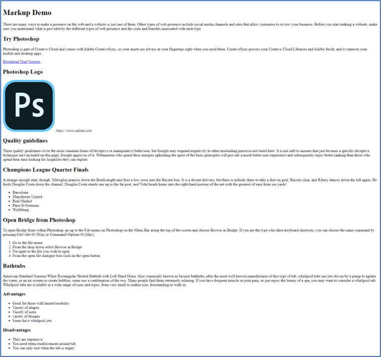

The following files are required for this lesson:

* [demo-markup.zip](files/demo-markup.zip)

## Demo Instructions
You can follow along with your instructor to complete this build and/or you can use this document as a guide in completing the demo build.

## Steps
1. Download the [demo-markup.zip](files/demo-markup.zip).
2. Extract the contents which contain the copy text and the image that will be added to the web page.
3. Create a copy of the <code>framework</code> folder which was built in a previous class (you can download this file, in a ZIP format, from Moodle if you have lost your copy).
4. Rename the copy of the folder in step 3 to **demo-markup**.
5. Examine the **demo-markup-copy.pdf** file to make note of the HTML elements you will need for this build; it is a good idea to make a list of these elements, in the order that you need them, to make the markup easier. _(**DO NOT include any italicized text from the copy document in your web page code.**)_
6. Start from the top of the copy document:<br>
    *  Need a heading, `<h1> … </h1>`, for the text above the first paragraph. Copy the text, **Markup Demo**, into the heading.
    *  Need a paragraph, `<p> … </p>`, for the first paragraph. Copy the text of the first paragraph into the paragraph you just created.
    *  For the second paragraph, the heading is a smaller font so we need to use a second level heading, `<h2> … </h2>`, as there can only ever be one `<h1>` on a web page.
    *  Need a paragraph, `<p> … </p>`, for the that paragraph. Copy the text of the first paragraph into the paragraph you just created.
    *  Below the second paragraph is a hyperlink with the text being Download Trial Version and the link is in the square brackets. This is an `<a href="http://www.adobe.com/products/photoshop.html" target="_blank">Download Trial Version</a>`.
    *  Next, we have an image to put on the web page. There is a second level heading just above the image. Remember that the code for the image is ``. Use the name of the image file, making sure that the name is sematic, and add an appropriate alternate text.
    *  Below the image code is a citation using the `<cite>` element: `<cite>https://www.adobe.com</cite>`.
    *  Below the `<cite>` element is another paragraph with a second level heading.
    *  The next paragraph has an unordered list below it. Add the paragraph and its second level heading. Once added, add an unordered list below using the html code structure below:<br>
    
    ```html
    <ul>
      <li>first list item</li>
      <li>second list item</li>
      .
      .
    </ul>
    ```

    *  The next paragraph is for an ordered list. Add the paragraph text, with the paragraph’s second level heading.
    *  Below the paragraph add an ordered list using the format below:<br>

    ```html
    <ol>
      <li>first step</li>
      <li>second step</li>
      .
      .
      .
    </ol>
    ```

    *  The final section has three paragraphs. The first has a second level heading. Below that is a third level heading, `<h3> … </h3>`, and a list below it. As there is no set order in the list, the list will be an unordered list.
    *  The last list, with its third level heading, is completed using the same structure as in the step above.
7. Save your web page and open the <code>index.html</code> file in your web browser and you should see something like:<br>

8. If your output (content only) is quite different, review the steps and make any necessary corrections and re-test the web page in the browser.

## Exercise Instructions
Now that your first web page was successful with the walkthrough with your instructor, now it is time for you to practice on your own (you can ask for advice if you are stuck). Download the **ex-markup.zip file** from Moodle and extract its contents to a work folder of your choice (remember where this is for future reference). Inside the ZIP file you will find a **copy.txt** file which hold the contents of the web page, a **layout.jpg** file which shows what the final product should look like, and a folder called **images**. You MUST rename the images semantically when adding them to your **img** folder. When finished, show your completed web page to your instructor.

#### [Module Home](../)
#### [COMP1017 Home](../../)