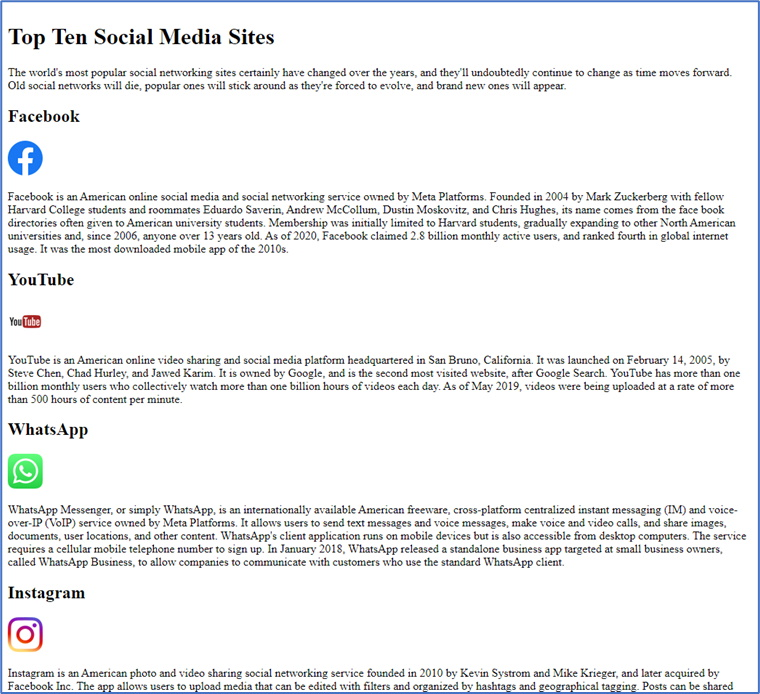

The following files are required for this lesson:

* [figure-demo.zip](files/figure-demo.zip)
* [image-links.zip](files/image-links.zip)
* [table.zip](files/table.zip)

## Figure Demo Instructions
You can follow along with your instructor to complete this build and/or you can use this document as a guide in completing the demo build.

### Steps
1. Download the [**figure-demo.zip**](files/figure-demo.zip) file from Moodle.
2. Extract the contents which contain the copy text and the images (make sure you rename the images semantically) that will be added to the web page.
3. Create a copy of the **framework** folder which was built in a previous class (you can download this file, in a ZIP format, from Moodle if you have lost your copy).
4. Rename the copy of the folder in step 3 to **figure-demo**.
5. Examine the **copy.docx** file to make note of the HTML elements you may need for this build; it is a good idea to make a list of these elements, in the order that you need them, to make the markup easier.
6. The final version should look like:<br>

7. Notice that three images are before a line of text. That code looks like:

    ```html
    <p> … paragraph content</p>
    ```

8. The last image uses the figure tag because it has a caption below it. The code for this looks like:

    ```html
    <figure>
        
        <figcaption>caption text</figcaption>
    </figure>
    ```

9. Save your work and preview the **index.html** page in your browser. It should look like the sample output shown previously. If there are major differences, review your code and make any necessary corrections and refresh the web page in your browser.

### Figure Demo - Exercise Instructions
There is no exercise directly related to this demo. The exercise will be after the **Image Links** and **Table demos**.

## Image Links Demo Instructions
You can follow along with your instructor to complete this build and/or you can use this document as a guide in completing the demo build.

### Steps
1. Download the [**image-links.zip**](files/image-links.zip) file.
2. Extract the contents which contain the copy text and the images (make sure you rename the images semantically) that will be added to the web page.
3. Create a copy of the **framework** folder which was built in a previous class (you can download this file, in a ZIP format, from Moodle if you have lost your copy).
4. Rename the copy of the folder in step 3 to **image-links**.
5. Examine the **copy.docx** file to make note of the HTML elements you will need for this build; it is a good idea to make a list of these elements, in the order that you need them, to make the markup easier.
6. The result, only showing the first few paragraphs, should look like the following:<br><br>
When you hover your mouse over the images, the cursor changes to indicate that the image acts like a hyperlink.
7. Add all the code as you have done previously, including adding the images. When you add an image, it needs to be embedded inside an html hyperlink code like that as shown below:

    ```html
    <a href="url related to image" target="blank">
        
    </a>
    ```

8. You need to add at least three image links to your web page, save the file, and open index.html in your web browser. If the result does not look like the sample image shown previously, examine your code, make the necessary corrections, and refresh your page.

### Image Links - Exercise Instructions
There is no exercise directly related to this demo. The exercise will be given after the **Tables** demo has been completed.

## Tables - Demo Instructions
You can follow along with your instructor to complete this build and/or you can use this document as a guide in completing the demo build.

### Steps
1. Download the **table.zip** file from Moodle.
2. Extract the contents which contain the copy text that will be added to the web page.
3. Create a copy of the **framework** folder which was built in a previous class (you can download this file, in a ZIP format, from Moodle if you have lost your copy).
4. Rename the copy of the folder in step 3 to **table**.
5. Examine the **copy.docx** file to make note of the HTML elements you will need for this build; it is a good idea to make a list of these elements, in the order that you need them, to make the markup easier.
6. The result should look like the following:<br>
7. For the paragraph text, add as you have done previously.
8. The table steps are outlined below:

    ```html
    <table border="1">
        <thead>
            <tr>
                <th>first column heading</th>
                <th>second column heading</th>
    .
    .
            </tr>
        </thead>
        <tbody>
            <tr>
                <td>first row, first cell</td>
                <td>first row, second cell</td>
    .
    .
    .
            </tr>
    .
    .
    .
            <tr>
                <td>last row, first cell</td>
                <td>last row, second cell</td>
    .
    .
    .
            </tr>
        </tbody>
        <tfoot>
            <tr>
                 <td colspan="# of columns to span">footer text</td>
            </tr>
        </tfoot>
    </table> 
    ```

    NOTE: It really does not matter which order the `<`thead>`, `<tbody>`, and `<tfoot>` are placed, but it is a convention to place them in this order for ease of readability and code debugging. Additionally, the **colspan** property essentially merges columns.
9. When all the table data has been added, save your work, and open index.html in your web browser. If there are errors (most of the errors will be displayed as columns and rows not looking correctly which is due to inconsistent `<tr>` and `<td>` elements in your code), make any necessary corrections and refresh the web page.

## Exercise Instructions
Download the **ex-markup2.zip** file from Moodle and extract its contents. Examine the copy.docx file for the content and the images in the images folder (you need to rename the images semantically) that will be added to your web page. When you have finished, show your web page to your instructor.

#### [Module Home](../)
#### [COMP1017 Home](../../)