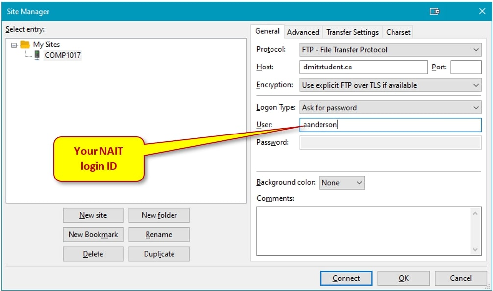
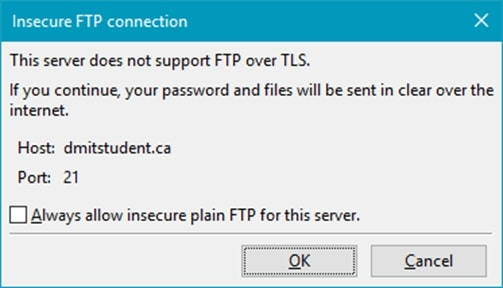
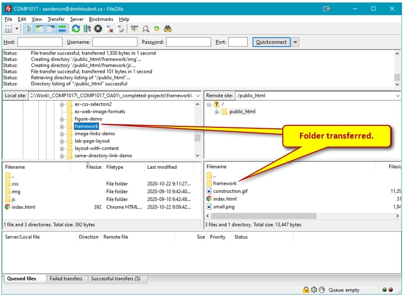

_Note: This account is ONLY for NAIT schoolwork. Do not use it for hosting files that are not related to your lessons. Any abuse of this account will result in the account being suspended._

## Account Information
**Login**: username (your NAIT username). 
**Temporary Password**: student ID number. 
**Admin Panel**: [https://dmitstudent.ca:10000](https://dmitstudent.ca:10000){:target="_blank"} 
**URL**: [http://username.dmitstudent.ca](http://username.dmitstudent.ca) 

**Day 1** - Login to your Admin Panel to change your password:
Login using temporary password >> Administration Options >> Change Password
This will change both the Admin Panel and the default FTP passwords.
_Note: Admin Panel security alert (browser): Do not worry about this. Just click Advanced, then Continue (Google Chrome), and go about your business. The browser-based security alert is because the panel is using SSL (https:// instead of http://), but a certificate has not been purchased for this domain._

## Deploying a Website Via FTP
The simplest way to upload your website to a web server is via file transfer protocol (FTP). FTP allows you to establish a connection with a server and to then transfer files to that server. The key here for us will be making sure we upload our website content to the correct folder.

## Connecting with an FTP Client - FileZilla [https://filezilla-project.org/](https://filezilla-project.org/){:target="_blank"}
Open FileZilla on your machine. If you do not have the program, it can be downloaded free of charge from their website. Please ensure that you install the client only. We will create and save a new connection using FileZilla’s “Site Manager”, that way we will not have to enter all of the FTP credentials every time we wish to connect.

**Host**: dmitstudent.ca 
**Protocol**: FTP 
**Username**: same as default NAIT login 
**Password**: the one you saved in the admin panel (best practice is to make this the same as your NAIT password) 

1.	On the File drop-down menu select “Site Manager”.
2.	Press the New Site button at the bottom of the left side and name it "Student-web”. Note: This will be done the first time you create the site. When you next connect you need only select the site name you created from the select entry navigation side.
3.	On the “General tab”, 
    <ol type="a">
        <li>For Host: "dmitstudent.ca"</li>
        <li>For Protocol: “FTP – File Transfer Protocol”</li>
        <li>For Encryption, “Use explicit FTP over TLS if available”</li>
        <li>Logon Type: “Ask for password”</li>
        <li>User: your NAIT student account</li>
    </ol>

### Advanced
You can set the default local (optional) and remote (recommended) directories when you connect: 

Press the Connect button and input your NAIT student password when prompted. You may get the warning, shown below, about not able to use SSL, just click the checkbox, **Always allow insecure plain over FTP for this server**, and continue.

Once connected, you should see something like: 

The client program window displays a lot of information. The FileZilla homepage ([https://wiki.filezilla-project.org/FileZilla_Client_Tutorial_(en)](https://wiki.filezilla-project.org/FileZilla_Client_Tutorial_(en)){:target="_blank"}) provides some good documentation on how to use the program.

## Uploading Your Project Folders to dmitstudent
Once connected, you will see your local machine on the left-side panel and the remote server on the right-side panel. You can use the FileZilla client just like a normal file explorer window, which means you can simply drag-and-drop your folders/files in the client.

**Important** 
**All web files MUST be uploaded into the public_html folder.**

If you did not set the default remote directory to <code>/public_html</code>, then double click on <code>public_html</code> to open that folder. Drag your project folder into that folder and FileZilla will begin to upload the files. 

## View Your Website Online
The last thing to do now is to view your website on the web. Simply open your favourite web browser and enter the URL into the address bar. The URL will be ‘your username + hostname + the project name’. As long as your main project’s HTML document is named index.html, it should be served by the server automatically.

For example, if your username is ‘ssmith1’ the URL would be as follows:

<code>http://ssmith1.dmitstudent.ca/project</code>

That is it! When submitting URL’s for lab and assignments, it is best to copy/paste the URL's
from your browser after you have checked your work.

#### [Module Home](../)
#### [COMP1017 Home](../../)