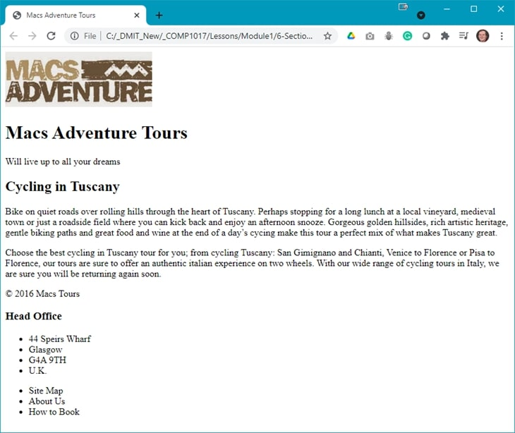

## Demo Instructions
You can follow along with your instructor to complete this build and/or you can use this document as a guide in completing the demo build.

## Steps
1. Download the [**document-structure.zip**](files/document-structure.zip) file.
2. Extract the contents which contain the copy text and the image (make sure you rename the image semantically) that will be added to the web page. The file, **document-structure.jpg**, is there to show you what the structure of the final web page will look like and must not be added to your **img** folder.
3. Create a copy of the **framework** folder which was built in a previous class (you can download this file, in a ZIP format, from Moodle if you have lost your copy).
4. Rename the copy of the folder in step 3 to **document-structure**.
5. Examine the **copy.docx** file to make note of the HTML elements you may need for this build; it is a good idea to make a list of these elements, in the order that you need them, to make the markup easier.
6. The final version should look like:<br>
<br>For your layout, the image will be in the `<header>` of the web page and the content from the copyright to the end will be in the `<footer>` of the web page.
7. The structure of the web page, inside the `<body>` element will look like:

    ```html
    <header>
        
        <h1> ... </h1>
        <p> ... </p>
    </header>
    <main>
        <h2> ... </h2>
        <p> ... </p>
        <p> ... </p>
    </main>
    <footer>
        <p>&copy; ... </p>
        <h3> ... </h3>
        <ul>
            <li> ... </li>
            .
            .
        </ul>
        <ul>
            <li> ... </li>
            .
            .
        </ul>
    </footer>
    ```

8. Save your work and open **index.html** in your web browser. If there are errors, make the necessary correction and refresh your web browser.

## Exercise Instructions
Download the **ex-document-structure.zip** file from Moodle and extract its contents. Make sure you semantically rename the image. The completed.jpg file is not to be added to your **img** folder. Your web page needs to have `<header>`, `<main>`, and `<footer>` sections. When you are finished, show your web page to your instructor.

#### [Module Home](../)
#### [COMP1017 Home](../../)