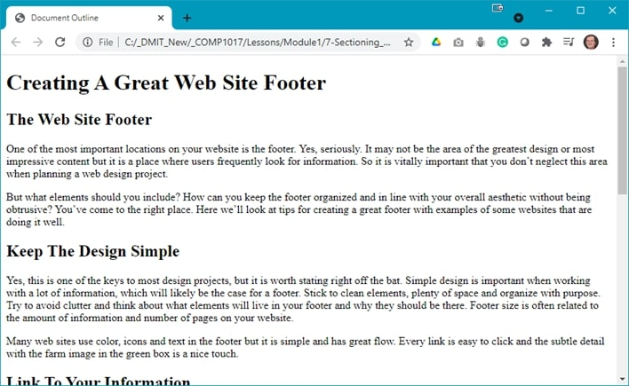
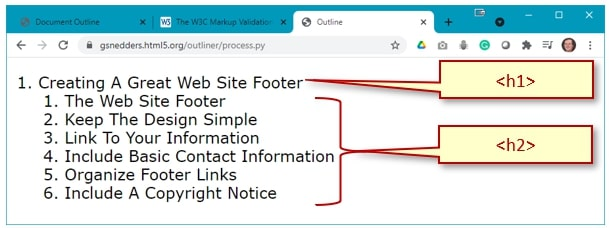

## Demo Instructions
You can follow along with your instructor to complete this build and/or you can use this document as a guide in completing the demo build.

## Steps
1. Download the [**document-outline.zip**](files/document-outline.zip) file.
2. Extract the contents which contain the copy text that will be added to the web page.
3. Create a copy of the **framework** folder which was built in a previous class (you can download this file, in a ZIP format, from Moodle if you have lost your copy).
4. Rename the copy of the folder in step 3 to **document-outline**.
5. Examine the **copy.docx** file to make note of the HTML elements you may need for this build; it is a good idea to make a list of these elements, in the order that you need them, to make the markup easier.
6. The final version, only showing the first few sections, should look like:<br>
<br>
For your layout, each of the second level headings denote that the content below is in its own **section**.
7. The structure of a section, inside the <main> element will look like:<br>

```html:
    <section>
        <h2> … </h2>
        <p> … </p>
        <p>` … </p>
    </section>
```

8. Validate your HTML using [https://validator.w3.org/](https://validator.w3.org/){:target="_blank"}. Correct any errors before proceeding.
9. Check your document outline using [https://gsnedders.html5.org/outliner/](https://gsnedders.html5.org/outliner/){:target="_blank"}. Your outline should look like the following:<br>

10. Once your HTML has been validated, and you have a valid document outline, open index.html in your web browser. If there are errors, make the necessary correction and refresh your web browser.

## Exercise Instructions
Download the **document-outline-ex.zip** file from Moodle and extract its contents. Make sure you semantically rename the image. Your web page needs to have `<header>`, `<main>`, and `<footer>` sections. You will also need to organize your `<main>` into `<section>`s. You must validate your HTML and create a valid document outline:

#### [Module Home](../)
#### [COMP1017 Home](../../)