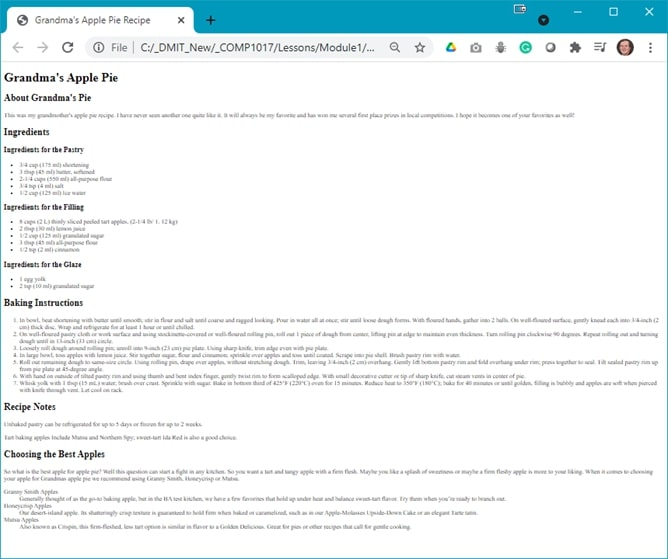
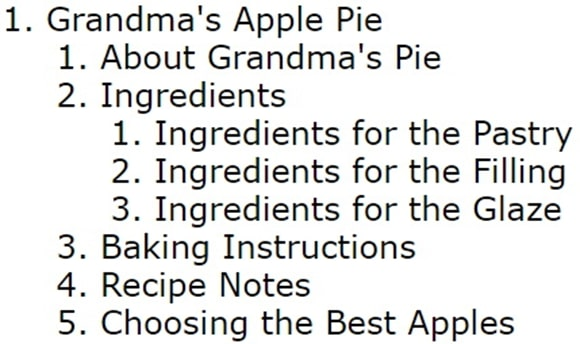

## Demo Instructions
You can follow along with your instructor to complete this build and/or you can use this document as a guide in completing the demo build.

## Steps
1. Download the [**document-outline-2.zip**](files/document-outline-2.zip) file.
2. Extract the contents which contain the copy text that will be added to the web page.
3. Create a copy of the **framework** folder which was built in a previous class (you can download this file, in a ZIP format, from Moodle if you have lost your copy).
4. Rename the copy of the folder in step 3 to **document-outline-2**.
5. Examine the **copy.docx** file to make note of the HTML elements you may need for this build; it is a good idea to make a list of these elements, in the order that you need them, to make the markup easier.
6. The final version, only showing the first few sections, should look like:<br>
<br>
For your layout, each of the second level headings denote that the content below is in its own **section**. You will also be adding an **aside**, which has content that is not directly related to the main topic of the web page; it only adds extra information. You will also be using a **dictionary list** which can be seen on the bottom of the web page.
7. The structure of an aside, inside the <main> element, with a dictionary list, will look like:<br>

```html:
    <aside>
        <h2> … </h2>
        <p> … </p>
        <dl>
            <dt>dictionary topic</dt>
            <dd>dictionary definition</dd>
            .
            .
        </dl>
    </aside>
```

8. Validate your HTML using [https://validator.w3.org/](https://validator.w3.org/){:target="_blank"}. Correct any errors before proceeding.
9. Check your document outline using [https://gsnedders.html5.org/outliner/](https://gsnedders.html5.org/outliner/){:target="_blank"}. Your outline should look like the following:<br>

10. Once your HTML has been validated, and you have a valid document outline, open **index.html** in your web browser. If there are errors, make the necessary correction and refresh your web browser.

## Lab Instructions
Download the **lab-document-outline.zip** file from Moodle and extract its contents and semantically rename the images. The **Lab-solution-outline.jpg** and **wireframe.jpg** files are not to be added to your **img** folder.

Follow the instructions and submission requirements posted on Moodle.

#### [Module Home](../)
#### [COMP1017 Home](../../)