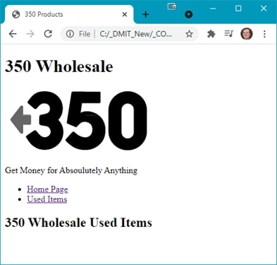
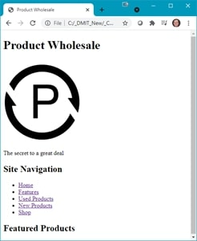
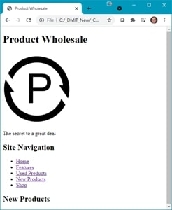
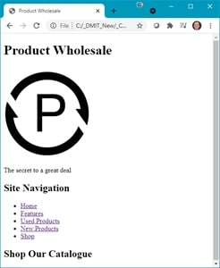
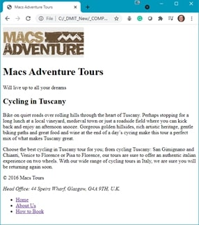
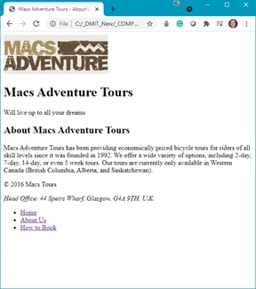
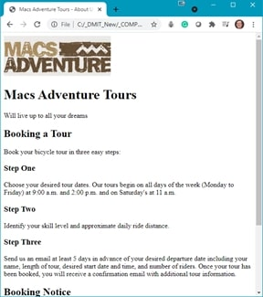

# 09 - Page Navigation

## Introduction
This walkthrough is done in 3 parts:
* [Part 1 – Same directory linking](#part1)
* [Part 2 – Sub-directory linking](#part2) 
* [Part 3 – Site navigation](#part3)

## Demo Instructions
You can follow along with your instructor to complete this build and/or you can use this document as a guide in completing the demo build.

## Steps – <a id="part1">Part 1</a>: Same Directory Linking
1.	Download the [**same-directory-linking-demo.zip**](files/same-directory-linking-demo.zip) file.
2.	Extract the contents which contain the copy text that will be added to the web page.
3.	Create a copy of the **framework** folder which was built in a previous class (you can download this file, in a ZIP format, from Moodle if you have lost your copy).
4.	Rename the copy of the folder in step 3 to **same-directory-linking-demo**.
5.	Examine the **site-map.jpg** file to see how the hyperlinks will work.
6.	The final version should look like:<br>
**index.html**:<br><br>
**used.html**:<br><br>
Notice the slight change in the text on each web page. Additionally, from the **used.html** web page you need to be able to navigate back to **index.html**.
7.	Modify the index.html file to match the screenshot above. The structure of the navigation on this page looks like:

```html:
    <ul>
        <li><a href="index.html">Home Page</a></li>
        <li><a href="used.html">Used Items</a></li>
    </ul>
```

8.	Create a second web page called used.html. Copy the content from index.html into this new page with the only difference in the two pages is the content of the `<main>`.
9.	Validate your HTML using [https://validator.w3.org/](https://validator.w3.org/). Correct any errors before proceeding.
10.	Once your HTML has been validated open **index.html** in your web browser and see if you can navigate between each of the web pages. If there are errors, make the necessary correction and refresh your web browser.

## Steps – <a id="part2">Part 2</a>: Sub-directory Linking
1.	Download the [**sub-directory-linking-demo.zip**](files/sub-directory-linking-demo.zip) file and extract its contents.
2.	Create a copy of the **framework** folder which was built in a previous class (you can download this file, in a ZIP format, from Moodle if you have lost your copy).
3.	Rename the copy of the folder in step 3 to **sub-directory-linking-demo**.
4.	Examine the **site-map.jpg** file to see how the hyperlinks will work.
5.	The final version should look like:<br>
**index.html**:<br><br>
**used.html**:<br><br>
Notice the slight change in the text on each web page. Additionally, from the **used.html** web page you need to be able to navigate back to **index.html**.
6.	Modify the index.html file to match the screenshot above. The structure of the navigation on this page looks like:

```html:
    <ul>
        <li><a href="index.html">Home Page</a></li>
        <li><a href="used-items/used.html">Used Items</a></li>
    </ul>
```

<br>
Note: the second hyperlink points to a directory in the web project folder.
7.	Create a folder in your web project called **used-items**. In this folder, create the **used.html** web page.
8.	Copy the contents of **index.html** into **used-items.html**.
9.	The navigation on this page needs to be:

```html:
    <ul>
         <li><a href="../index.html">Home Page</a></li>
         <li><a href="used.html">Used Items</a></li>
    </ul>
```

<br>
Note: Examine the link to get back to index.html.
10.	Change the contents of the `<main>` on used.html to match the screenshot above.
11.	Validate your HTML using [https://validator.w3.org/](https://validator.w3.org/). Correct any errors before proceeding.
12.	Once your HTML has been validated open **index.html** in your web browser and see if you can navigate between each of the web pages. If there are errors, make the necessary correction and refresh your web browser.

## Steps – <a id="part3">Part 3</a>: Site Navigation
1.	Download the [**site-navigation-demo.zip**](files/site-navigation-demo.zip) file and extract its contents.
2.	Create a copy of the **framework** folder which was built in a previous class (you can download this file, in a ZIP format, from Moodle if you have lost your copy).
3.	Rename the copy of the folder in step 3 to **site-navigation-demo**.
4.	Examine the **site-map.jpg** file to see how the hyperlinks will work.
5.	The final version should look like:<br>
**index.html**:<br><br>
**featured.html**:<br><br>
**used.html**:<br><br>
**new.html**:<br><br>
**shop.html**:<br><br>
Note: all web pages are in the same directory and thus use the same navigation menu.
6.	Modify the **index.html** to match the screenshot above.
7.	The navigation menu, which will be the same on each page, will look like:

```html:
    <ul>
        <li><a href="index.html">Home</a></li>
        <li><a href="feature.html">Features</a></li>
        <li><a href="used.html">Used Products</a></li>
        <li><a href="new.html">New Products</a></li>
        <li><a href="shop.html">Shop</a></li>
    </ul>
```

8.	Create a new web page for each of the other pages of the project. Use the names shown in the navigation menu.
9.	Copy the code from **index.html** into each new web page. Modify the `<main&gt on each page to match the screenshots above.
10.	Validate your HTML using [https://validator.w3.org/](https://validator.w3.org/). Correct any errors before proceeding.
11.	Once your HTML has been validated open index.html in your web browser and see if you can navigate between each of the web pages. If there are errors, make the necessary correction and refresh your web browser.

## Exercise Instructions
Download the **simple-navigation-exercise.zip** file from Moodle and extract its contents. Examine the copy.docx file and create a web project that looks like:<br>
&nbsp;&nbsp;

### [Module Home](../README.md)

### [Home](../../README.md)
