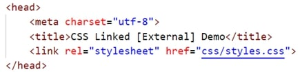

The following files are required for this lesson:

* [demo-style-sheet-start.zip](files/demo-style-sheet-start.zip)
* [css-inline-demo.zip](files/css-inline-demo.zip)
* [css-embedded-demo.zip](files/css-embedded-demo.zip)
* [css-linked-demo.zip](files/css-linked-demo.zip)

## Introduction
This demo will be done in three parts:
* [Part 1 -Inline Styles](#part1)
* [Part 2 – Embedded Styles](#part2)
* [Part 3 – Linked Stylesheet](#part3)

## Demo Instructions
You can follow along with your instructor to complete this build and/or you can use this document as a guide in completing the demo build.

## Steps – <a id="part1">Part 1</a>: Inline Styles
1. Download the **demo-style-sheet-start.zip** file and extract the contents. Make note of this location as you will need it for the other parts of this walkthrough. Note, there is no document for the copy; the contents will be generated from [https://www.lipsum.com/](https://www.lipsum.com/){:target="_blank"}.
2. Create a folder called **css-inline-demo** and copy the extracted contents into this folder.
3. The result of this demo should look like (the text generated may be different):<br>
<br>
Note: the styling of the heading is red.
4. The styling of the heading uses:

    ```html
    <h1 style="color: red;">CSS Inline Demo</h1>
    ```

5. Save and open **index.html** in your browser.

## Steps – <a id="part2">Part 2</a>: Embedded Styles
1. Create a new folder called **css-embedded-demo** and copy the extracted contents from **Part 1, Step 1**, into this new folder. Note, there is no document for the copy; the contents will be generated from [https://www.lipsum.com/](https://www.lipsum.com/){:target="_blank"}.
2. The result of this demo should look like (the text generated may be different):<br>

3. To style the heading to be red, and to change the font size, use the following in the <head> of the web page:

    ```html
    <style>
        /* 
            embedded stylesheets are included between style tags
        */
        h1 {
            color: red;
        }

        p {
            font-size: 18px;
        }
    </style>
    ```

4. Save and open **index.html** in your browser.

## Steps – <a id="part3">Part 3</a>: Linked Stylesheet
1. Create a new folder called **css-linked-demo** and copy the extracted contents from **Part 1, Step 1**, into this new folder. Note, there is no document for the copy; the contents will be generated from [https://www.lipsum.com/](https://www.lipsum.com/){:target="_blank"}.
2. The result of this demo should look like (the text generated may be different):<br>

3. This part of the walkthrough requires you to create a new file. Create a file called **styles.css** in your **css** folder.
4. The code for styles.css will be:<br>
<br>
Note: this is an image as you need practice to create your first stylesheet; you can omit the comment in this code.<br><br>
The first style rule changes the `<h1>` element to red as we did in the previous parts. The **.odd** class can be applied to any element on our web page.
5. In the **index.html** file, you need to create a link to this stylesheet. This is done using the following code (this is another image as you need to know how to type this out):<br>

6. Next we need to apply the **.odd** class to `<p>` elements (only the odd numbered paragraphs). We do this by:<br>

7. Modify the 1st and 3rd paragraphs with the class shown in step 6.
8. Save your work and open **index.html** in your browser.

## Exercise Instructions
Download the **ex-selecting-elements.zip** file from Moodle and extract the contents into a folder called **ex-selecting-elements**. You are to create a stylesheet, **styles.css**, in your **css** folder. Link your stylesheet to your **index.html** file. The resulting web page should look like (partial results shown):<br>


When completed, show your web page to your instructor.

#### [Module Home](../)
#### [COMP1017 Home](../../)