The following file is required for this lesson:

* [demo-css-seelctors.zip](files/demo-css-seelctors.zip)

## Introduction
This demo is a walkthrough of the CSS Selectors Exercise.

## Demo Instructions
You can follow along with your instructor to complete this build and/or you can use this document as a guide in completing the demo build.

## Steps
1.	Download the **demo-css-selectors.zip** file from Moodle and extract the contents.
2.	Create a folder called **demo-css-selectors** and copy the extracted contents into this folder.
3.	The starting solution looks like: 
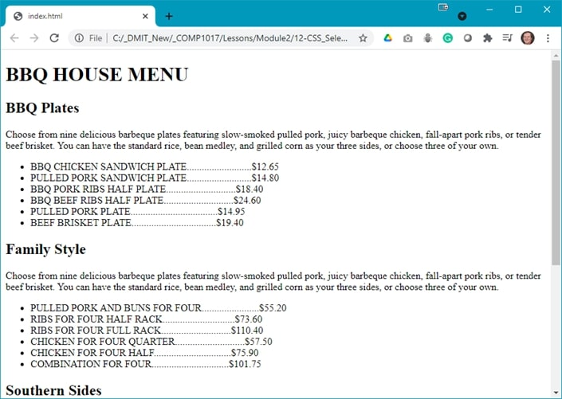 
And the finished result looks like (partial results shown): 
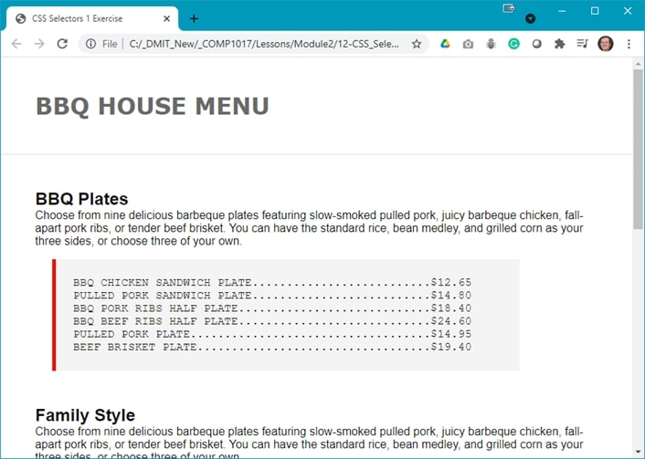 
The `<footer>` looks like: 
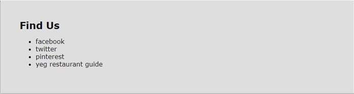
4.	The first step is to create the **styles.css** file in your **css** folder.
5.	The code in this file uses the following rules (images shown; the colours shown beside each colour are automatically generated by Visual Studio Code): 
    <ol type="a">
        <li>Multiple selector code to set margins and padding: 
        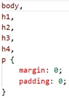
        </li>
        <li>Set the &lt;body&gt; for font and font colour: 
        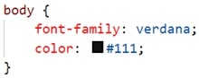
        </li>
        <li>Set the &lt;footer&gt; padding and background colour: 
        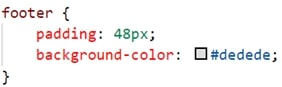</li>
        <li>Format the &lt;h1&ht;: 
        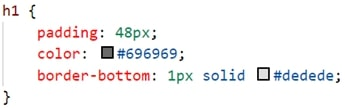
        </li>
        <li>Create a class to format the items on the menu: 
        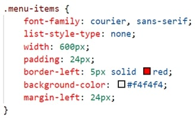
        </li>
        <li>Format the &lt;section&gt; element: 
        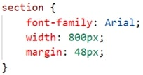
        </li>
    </ol>
6.	Add the link to the stylesheet in **index.html**.
7.	Style the `<ul>` elements as shown below: 
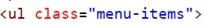
8.	Validate your HTML using [https://validator.w3.org/](https://validator.w3.org/){:target="_blank"}.
9.	Save your work and open index.html in your browser.

## Exercise Instructions
Download the **ex-selectors2.zip** file from Moodle and extract the contents into a folder called **ex-selectors2**. You are to create a stylesheet, **styles.css**, in your **css** folder. Link your stylesheet to your **index.html file**. The resulting web page should look like: 
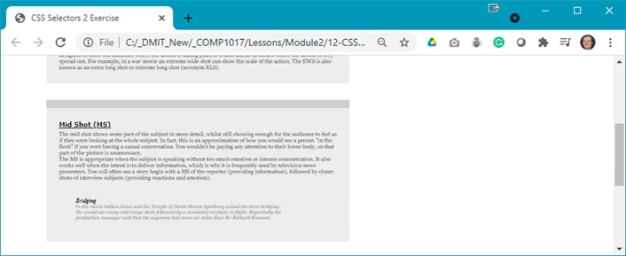 
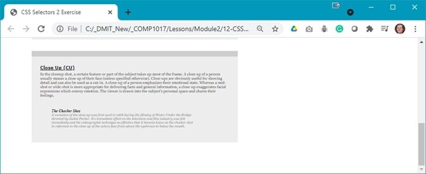

## Lab Instructions
Make a copy of your **demo-css-selectors** project and name the copy **css-selectors-lab**. Modify your **styles.css**, and any necessary changes to **index.html** to get the following results (the multiple screenshots are captured from a single web page): 
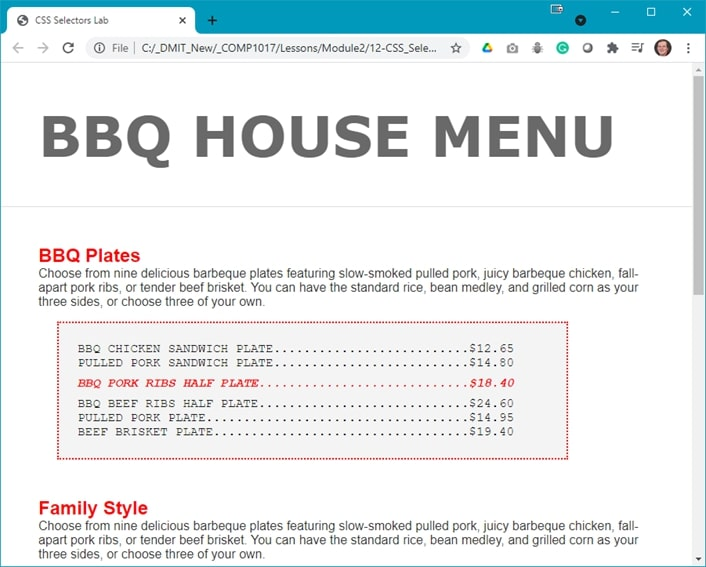 
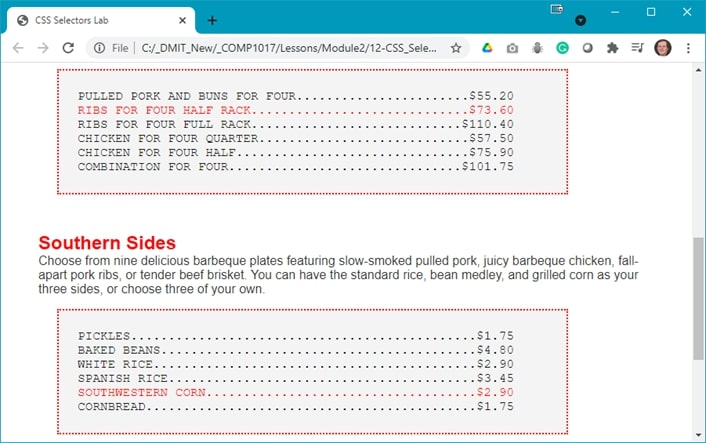 
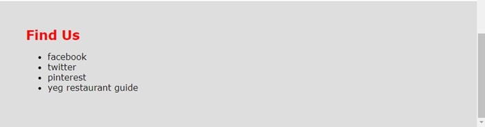

Complete and submit your lab following the instructions on Moodle.

### [Module Home](../module2.md)

### [Home](../../)
