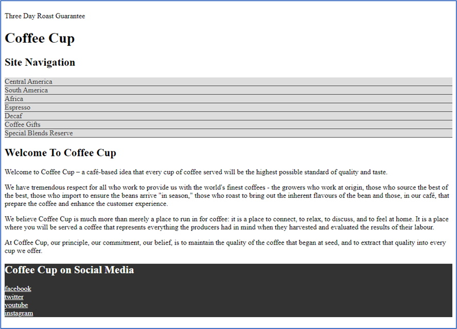
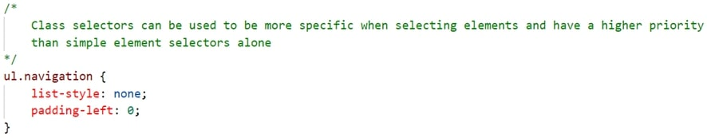

The following file is required for this lesson:

* [demo-cascade.zip](files/demo-cascade.zip)

## Demo Instructions
You can follow along with your instructor to complete this build and/or you can use this document as a guide in completing the demo build.

## Steps
1. Download the **demo-cascade.zip** file and extract the contents.
2. Create a folder called **demo-cascade** and copy the extracted contents into this folder.
3. The resulting solution looks like: 

4. The first step is to modify the **styles.css** file in your **css** folder using the following rules (images of the code are shown; the comments with each style rule can be omitted):
    *  Style the `<footer>` element: 
       
    *  Use multiple selectors to target certain elements in the `<footer>`: 
       
    *  Use descendant selectors to be more precise for the `<ul>` element: 
       
    *  Use multiple levels of descendant selectors to target specific `<li>` elements: 
       
    *  And even more levels of descendant selectors: 
       
    *  Target the pseudo classes for the hyperlinks: 
       
    *  Finally, target class selectors: 
       
5.	Link the stylesheet to your **index.html** file.
6.	Validate your HTML using [https://validator.w3.org/](https://validator.w3.org/){:target="_blank"}.
7.	Save your work and open **index.html** in your browser.

## Exercise Instructions
There is no related exercise for this walkthrough.

#### [Module Home](../)
#### [COMP1017 Home](../../)