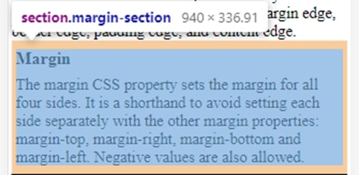
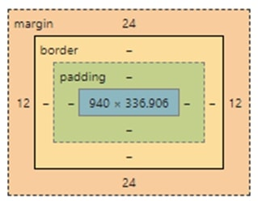
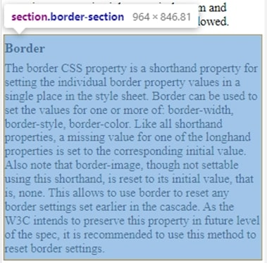
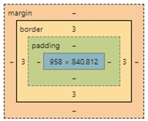
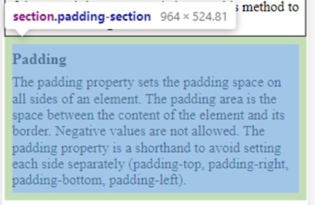
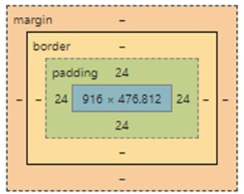
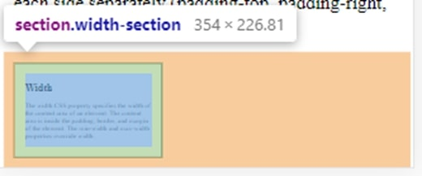
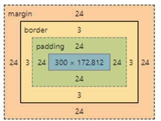

The following file is required for this lesson:

* [demo-box-model.zip](files/demo-box-model.zip)

## Demo Instructions
You can follow along with your instructor to complete this build and/or you can use this document as a guide in completing the demo build.

## Steps
1.	Download the **demo-box-model.zip** file and extract the contents.
2.	Create a folder called **demo-box-model** and copy the extracted contents into this folder.
3.	The resulting solution looks like (multiple screenshots from a single web page): 
 

4.	The first step is to modify the **styles.css** file in your **css** folder using the following rules (images of the code are shown; the comments with each style rule can be omitted): 
    <ol type="a">
        <li>Create a class to target the margins of a &lt;section&gt; element: 
        
        </li>
        <li>Create a class to target the borders of a &lt;section&gt; element: 
        
        </li>
        <li>Create a class to target the padding of a &lt;section&gt; element: 
        
        </li>
        <li>Finally, create a class to targe the width of a &lt;section&gt; element: 
        
        </li>
    </ol>
5.	Link the stylesheet to your **index.html** file.  
**In the following steps, the sizes shown for each `<section>` element might be different on your computer.**  
6.	In the second `<section>` element apply the **.margin-section** class, save and view the results in your browser, and using the browser’s developer tools. 
&nbsp;
7.	In the third `<section>` element apply the **.border-section** class, save and refresh the browser to see the changes applied. 
&nbsp;
8.	In the fourth `<section>` element apply the **.padding-section** class, save and refresh the browser to see the changes applied. 
&nbsp;
9.	In the last `<section>` element apply the **.width-section** class, save and refresh the browser to see the changes applied. 
&nbsp;

## Exercise Instructions
There is no related exercise for this walkthrough.

For each of the classes applied, do the math to see the actual size the sections take up on a web page.

### [Module Home](../module2.md)

### [COMP1017 Home](../../)