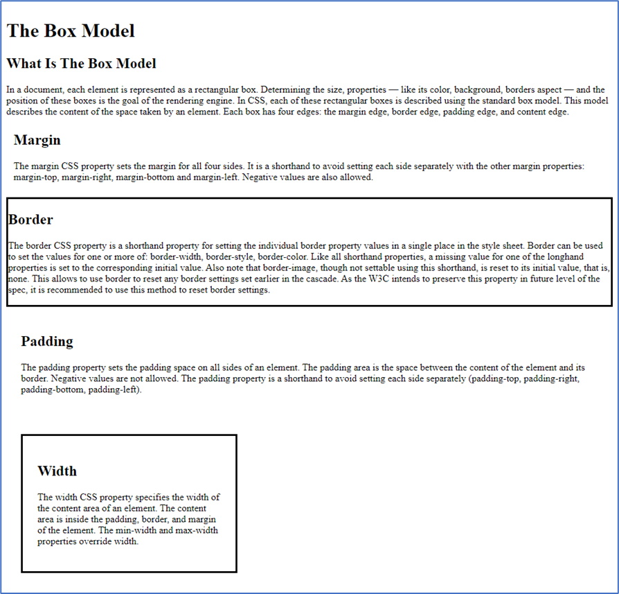
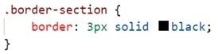

The following file is required for this lesson:

* [demo-box-model.zip](files/demo-box-model.zip)

## Demo Instructions
You can follow along with your instructor to complete this build and/or you can use this document as a guide in completing the demo build.

## Steps
1. Download the **demo-box-model.zip** file and extract the contents.
2. Create a folder called **demo-box-model** and copy the extracted contents into this folder.
3. The resulting solution looks like: 

4. The first step is to modify the **styles.css** file in your **css** folder using the following rules (images of the code are shown; the comments with each style rule can be omitted):
    *  Create a class to target the margins of a `<section>` element: 
       
    *  Create a class to target the borders of a `<section>` element: 
       
    *  Create a class to target the padding of a `<section>` element: 
       
    *  Finally, create a class to targe the width of a `<section>` element: 
       
5. Link the stylesheet to your **index.html** file.  
**In the following steps, the sizes shown for each `<section>` element might be different on your computer.**  
6. In the second `<section>` element apply the **.margin-section** class, save and view the results in your browser, and using the browser’s developer tools. 
&nbsp;
7. In the third `<section>` element apply the **.border-section** class, save and refresh the browser to see the changes applied. 
&nbsp;
8. In the fourth `<section>` element apply the **.padding-section** class, save and refresh the browser to see the changes applied. 
&nbsp;
9. In the last `<section>` element apply the **.width-section** class, save and refresh the browser to see the changes applied. 
&nbsp;

## Exercise Instructions
There is no related exercise for this walkthrough.

For each of the classes applied, do the math to see the actual size the sections take up on a web page.

#### [Module Home](../)
#### [COMP1017 Home](../../)