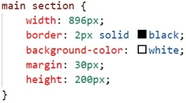

The following files are required for this lesson:
* [center-page-framework.zip](files/center-page-framework.zip)
* [demo-page-layout.zip](files/demo-page-layout.zip)

## Introduction
This walkthrough is done in two parts:
* [Part 1 – Center Page Framework](#part1)
* [Part 2 – Demo Page Layout](#part2)

## Demo Instructions
You can follow along with your instructor to complete this build and/or you can use this document as a guide in completing the demo build.

## Steps – <a id="part1">Part 1</a>: Center Page Framework
1.	Download the **demo-center-page-framework.zip** file and extract its contents to a folder called **center-page-framework**.
2.	In the **css** folder add a stylesheet named **styles.css**.
3.	In this file add the following code: 

4.	Open the **index.html** file and make the following change in the `<body>` which will use the class created in the stylesheet: 

5.	Save this center-page framework as it will be used in future examples, exercises, labs, and assignments.

## Steps – <a id="part2">Part 2</a>: Demo Page Layout
1.	Download the **demo-page-layout.zip** file and extract its contents into a folder named **demo-page-layout**.
2.	The download contains an image of the completed web page: 

3.	The steps to achieve the above result require you to make the following additions to styles.css (the comments in the code below are optional but recommended)
    *  Change the font styling: 
        
    *  Style the `<nav>` element: 
        
    *  Style the `<header>` element: 
        
    *  Style the `<main>` element: 
        
    *  Style the `<section>`; element inside the `<main>`: 
        
    *  Style the `<footer>` element: 
        
4.	Save and run/refresh **index.html** in your browser. If your resulting web page does not look like the supplied wireframe, make any necessary code corrections, and refresh your browser.

## Exercise Instructions
There is no related exercise for this walkthrough.

## Lab
Download the **lab-page-layout.zip** file from Moodle. The completed web page should look like the **compted.jpg** file supplied. Submit this as per the instructions on Moodle.

#### [Module Home](../)
#### [COMP1017 Home](../../)