The following file is required for this lesson:
* [demo-flexbox.zip](files/demo-flexbox.zip)

## Demo Instructions
You can follow along with your instructor to complete this build and/or you can use this document as a guide in completing the demo build.

## Steps
1. Download the **demo-flexbox.zip** file and extract its contents to a folder called **demo-flexbox**.
2. The result of this demo should look like: 
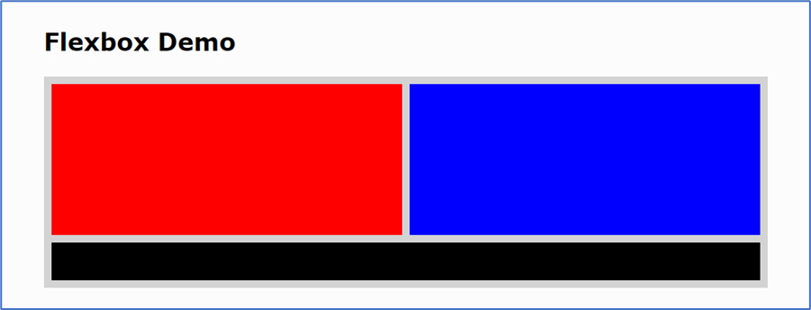
3. Modify the `<footer>` element in index.html to look like: 
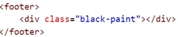
4. Calculate the width of each 
 in the <main> using the following steps:
    *  Subtract the final right margin: **960 - 10 = 950**
    *  Subtract the left margin of each `
`: **950 – 20 = 930**
    *  Divide that result by 2: **930 / 2 = 465**
5. In the **css** folder add the following code:
    *  Style the `<main>` element: 
        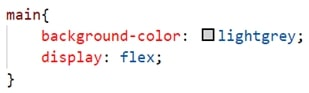
    *  Style the `
` elements: 
        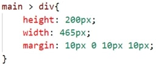
    *  Create a class called `.red-paint`: 
        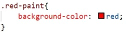
    *  Create a class called `.blue-paint`: 
        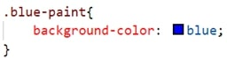
    *  Create a class called `.black-paint`: 
        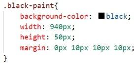
    *  Style the `<footer>` element: 
        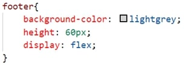
6. Open the **index.html** file in your browser. If the result is different, make any necessary corrections, and refresh your browser.
7. In your browser, open the developer tools and examine the widths of each of the `
` elements in the `<main>`: 
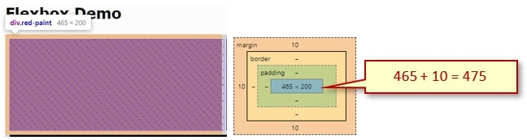 
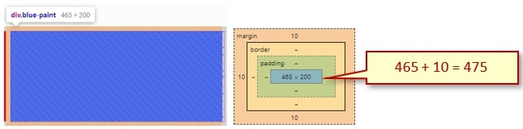 
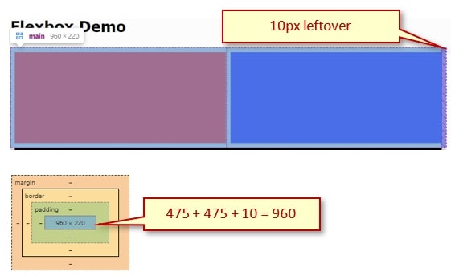
8. As an experiment, adjust the size in the main > div to:
    *  **width: 465px;**
    *  **width: 470px;**

## Exercise Instructions
There are three exercises related to this demo; the first one is this demo. Download the following exercise files from Moodle:
* **ex-css-flex-2.zip**
* **ex-css-flex-3.zip**

Complete the exercises as per the instructions on Moodle. Remember to calculate the `
` widths using the Box Model.

#### [Module Home](../)
#### [COMP1017 Home](../../)