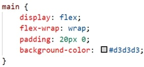
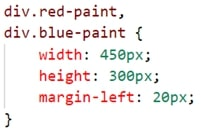
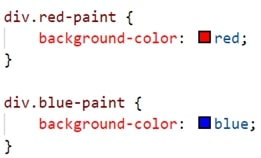
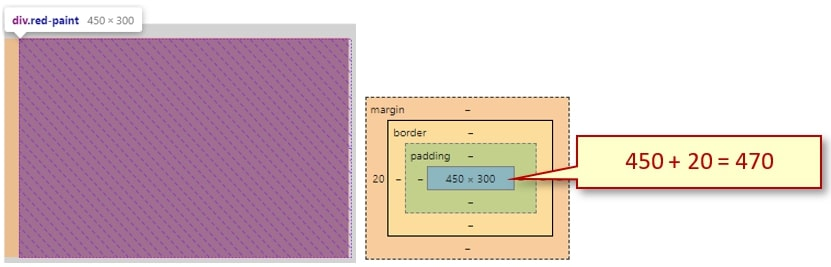

The following file is required for this lesson:
* [demo-flex-wrap.zip](files/demo-flex-wrap.zip)

## Demo Instructions
You can follow along with your instructor to complete this build and/or you can use this document as a guide in completing the demo build.

## Steps
1. Download the **demo-flex-wrap.zip** file and extract its contents to a folder called **demo-flex-wrap**.
2. The result of this demo should look like: 

3. Calculate the width of each `
` in the `<main>` using the following steps:
    *  Subtract the final right margin: **960 - 20 = 940**
    *  Subtract the left margin of each `<div?`: **940 – 40 = 900**
    *  Divide that result by 2: **900 / 2 = 450**
    *  Calculate the width of the "black" `<div?`: Subtract left and right margins: **960 – 40 = 920**
4. In the **css** folder add the following code to the **styles.css** file:
    *  Style the `<main>` element: 
       
    *  Style the `
` elements: 
       
    *  Colour the first two `
` elements: 
       
    *  Style the `.full-width`: 
       
5. Open the **index.html** file in your browser. If the result is different, make any necessary corrections, and refresh your browser.
6. In your browser, open the developer tools and examine the widths of each of the `
` elements in the `<main>`: 
 
 

## Exercise Instructions
There are two exercises related to this demo. Download the following exercise files from Moodle:
* **ex-css-flex-4.zip**
* **ex-css-flex-5.zip**

Complete the exercises as per the instructions on Moodle. Remember to calculate the `
` widths using the Box Model.

## Lab Instructions
Complete the Lab for this lesson and submit as per the instructions on Moodle.

#### [Module Home](../)
#### [COMP1017 Home](../../)