The following file is required for this lesson:
* [layout-with-content.zip](files/layout-with-content.zip)

## Demo Instructions
You can follow along with your instructor to complete this build and/or you can use this document as a guide in completing the demo build.

## Steps
1. Download the **layout-with-content.zip** file and extract its contents to a folder called **layout-with-content**.
2. The result of this demo should look like: 
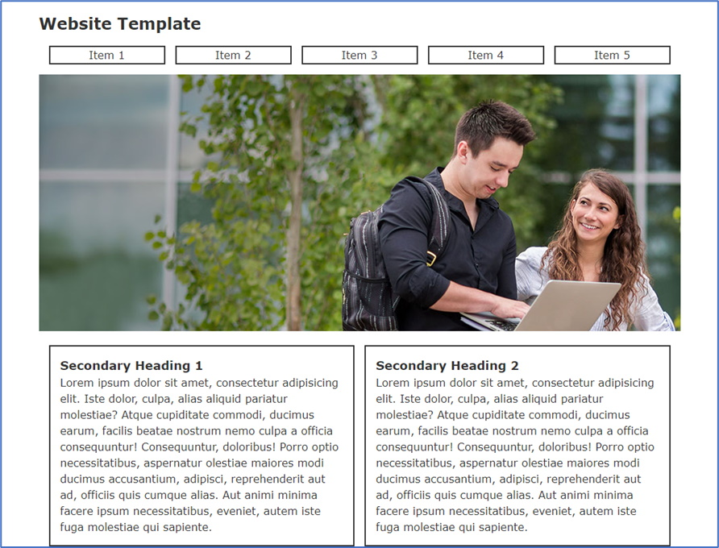
3. Calculate the width of each `<li>` in the `<ul class="menu">` using the following steps:
    *  Subtract the final right margin: **960 - 15 = 945**
    *  Subtract the left margin from each `<li>`: **945 – 75 = 870**
    *  Subtract the left and right border of each `<li>`: **870 – 20 = 850**
    *  Divide that result by 5: **850 / 5 = 170**
    *  Calculate the width of the each `<section>`:
        *  Subtract the final right margin: **960 – 15 = 945**
        *  Subtract the left margin for each `
`: **945 – 30 = 915**
        *  Subtract the left and right borders: **915 – 8 = 907**
        *  Subtract the left and right padding: **907 – 60 = 847**
        *  Divide the result by 2: **847 / 2 = 423.5**
4. In the **css** folder add the following code to the **styles.css** file:
    *  Style the typography: 
       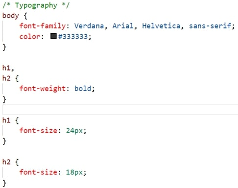
    *  Style the `.site-header` class: 
       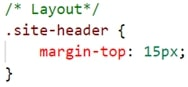
    *  Style the `.site-header nav` class: 
       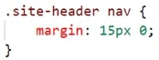
    *  Style the `.menu`: 
       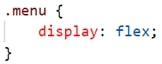
    *  Style the `<li>` in the `<nav>`: 
       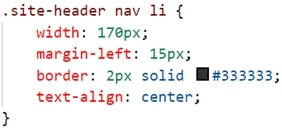
    *  Style the `<main>` element: 
       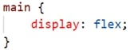
    *  Style the `<section>` elements in the `<main>`: 
       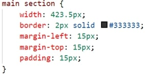
5. Open the **index.html** file in your browser. If the result is different, make any necessary corrections, and refresh your browser.
6. In your browser, open the developer tools and examine the widths of each of the <code>class="menu"</code>: 
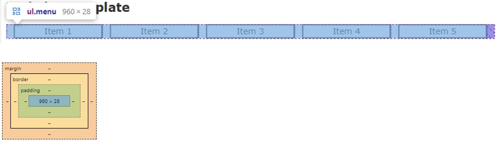
7. Now examine a single `<li>` element: 
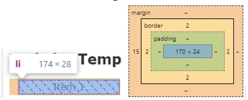
8. Now examine a `<section>` element: 
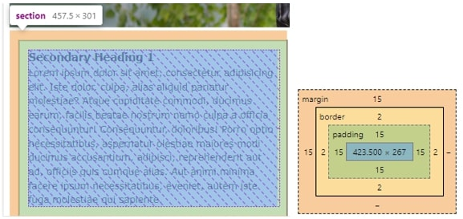
9. Now the `<main>`: 
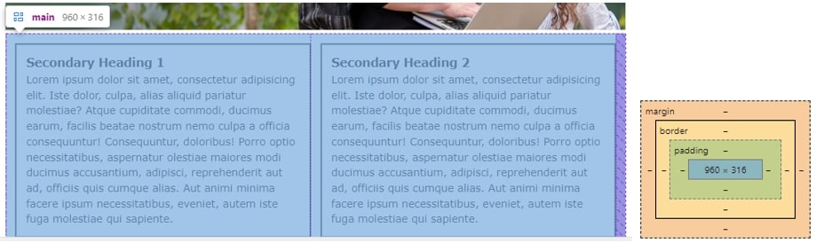

## Exercise Instructions
There are no exercises related to this demo.

#### [Module Home](../)
#### [COMP1017 Home](../../)