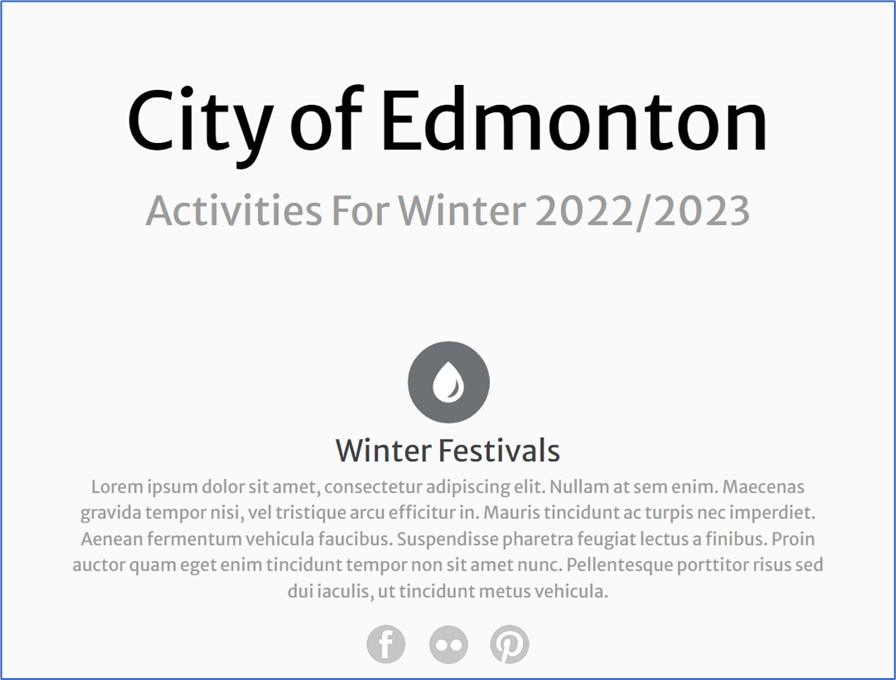

The following file is required for this lesson:
* [demo-styling-text.zip](files/demo-styling-text.zip)

## Demo Instructions
You can follow along with your instructor to complete this build and/or you can use this document as a guide in completing the demo build.

## Steps
1. Download the **demo-styling-text.zip** file and extract its contents to a folder called **demo-styling-text**.
2. The result of this demo should look like: 

3. In your browser, navigate to [https://fonts.google.com/](https://fonts.google.com){:target="_blank"}
4. In the search field, enter **lato**.
5. Select the font that is displayed: 

6. Select the regular font: 

7. Press the **+ Select this style** link button.
8. From the results, copy the `<link>` code into the `<head>` section just above the link(s) to the stylesheets: 
 

9. You will also need the **font-family** code in your **.container** class in your spreadsheet: 
 

10. Make the following changes to the **index.html** file:
    *  `<header>`: 
        
    *  `<footer>`: 
        
11. In the **css** folder add the following code to the **styles.css** file:
    *  Style the typography: 
        
    *  Style the `.page-header` class: 
        
    *  Style the `<section>` element: 
        
12. Open the **index.html** file in your browser. If the result is different, make any necessary corrections, and refresh your browser.

## Exercise Instructions
There are no exercises related to this demo.

#### [Module Home](../)
#### [COMP1017 Home](../../)