The following file is required for this lesson:
*[demo-web-image-formats.zip](files/demo-web-image-formats.zip)

## Introduction
This lesson does not produce a web page only extracted images from a Photoshop file. If you take further web courses in DMIT, you are encouraged to purchase the [Creative Cloud Suite from Adobe](https://www.adobe.com/ca/creativecloud/buy/students.html?promoid=P79NQTWV&mv=other){:target="_blank"}.

## Demo Instructions
You can follow along with your instructor to complete this build and/or you can use this document as a guide in completing the demo build. Download the **demo-web-image-formats.zip** file and extract its contents to a folder called **demo-web-image-formats**. Open the **demo.psd** file in either Photoshop or the online tool.

## Steps
1.	Open the demo.psd file in Photoshop: 
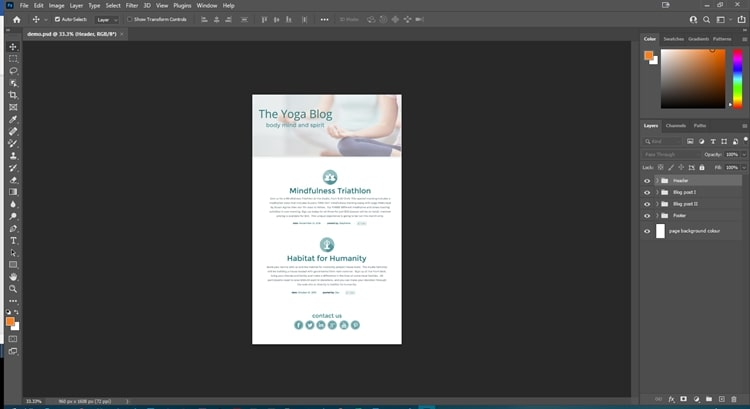
2.	Make note of what you see in the **Layers Panel**: 
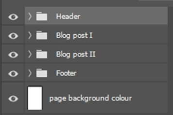
3.	You will start by extracting one of the images in the **Header**. Expand the **Header** section and hide all the other layers and all but the **The Yoga Blog-jpg** layer by clicking on the _eye_ icon: 
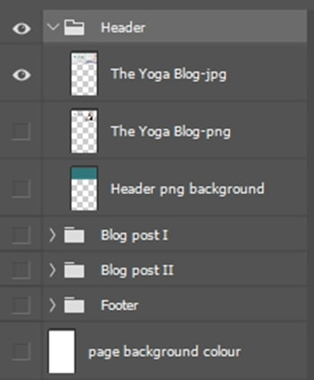&nbsp;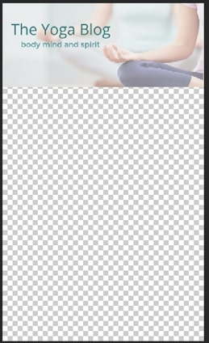
4.	Select the **The Yoga Blog-jpg** layer and hold down the Ctrl key: 
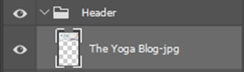&nbsp;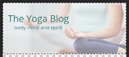 Note the dotted line around just that layer/image
5.	Copy the layer selected: 
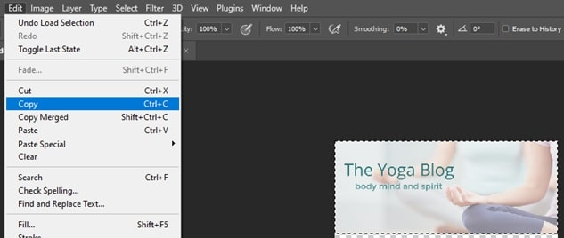
6.	Create a New file and select the size from the Clipboard: 
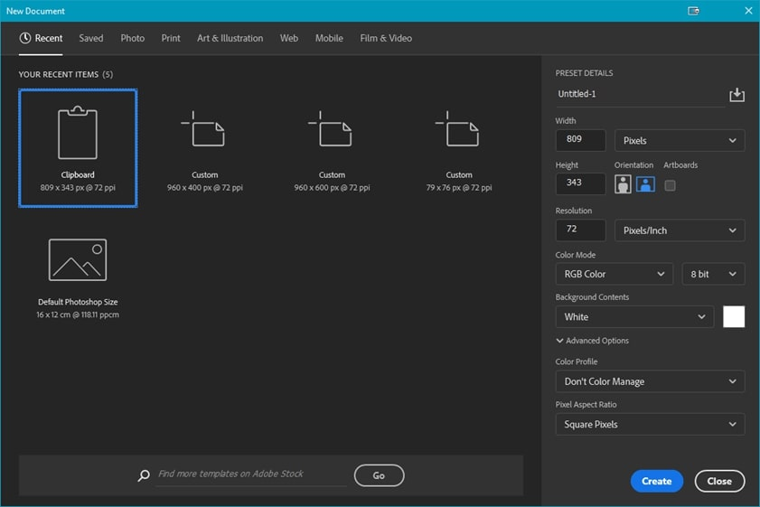
7.	Once the new file is created, paste in the copied image: 
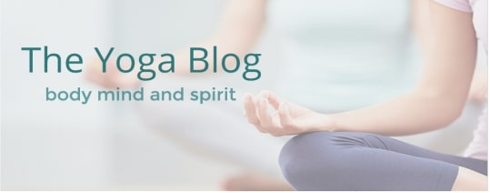
8.	Now you need to export this image for the web: 
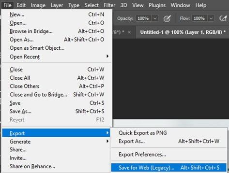
9.	Next you need to select the type of image. This image is a jpeg file as it has full colour and no transparency: 
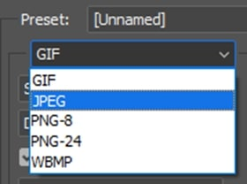
10.	Now save this image with a semantic name to the folder you created earlier: 
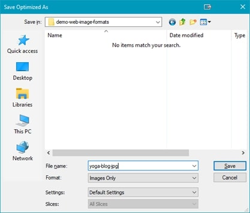&nbsp;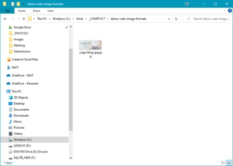
11.	Next, you will extract the other image in the **Header**. Follow the steps 1 to 6 as before except change the **Background Contents** to **Transparent**: 
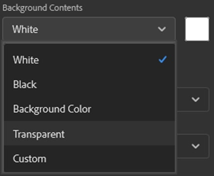
12.	Now paste in the copied image: 
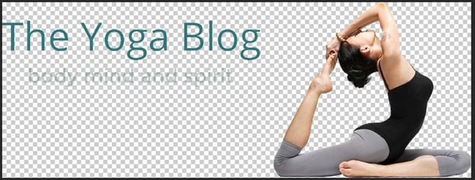
13.	When exporting this image, using the steps 8 &amp; 9 the only difference is this image is full colour with transparency, thus you need to select **jpg-24**: 
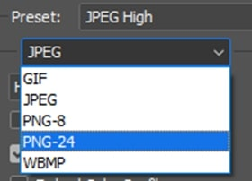
14.	Now save this image with a semantic name to the folder you created earlier: 
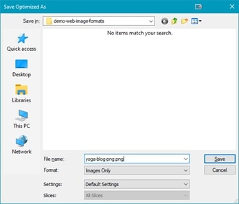&nbsp;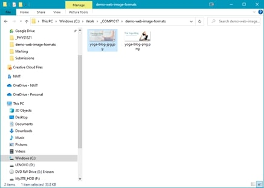
15.	Next there is an image in the **Blog post I** layer which will need to be extracted: 
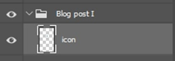
16.	Repeat the steps above until, make sure the clipboard background is transparent. The image preset will be **GIF**: 
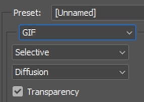
17.	Now save as before to the same folder: 
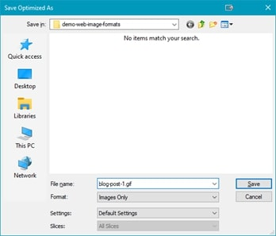&nbsp;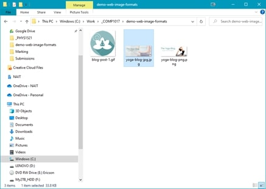
18.	There is an image in the **Blog post II** layer that will be extracted using the same steps as previously completed. Once saved, you should have: 
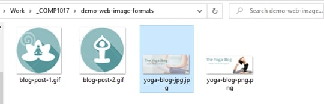
19.	There is one more image that is in both blog post layers: 
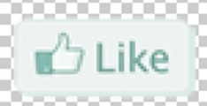
20.	Extract this image using the previous steps. Save the image and you should have: 
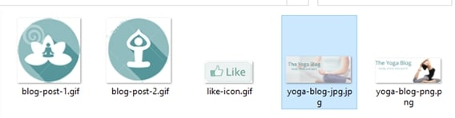
21.	Finally, there is an image in the **Footer** layer. This image has 6 icons that need to be extracted: 
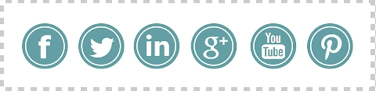
22.	You will need to change the rectangular select tool to the **Elliptical Marquee** tool by selecting the small triangle icon in the corner of the tool and selecting the tool: 
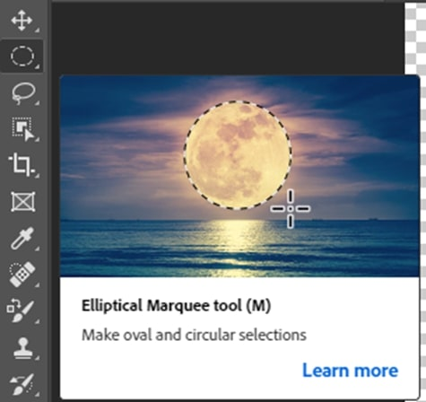
23.	Start the selection in the upper left corner of a square that would surround the icon. Drag the tool to create a circular selection of the image (HINT: for a better circle, hold down the Shift key while dragging). Make sure you have the **social media icons** layer selected, then copy the selected item to the clipboard: 

24.	Create a new file from the clipboard, with transparent background, and paste in the copied image: 

25.	As this image has few colours, and transparency, the image type is GIF. Save to the same folder to get: 
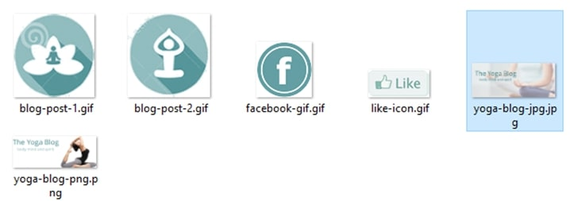
26.	Repeat steps 23 &amp; 24 for each of the other social media icons. As you already have a selection circle around the first icon, just use the cursor to move the selection circle to the next icon as all the icons need to be the same size. When finished, you should have: 
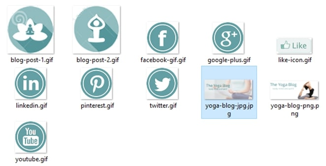

## Exercise Instructions
Download the **ex-web-imageformats.zip** file from Moodle and extract to a folder called **ex-web-image-formats**. You can use either Photoshop or photpea.com to extract the images from the **design-comp.psd** file. Use the submission instructions on Moodle.

##### [Module Home](../)
### [COMP1017 Home](../../)