The following file is required for this lesson:
* [demo-css-background-image.zip](files/demo-css-background-image.zip)

## Introduction
This walkthrough will be done in two parts:
* [Part 1: Background Image](#part1)
* [Part 2: Lab - Completed Web Page](#part2)

## Demo Instructions
You can follow along with your instructor to complete this build and/or you can use this document as a guide in completing the demo build.

## Steps – <a id="part1">Part 1</a>: Background Image
1.	Download the **demo-css-background-image.zip** file and extract its contents to a folder called **demo-css-background-image**.
2.	The result of this demo should look like: 
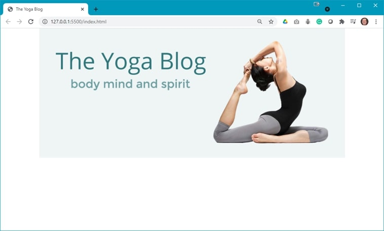
3.	Open the **demo.psd file** and examine the images, fonts, and layout properties of the file; the images are already extracted for you).
4.	Modify the styles.css file as shown below: 
    <ol type="a">
        <li>Add a <b>.page-header</b> class: 
        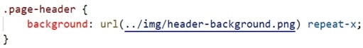
        </li>
        <li>Add a <b>.hidden</b> class: 
        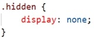
        </li>
    </ol>
5.	Modify the **index.html** file as shown below: 
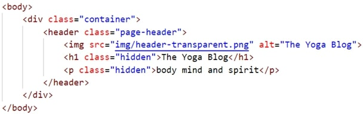
6.	Open the **index.html** file in your browser. If the result is different, make any necessary corrections, and refresh your browser.

## Steps – <a id="part2">Part 2</a>: Lab - Completed Web Page
Using the extracted images and the **copy.txt** complete the web page so that it looks like: 
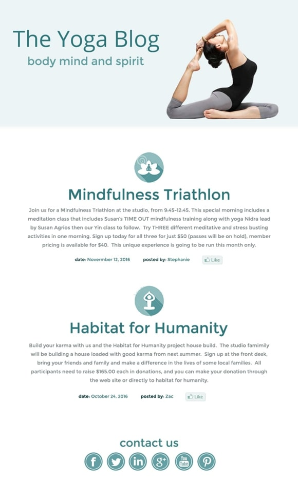
1.	Open the **demo.psd** file and use the eye dropper tool to determine the font colours, font sizes, and layout spacing. Verify your values with the code shown in this section of the document.
2.	Modify **index.html** as follows: 
    <ol type="a">
        <li>First &lt;section&gt; (use the first full paragraph of copy.txt for the contents of the paragraph): 
        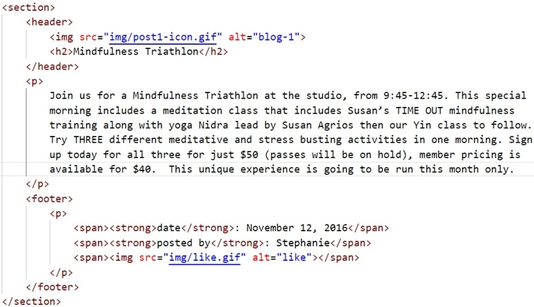
        </li>
        <li>Second &lt;section&gt; (use the second full paragraph of copy.txt for the contents of the paragraph): 
        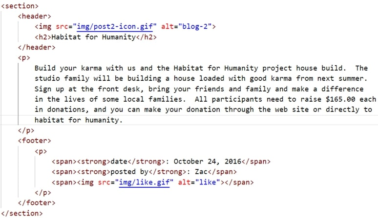
        </li>
        <li>The &lt;footer&gt; section: 
        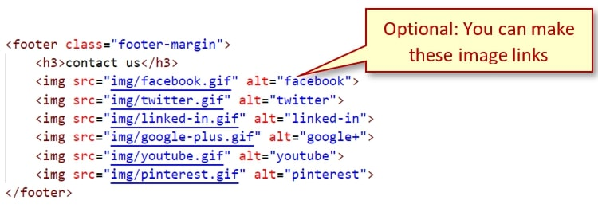
        </li>
    </ol>
3.	Modify **styles.css** as follows: 
    <ol type="a">
        <li>Headings: 
        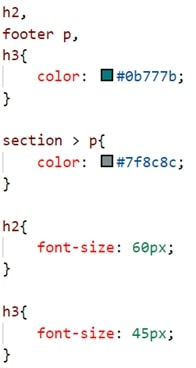
        </li>
        <li>The &lt;section&gt; element: 
        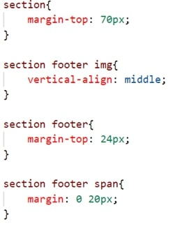
        </li>
        <li>The &lt;footer&gt; element: 
        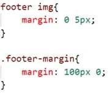
        </li>
        <li>The &lt;strong&gt; element: 
        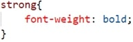
        </li>
    </ol>
4.	Open **index.html** in your browser. If the results are different, make any necessary corrections, and refresh your browser.

## Exercise Instructions
There are no exercises related to this demo.

## Lab
Submit your completed las as per the instructions on Moodle.

### [Module Home](../module3.md)

### [COMP1017 Home](../../)