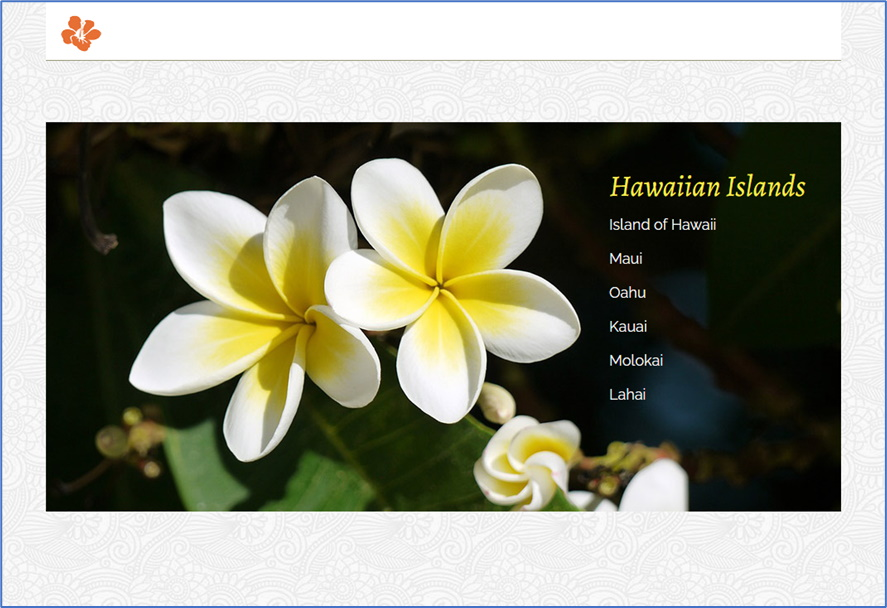

The following file is required for this lesson:
* [css-vertical-nav.psd.zip](files/css-vertical-nav.psd.zip)

## Demo Instructions
You can follow along with your instructor to complete this build and/or you can use this document as a guide in completing the demo build.

## Steps
1. Download the **css-vertical-nav.psd.zip** file and extract its contents to a folder called **css-vertical-nav**.
2. The result of this demo should look like: 

3. Open the **css-vertial-nav.psd** file and examine the images, fonts, and layout properties of the file; the images are already extracted for you).
4. In **index.html**, modify the `<nav>` `<li>`’s to be: 

5. Modify the **styles.css** file as shown below:
    *  Style the `<header>` to be: 
       
    *  Add and style the `.banner` class: 
       
    *  Style the `<a>` elements in the `.banner` class: 
        
6. Save and open **index.html** in your browser. If the result is different from the expected, make any necessary corrections, and refresh your browser.

## Exercise Instructions
There are no exercises related to this demo.

#### [Module Home](../)
#### [COMP1017 Home](../../)