The following file is required for this lesson:
* [css-horizontal-menu.zip](files/css-horizontal-menu.zip)

## Demo Instructions
You can follow along with your instructor to complete this build and/or you can use this document as a guide in completing the demo build.

## Steps
1.	Download the css-horizontal-menu.zip file from Moodle and extract its contents to a folder called css-horizontal-menu.
2.	The result of this demo should look like: 
3.	Open the **css-horizontal-menu.psd** file and examine the images, fonts, and layout properties of the file; the images are already extracted for you).
4.	You will need to following fonts from google fonts: 
    <ol type="a">
        <li>Raleway</li>
        <li>Alegreya (do not select Alegreya Sans)</li>
    </ol>
5.	Add the links to those two fonts in the `<head>` of **index.html**. (These fonts will be added to your **styles.css** file later in this walkthrough.)
6.	Add the following code to **index.html** (_Note: the classes used below will need to be added to your **styles.css** file._): 
    <ol type="a">
        <li>Add the &lt;header&gt; block: 
        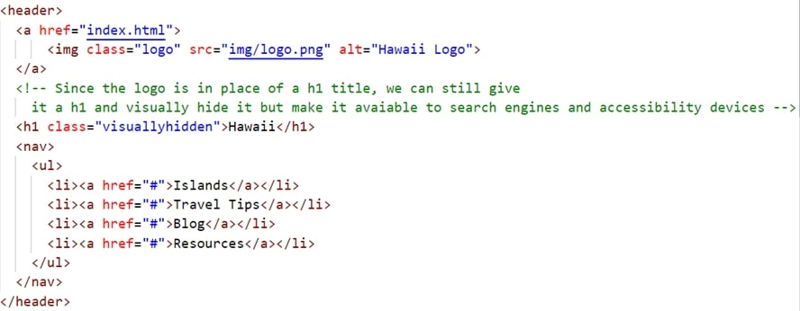
        </li>
        <li>Add the &lt;main&gt; block: 
        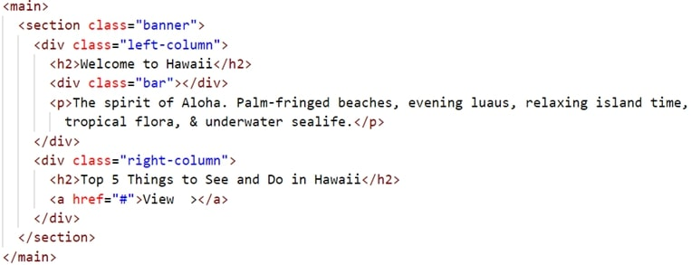
        </li>
    </ol>
7.	Modify the **styles.css** file as shown below: 
    <ol type="a">
        <li>Modify the &lt;body&gt; to add font styling: 
        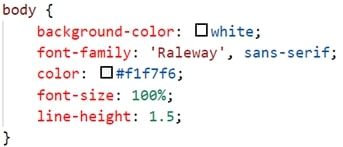
        </li>
        <li>Style the &lt;header&gt; to be: 
        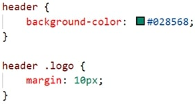
        </li>
        <li>Target the &lt;a&gt; element: 
        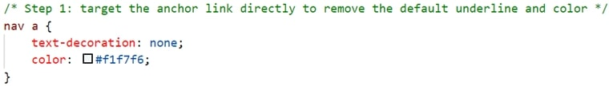
        </li>
        <li>Add additional styling to the &lt;li&gt; element: 
        
        </li>
        <li>Layout the &lt;li&gt; elements horizontally: 
        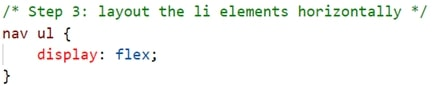
        </li>
        <li>Layout the logo image and the &lt;nav&gt;: 
        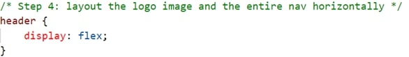
        </li>
        <li>Position the &lt;nav&gt; and add hover effects: 
        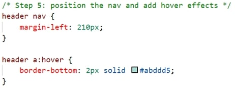  
        The following additions to <b>styles.css</b> will be for the <b>.banner</b> class  
        </li>
        <li>Add a <b>.banner</b> class: 
        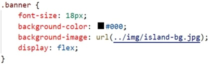
        </li>
        <li>Style the &lt;h2&gt; in the banner: 
        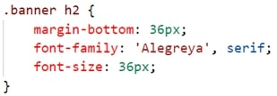
        </li>
        <li>Style the <b>.left-column</b> class (Note the calculation needed): 
        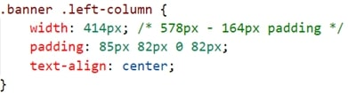
        </li>
        <li>Style the <b>.bar</b> class: 
        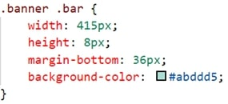
        </li>
        <li>Style the <b>.right-column</b> class (Note the calculation needed): 
        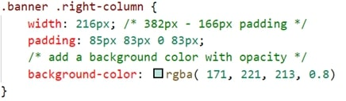
        </li>
        <li>Style the &lt;h2&gt; in the <b>.right-column</b>: 
        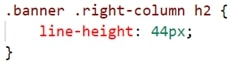
        </li>
        <li>Style an &lt;a&gt; element to look like a button: 
        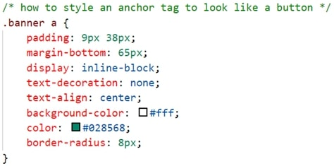
        </li>
        <li>Style the hover effect of the &lt;a&gt; element: 
        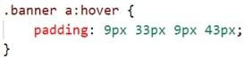
        </li>
    </ol>
8.	Save and open **index.html** in your browser. If the result is different from the expected, make any necessary corrections, and refresh your browser.

## Exercise Instructions
Download the **ex-css-horizontal-navigation.zip** file from Moodle. The ZIP file contains a sample output file, **ex-horizontal-complete.jpg**, and the Photoshop file, **design-comp.psd**, which will aid you in completing this exercise. Complete this exercise as per the instructions on Moodle.

## Lab Instructions
Download the documents for the Lab from Moodle to get the following files:

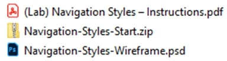

Complete the lab as per the instructions on Moodle.

### [Module Home](../module3.md)

### [COMP1017 Home](../../)