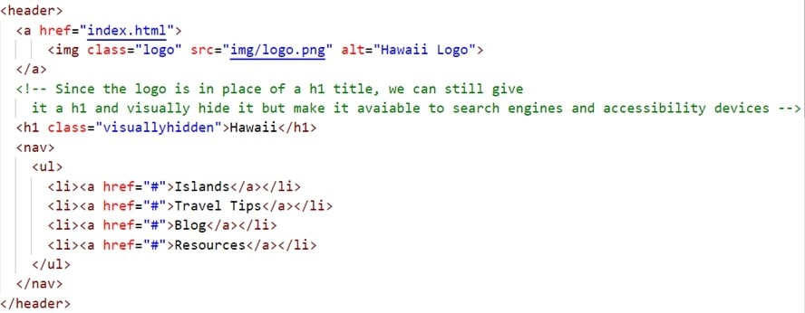
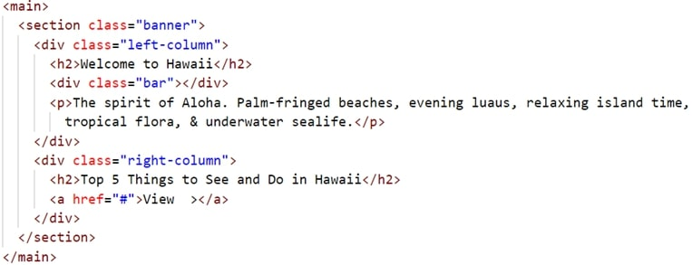
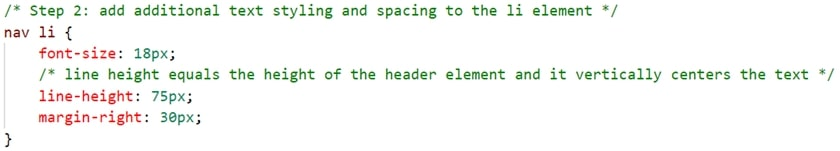
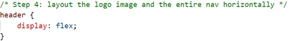
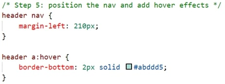
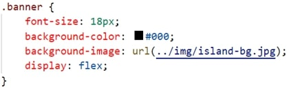
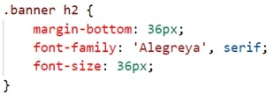
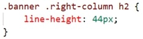
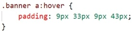
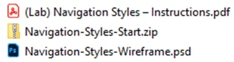

The following file is required for this lesson:
* [css-horizontal-menu.zip](files/css-horizontal-menu.zip)

## Demo Instructions
You can follow along with your instructor to complete this build and/or you can use this document as a guide in completing the demo build.

## Steps
1. Download the css-horizontal-menu.zip file from Moodle and extract its contents to a folder called css-horizontal-menu.
2. The result of this demo should look like: 
3. Open the **css-horizontal-menu.psd** file and examine the images, fonts, and layout properties of the file; the images are already extracted for you).
4. You will need to following fonts from google fonts:
    *  Ralewa
    *  Alegreya (do not select Alegreya Sans)
5. Add the links to those two fonts in the `<head>` of **index.html**. (These fonts will be added to your **styles.css** file later in this walkthrough.)
6. Add the following code to **index.html** (_Note: the classes used below will need to be added to your **styles.css** file.):
    *  Add the `<header>` block: 
        
    *  Add the `<main>` block: 
        
7. Modify the **styles.css** file as shown below:
    *  Modify the `<body>` to add font styling: 
        
    *  Style the `<header>` to be: 
        
    *  Target the `<a>` element: 
        
    *  Add additional styling to the `<li>` element: 
        
    *  Layout the `<li>` elements horizontally: 
       
    *  Layout the logo image and the `<nav>`: 
       
    *  Position the `<nav>` and add hover effects: 
          
        The following additions to <b>styles.css</b> will be for the <b>.banner</b> class  
    *  Add a `.banner` class: 
        
    *  Style the `<h2>` in the banner: 
        
    *  Style the `.left-column` class (Note the calculation needed): 
        
    *  Style the `.bar` class: 
        
    *  Style the `.right-column` class (Note the calculation needed): 
       
    *  Style the `<h2>` in the `.right-column`: 
        
    *  Style an `<a>` element to look like a button: 
        
    *  Style the hover effect of the `<a>` element: 
        
8. Save and open **index.html** in your browser. If the result is different from the expected, make any necessary corrections, and refresh your browser.

## Exercise Instructions
Download the **ex-css-horizontal-navigation.zip** file from Moodle. The ZIP file contains a sample output file, **ex-horizontal-complete.jpg**, and the Photoshop file, **design-comp.psd**, which will aid you in completing this exercise. Complete this exercise as per the instructions on Moodle.

## Lab Instructions
Download the documents for the Lab from Moodle to get the following files:

Complete the lab as per the instructions on Moodle.

#### [Module Home](../)
#### [COMP1017 Home](../../)