# 24 - Styling Forms
The following file is required for this lesson:
* [demo-styling-forms.zip](files/demo-styling-forms.zip)

## Demo Instructions
You can follow along with your instructor to complete this build and/or you can use this document as a guide in completing the demo build.

## Steps
1.	Download the demo-styling-forms.zip file from Moodle and extract its contents to a folder called demo-styling-forms.
2.	The result of this demo should look like (notice it uses the horizontal menu from a previous assignment): 
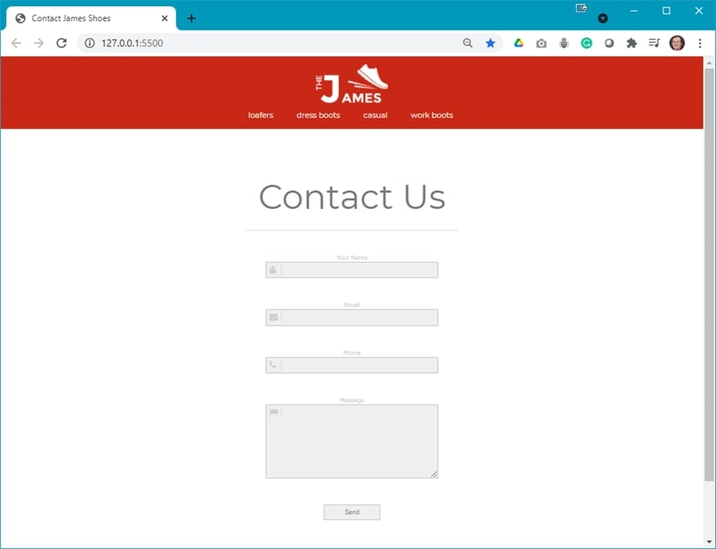
3.	Open the **design-comp.psd** file and examine the images, fonts, and layout properties of the file; the images are already extracted for you).
4.	You will need to following font from google fonts: 
    <ol type="a">
        <li>Montserrat</li>
    </ol>
5.	Add the link to this font in the `<head>` of **index.html**. (This font will be added to your **styles.css** file later in this walkthrough.)
6.	Add the following code to **index.html**: 
    <ol type="a">
        <li>Add the &lt;form&gt; element inside the &lt;main&gt;: 
        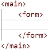
        </li>
        <li>Inside the &lt;form&gt; element add the following:
            <ol type="i">
                <li>A textbox for the name: 
                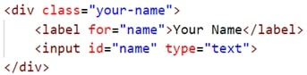
                </li>
                <li>A textbox for the email address: 
                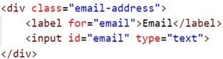
                </li>
                <li>A textbox for the phone number: 
                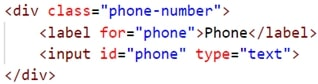
                </li>
                <li>A text area for the message: 
                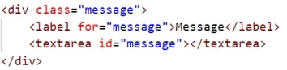
                </li>
                <li>A button to simulate submitting the form: 
                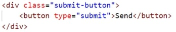
                </li>
            </ol>
        </li>
    </ol>
     
Before adding style rules to your styles.css file, the web page should look like: 
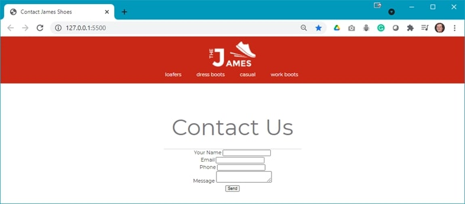 
7.	Add the following styles to the **styles.css** file as shown below to style the form elements: 
    <ol type="a">
        <li>Style the &lt;input&gt; and &lt;button&gt; elements: 
        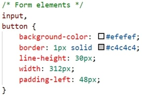
        </li>
        <li>Style the &lt;textarea&gt; element: 
        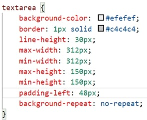
        </li>
        <li>Style the &lt;label&gt; element: 
        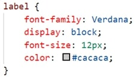
         
        Refresh your browser to see something like: 
         
        </li>
        <li>Add the background icons for the textbox form elements: 
        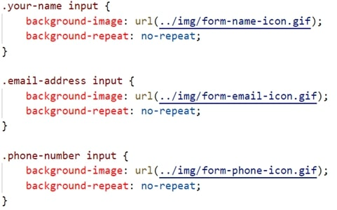
        </li>
        <li>Add the background image for the text area by adding the following code to the text area style rule: 
        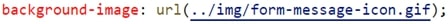
          Refresh your browser to see the following: 
        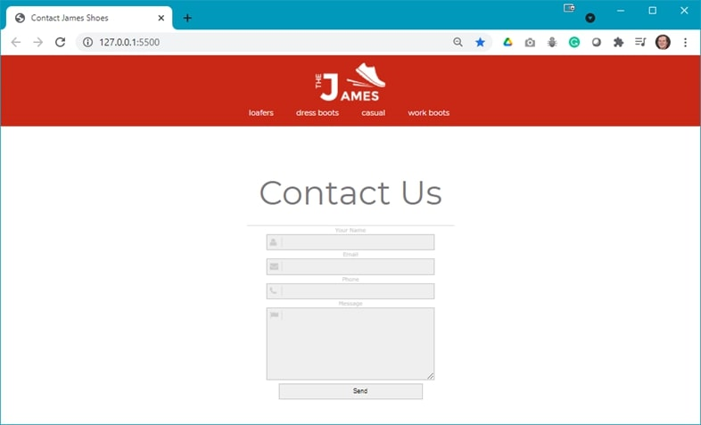 
        </li>
        <li>Style the send button: 
        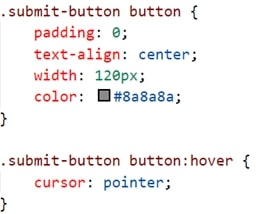
        </li>
        <li>Add layout styling to the form: 
        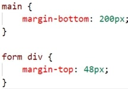
        </li>
    </ol>
8.	Save and open **index.html** in your browser. If the result is different from the expected, make any necessary corrections, and refresh your browser.

## Exercise Instructions
Download the **ex-contact-form.zip** file from Moodle. The ZIP file contains instructions in the file, **ex-contact-form.pdf**, and the Photoshop file, **form-design-comp.psd**, which will aid you in completing this exercise. Complete this exercise as per the instructions on Moodle.

### [Module Home](../README.md)

### [Home](../../comp1017.md)