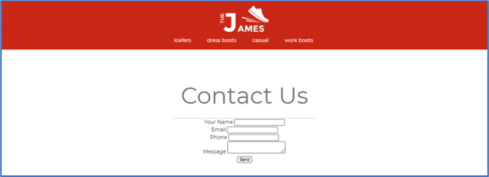
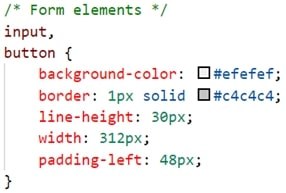
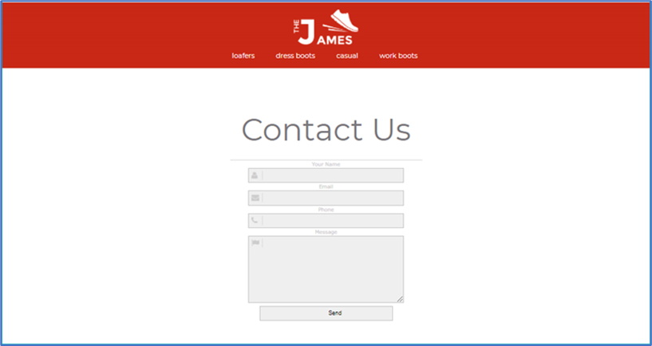
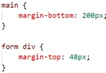

The following file is required for this lesson:
* [demo-styling-forms.zip](files/demo-styling-forms.zip)

## Demo Instructions
You can follow along with your instructor to complete this build and/or you can use this document as a guide in completing the demo build.

## Steps
1. Download the demo-styling-forms.zip file from Moodle and extract its contents to a folder called demo-styling-forms.
2. The result of this demo should look like (notice it uses the horizontal menu from a previous assignment): 

3. Open the **design-comp.psd** file and examine the images, fonts, and layout properties of the file; the images are already extracted for you).
4. You will need to following font from google font:
    *  Montserrat
5. Add the link to this font in the `<head>` of **index.html**. (This font will be added to your **styles.css** file later in this walkthrough.)
6. Add the following code to **index.html**:
    *  Add the `<form>` element inside the `<main>`: 
       
    *  Inside the `<form>` element add the following:
        *  A textbox for the name: 
           
        *  A textbox for the email address: 
           
        *  A textbox for the phone number: 
           
        *  A text area for the message: 
           
        *  A button to simulate submitting the form: 
            
    Before adding style rules to your styles.css file, the web page should look like: 

7. Add the following styles to the **styles.css** file as shown below to style the form elements:
    *  Style the `<input>` and `<button>` elements: 
       
    *  Style the `<textarea>` element: 
       
    *  Style the `<label>` element: 
       
         
        Refresh your browser to see something like: 
         
    *  Add the background icons for the textbox form elements: 
       
    *  Add the background image for the text area by adding the following code to the text area style rule: 
       
          Refresh your browser to see the following: 
         
    *  Style the send button: 
       
    *  Add layout styling to the form: 
       
8. Save and open **index.html** in your browser. If the result is different from the expected, make any necessary corrections, and refresh your browser.

## Exercise Instructions
Download the **ex-contact-form.zip** file from Moodle. The ZIP file contains instructions in the file, **ex-contact-form.pdf**, and the Photoshop file, **form-design-comp.psd**, which will aid you in completing this exercise. Complete this exercise as per the instructions on Moodle.

#### [Module Home](../)
#### [COMP1017 Home](../../)