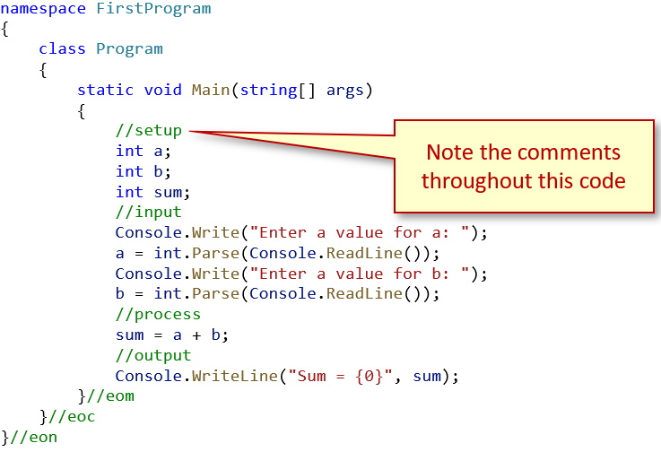

## Naming Conventions
All names used in your code will be semantically named; named for their use for the problem you are solving. The table below shows the correct naming structure that **MUST** be adhered to.

Type | Convention | Example
-----|------------|--------
Variables | Camel cased | `int firstName;`
Classes | Pascal cased | `class StudentData`
Methods | Pascal cased | `static void DisplayData()`
Constants | Pascal cased | `const double GstRate = 0.05;`

## Coding Structure
The structure of your code must be such that it is easily read by humans. There are basically three rules you will follow in this class:

### Indentation
All code will be correctly indented. This is normally not a problem if you let Visual Studio (IDE or Code) work for you. Each block level, inside the curly braces, {…}, will be indented (normally 4 spaces, or a tab).

### Whitesapce
Excessive whitespace, i.e., blank lines, do two things:
* Add unnecessary size to your code files
* Makes it harder to read and see where your working, or non-working, code is.

### Commenting
There are three rules that you will follow for commenting:
1. **Initial Comment Block**: At the top of **EVERY** code file, just above the `namespace` code line, you will have a comment block that looks like:

    ````csharp
    /* 
    Purpose:		    What is the purpose of this application?
    Input:			    What are the inputs?
    Output:			    What are the outputs?
    Written By: 	  Your Name
    Last Modified:	Date of the last modification
    */
   ```

2. **Other Commenting**: You will need to sufficiently document your code, especially sections where the code logic is a bit complex; this serves to help you, and your instructor, in understanding and debugging your code. For example:<br>

3. **Commented Code**: It is a **bad** practice to have code lines commented out. This indicates that you have experimented, or used a ***Trial-and-Error*** method, to solve the problem. It can also add confusion and adds size to your code files. If your submitted assignments have code commented out, you will receive a deduction in your mark.

#### [Introduction Home](index.md)
#### [CPSC1012 Home](../)