## Symbols

Symbol | Name | Symbol | Name
-------|------|--------|-----
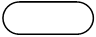 | Terminal Symbol | 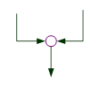 | Collector
 | Input/Output Symbol |  | Annotation Symbol
 | Decision Symbol |  | Preparation Symbol
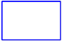 | Process Symbol | 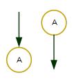 | On-page Connectors
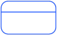 | Module Call | 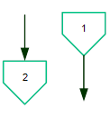 | Off-page Connectors
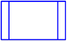 | Module Call | 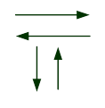 | Flow Lines

## Flowcharting Examples
### Simple Sequence
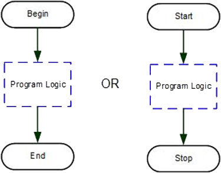

## If-Then-Else
The flow line enters from the top, and a diamond shaped symbol is used to direct the logic flow into two different paths. One or more processes may be executed on one or both of the paths. This new structure ends by rejoining both logic flow lines into one, using the collector symbol. The logic flow enters from the top and exits only from the left and right points of the diamond symbol within an If-Then-Else structure. A logic flow does NOT exit from the bottom of the diamond symbol.

There is no standard for which side “Yes” or “No” should be placed on an If-Then-Else structure, but the following is recommended: be consistent to avoid human error and use Yes/No, Y/N, True/False or T/F to label the flows. 
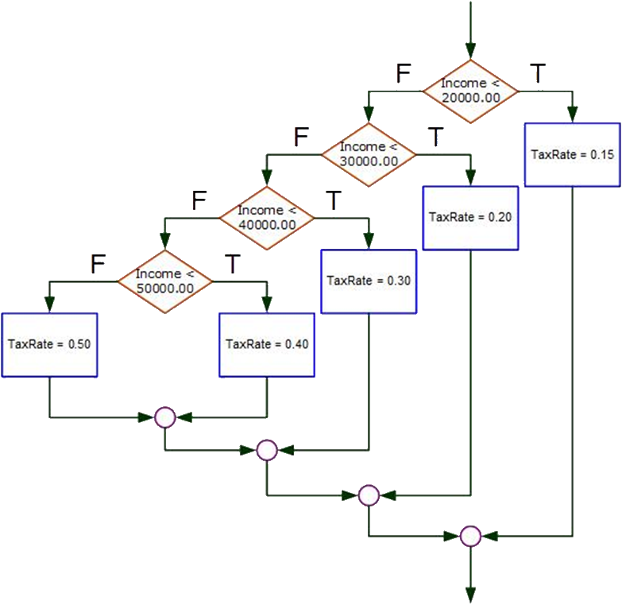

## Case Structure
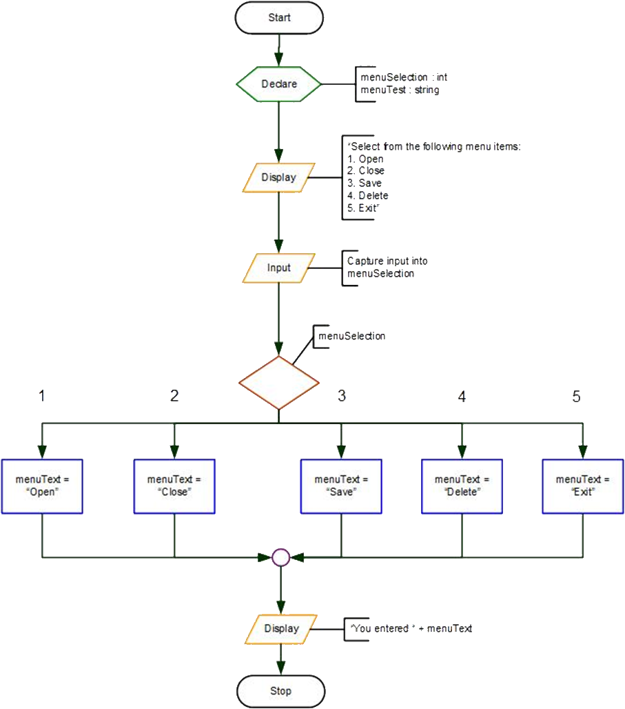

## Getting Information from Users
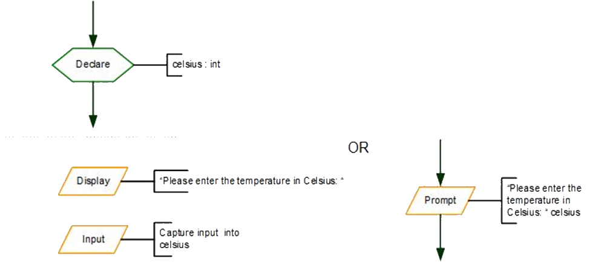

## Pre-test Loop (Do-While)
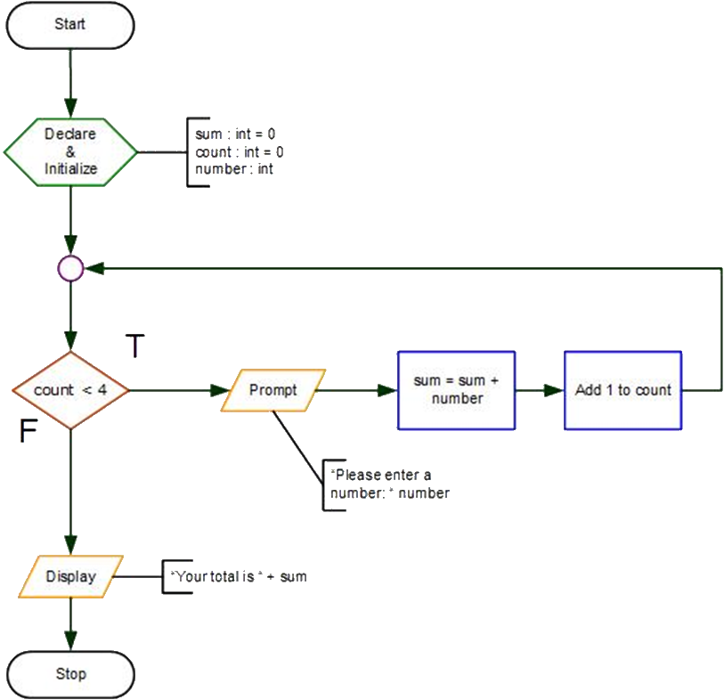

## Post-test (Do-Until)
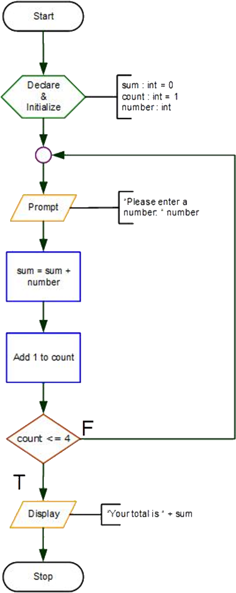

## Module Calling
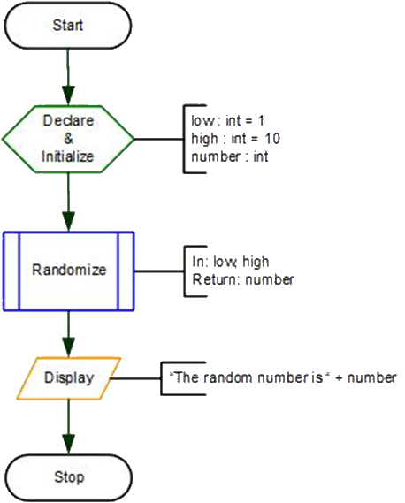

## Arrays
To declare an array: 
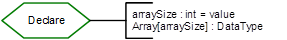

Array must be a valid variable name
Brackets, `[ ]`, indicate an array, and specifies the number of elements
DataType is int, double, string, char, etc.

To declare an array, called hockeyScore, of 6 scores: 
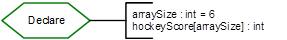

To assign a value to an array element: 
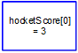

To use an array in an expression: 
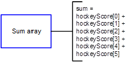

Index operations in a loop: 
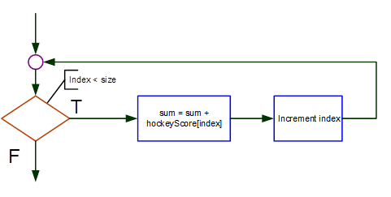

## Flowcharting Standards
1.	Flowcharts should always run top to bottom and left to right.
2.	Arrowheads must always be used so as to ensure that the reader of the flowchart can follow the path of logic correctly.
3.	All symbols used in a flowchart will be labelled or annotated so as to describe what each step is accomplishing.
4.	Processes must appear in logical and sequential order. That is, you must ensure that you have captured a value BEFORE you use it in a calculation.
5.	Flowcharts must be neat and legible. This is not a big concern if you are utilizing a software package that allows you to create flowcharts, but it is of paramount importance for any flowcharts drawn by hand
6.	All flowcharts will have their logic executed between two terminal symbols. The symbols will indicate where the flowchart begins and where it ends
7.	One process per box.
8.	There is no standard for which side Yes or No should be placed on an If-Then-Else or Loop, but the following is recommended: 
    <ol type="a">
        <li>Try to be consistent to avoid human error</li>
        <li>Use Yes/No, Y/N, True/False or T/F to label the flows</li>
    </ol>
9.	Process boxes used for complex calculations should have the formula annotated
10.	Use a collector whenever a flow line will connect with another flow line. The only exception to this is the Case structure where a flow line can go directly into another flow line that leads to a common collector
11.	Use a connector if the logic of the problem will not fit in the area available. Avoid breaks in logic within a structure. Use the on page connector if there is only a small amount of logic to finish and it will still be readable; use an off page connector if there is a substantial amount
12.	Decision symbols must use a comparison condition of equal (=), less than (<), greater than (>), less than or equal to (<= or ≤), greater than or equal to (>= or ≥) or not equal (<> or ≠). A case structure will always be an equal condition
13.	If a comparison involves the use of Boolean operators, use one of these capitalized words: AND, OR, NOT.
14.	Variable will be named using camel casing. This process capitalizes the first letter of each word, excluding the first word and then concatenates the words together to eliminate the spaces (bigSister, firstName, dayOfWeek
15.	Variables must have meaningful names.
16.	Variables can be set to int, double, char, string, bool, or DateTime.

### [Introduction Home](01-intro-to-programming.md)
### [CPSC1012 Home](../)
