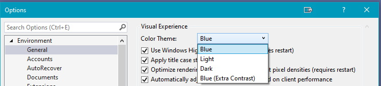
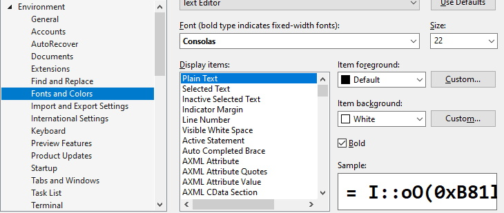
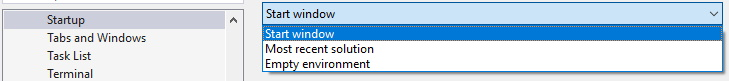
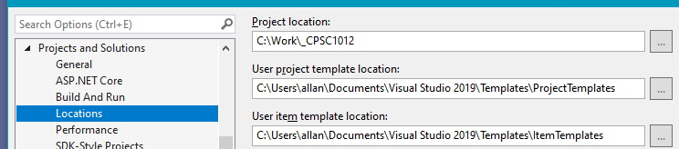
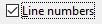
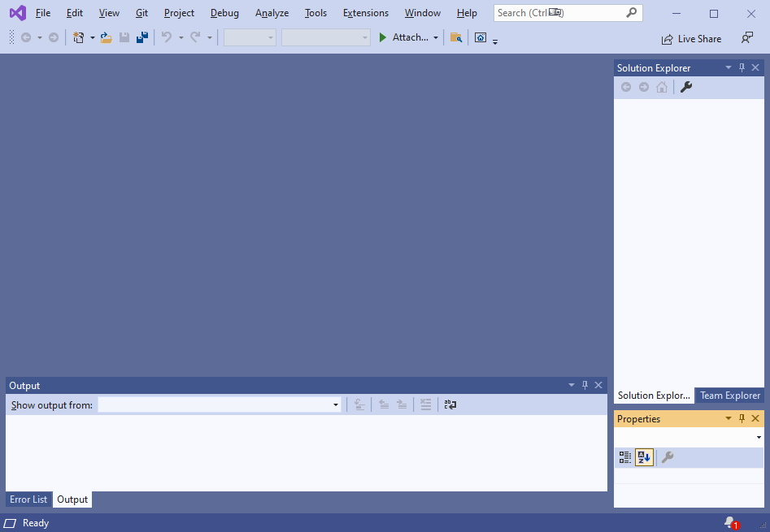
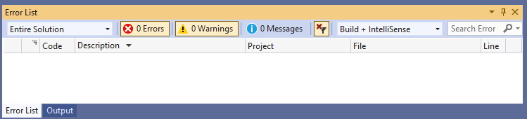
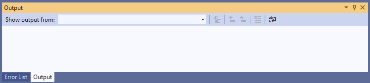
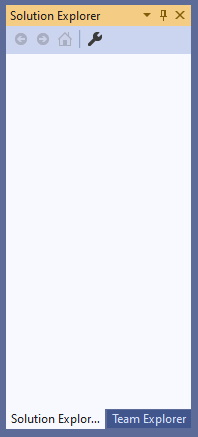
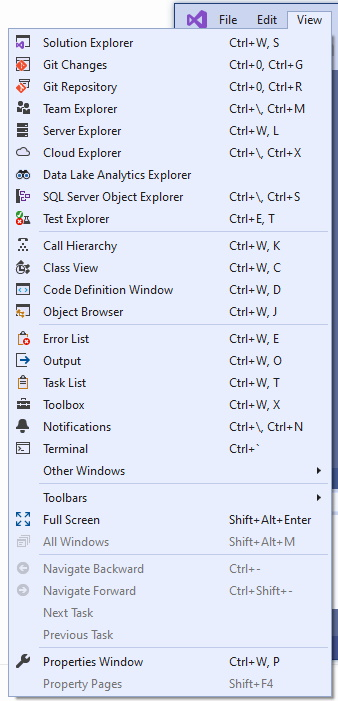

## Introduction
There are several ways to create a coding solution in **C#**. You could type all your code in a text editor, then, in a command prompt, do a command-line compile of your code, then run the executeable file created. Doing it this way makes debugging very difficult. The other options use Integrated Development Enviroments (IDEs). The two that work best for beginners are [Visual Studio Code](https://code.visualstudio.com/){:target="_blank"} and [Visual Studio](https://visualstudio.microsoft.com/){:target="_blank"}. In this course we will **only** use Visual Studio.

## Visual Studio
There are several versions of Visual Studio available. The one that is recommended is the [Community Edition](https://visualstudio.microsoft.com/thank-you-downloading-visual-studio/?sku=Community&rel=16){:target="_blank"}. This is a free version of Visual Studio and the only requirement to use this application beyond the 30-day trial, is to have a **free** Microsoft account. While you are a student, you can use your NAIT login ID as your Microsoft account. After you finish at NAIT, and want to keep using Visual Studio Community Edition, you will need to register for a **free** Microsoft account.

### Workloads
Visual Studio allows you to customize your working environmnet through various workloads. For this course, the basic installation should be all that you need. If you enroll in more advanced programming courses, such as CPSC1517 and DMIT2018, your instructor may require you to add additional workspaces for that course.

### Configuration Options
1. From the **Tools** menu, select **Options**
2. The first option selected is normally **Environment: General**. Here you can select your theme: 
3. Next, you can choose your font (recommend not changing the font or the colour scheme, only the font size): 
4. You can choose how Visual Studio starts (this is a personal preference): 
5. You can customize where the default project location is (**do not** change the location of the templates): 
6. You will want to have line numbers turned on for all your files (by default this is turned off): [vs-options-05](files/vs-options-05.jpg) To turn them on click twice in the **Line numbers** check box to get 
7. Press **OK** to save all your options.

There are many other options, but these are the ones you may find the most helpful for your working environment.

### Working Environment
It is encouraged to have the following layout of Visual Studio: 

_Note: The lower right corner of Visual Studio will show a **notification** icon if there are updates to Visual Studio. You should keep Visual Studio current with bug fixes and language updates. Be aware that some updates will require you to restart your computer, thus it is recommended to only update when you are finished working with Visual studio, and your computer, for the day._

The windows that you should have are:
#### Error List

This window will let you know of all errors and warnings in your code, and will show you the file and line number of each occurence.

#### Output

This window is useful for compile and execution statements.

#### Solution Explorer

This window will show you all the files currently associated with your project. There may be other files in your project's folder. If they do not appear it is because they have not been included in your project.

#### Other Windows
You can add other windows, or restore missing windows by using the **View** menu item: 

### [Introduction Home](01-intro-to-programming.md)
### [CPSC1012 Home](../)