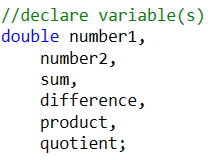
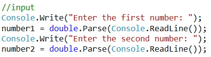
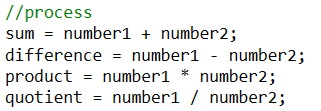
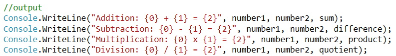
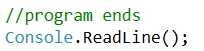
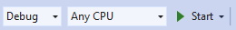
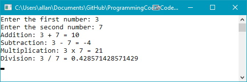

## Introduction
This topic will be a refresher on inputting data into, and outputting data from, your application. Additionally, you will learn how to code som simple arithmetic operations in C#.

## Example Problem
This problem is outlined in the [Problem Solving Process](../01-intro-to-programming/problem-solving.md) document. In this topic, you will take the results of going through the **Problem Solving Process** and complete step 7 of that process.

### Steps
1. Create a new C# Console Application called **ExampleProblem**. 

2. Add the code comment block (replace **authorname** with your name, and **modifieddate** with the date you write this code): 

3. Add the comment structure inside the `static void Main(string[] args)` method: 

4. Modify the `//declare variable(s)` code to look like: 
 
Here you are declaring the variables identified during the [Problem Solving Process](../01-intro-to-programming/problem-solving.md). These will be used in the remaining code for this sample problem.
5. Next, modify the `//input` block of code to look like: 
 
Here you are **prompting** the user for values that will be assigned to `number1` and `number2`. When prompting, all data is inputted as a `string` and must be explicitly converted to a `double`.
6. Next, modify the `//process` block to look like: 
 
Here you are performing calculations by assigning the value of a coding expression to your variables. *Note: the `=` symbol is an **assignment** operator not an **equality** operator.*
7. Next, modify the `//output` block to look like: 
 
Here you are using one of the methods to ouput results to the console window (you may use another technique if you desire).
8. Finally, as you will be running your code in **Debug** mode, modify the `//program ends` block to look like: 

### Testing
The best practice when learning how to write code is to run your code in **Debug** mode. The rationale for this is to be able to see where your code *may break* during testing. To run your code press the  button (the green triangle). This action does the following:
* Saves all open files
* Does a build (compile) of your code
* Opens a Console window
* Begins to execute your code

A sample run of the code is: 

You need to press **Enter** to close the Console window. You should also test your code with different vlause for the two numbers.

### References
Please refer to the [Data Types in C#](../references/data-types.md) reference for the types of data that you will be using in this course.

#### [Sequence Home](index.md)
#### [CPSC1012 Home](../)