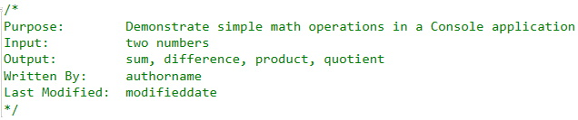

## Introduction
This topic will be a refresher on inputting data into, and outputting data from, your application. Additionally, you will learn how to code som simple arithmetic operations in C#.

## Example Problem
This problem is outlined in the [Problem Solving Process](../01-intro-to-programming/problem-solving.md) document. In this topic, you will take the results of going through the **Problem Solving Process** and complete step 7 of that process.

### Steps
1. Create a new C# Console Application called **ExampleProblem**. 

2. Add the code comment block (replace **authorname** with your name, and **modifieddate** with the date you write this code): 

3. Add the comment structure inside the `static void Main(string[] args)` method: 

4. The remaining steps coming soon.

### References
Please refer to the [Data Types in C#](../references/data-types.md) reference for the types of data that you will be using in this course.

### [Sequence Home](02-sequence.md)
### [CPSC1012 Home](../)