<style>
    .monospace{
        font-family: Courier New;
    }
</style>

## Introduction
This topic will focus on inputting data into, and outputting data from, your application. The main C# code in this section is:

```csharp
//Input into your code
Console.ReadLine();

//Output from your code - same display line
Console.Write();

//Output from your code - adding a Carriage Return Linefeed (CRLF)
Console.WriteLine();
```

## Your First Console Application
This first Console Application will not only test the code for this lesson, but also test you can create a Console Application in Visual Studio.

### Steps
1. Start Visual Studio
2. If using the **Start Window**, select the 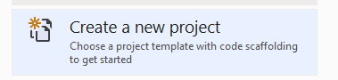 from the options shown. If using the **Empty Environment**, select 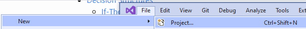.
3. From the **Create a new project** wizard, make the following selections:<br>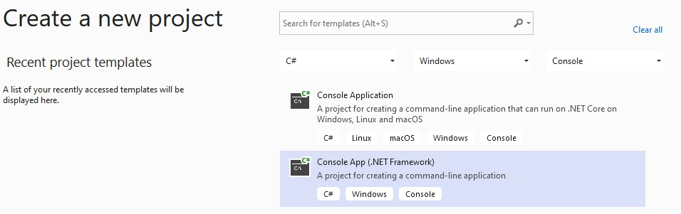<br>You need to select the **Console App (.NET Framework)** option then press **Next**
4. On the next wizard screen make the following changes (if you have a different **Location**, based on your preferences from the Options, then use that one):<br>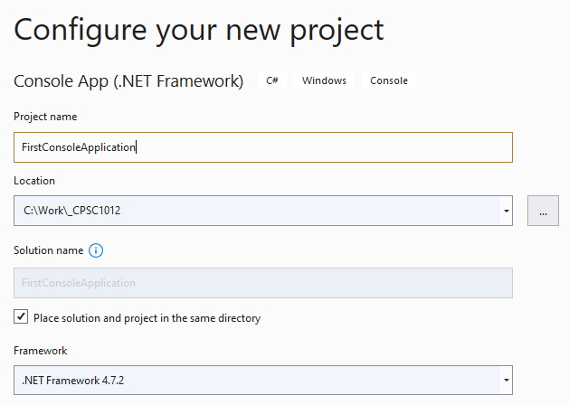<br>The checkbox on **Place solution and project in the same directory** is strongly recommended.
5. Press **Create** to see the following:<br>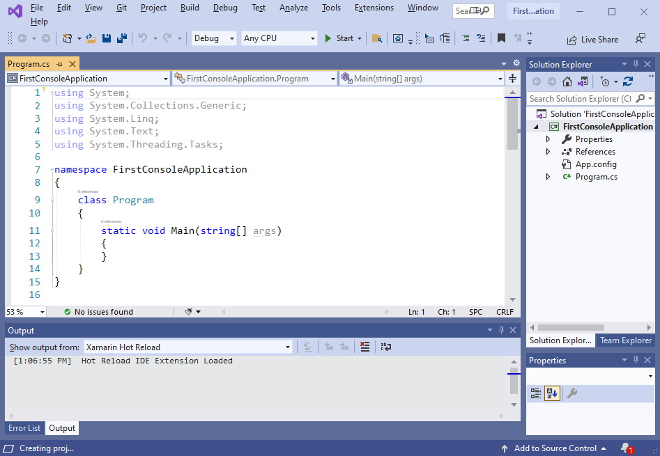

### Examining the Project
There are a few things to notice about this project you have just created:
1. The **Solution Explorer** shows all the files associated with this project. The application name is **bolded** which means it is the startup project; it will run when you press the **Start** button on the menu bar.
2. The **Code Window** shows you the code that was auto-generated by Visual Studio:<br>
    <ol type="a">
        <li>Lines 1-5: these are automatically added by Visual Studio. They reperesent the <em>standard or common</em> namespaces for Visual Studio code files.</li>
        <li><b class="monospace">namespace</b>: for this course it will always be the name of the application created. This is the overall <em>container</em>for our code.</li>
        <li><b class="monospace">class Program</b>: this is the application; you can change this name but it is recommended to leave it as is.</li>
        <li><b class="monospace">static void Main(string[] args)</b>: this is the main entry point to the code that will execute when we press the <b>Start</b> button. You will be writing code in this <em>method</em>.</li>
    </ol>

### Writing Code
The first this to do is add the required comment block at the top of your code. It should look something like (replace **authorname** with your name, and **modifieddate** with the date you wrote this code) which is placed just above the **namespace** code line:

```csharp
/* 
Purpose:        Demonstrate simple input & output in a Console application	 
Input:          your name	
Output:         your name 
Written By:     authorname
Last Modified:  modifieddate 
*/
```

Next, you will need one variable (a piece of code that holds some data). Expand the `static void Main(string[] args)` to add a blank line between the open and closed braces (`{` and `}`). Add the following comment structure:

```csharp
static void Main(string[] args)
{
    //declare variable(s)

    //input

    //process

    //output

    //program ends
}
```

This structure outlines what we need to do in your application. You will write code from _top to bottom_ in this **Main** _method_.

Below the `//declare variable(s)` comment add the following:

```csharp
string yourName;
```

Below the `//input` comment add the following:

```csharp
Console.Write("Enter your name: ");
yourName = Console.ReadLine();
```

There is no processing in this simple application, thus you do not need to add anything below the `//process` comment.

Below the `//output` comment add the following:

```csharp
Console.WriteLine("Your name is " + yourName);
```

This will write out the value of the variable, `yourName` to the console window, preceeded by some _hard-coded_ text. The `+` sign is not addition, but a **concatenation**, or _joining_, operation.

Below the `//program ends` comment add a line that reads:

```csharp
Console.ReadLine();
```

### Running Your Code
The last line of code you entered is only necessary when running your code in **debug** mode, which is the mode your code runs when you press the **Start** button. (_The **Start** button has a keyboard shortcut of **F5**._) If you did not add that code line, you would need to start your code by using **Ctrl+F5** to skip debugging; it is strongly encouraged to use debugging mode until you are fully confident in your code.

Press the **Start** button, or **F5** to run your code (my resulting console colours are different for instructional purposes):<br>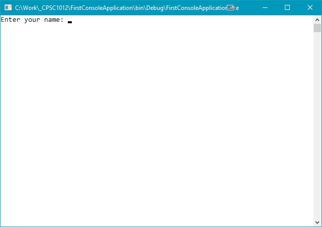

Test this by entering your name at the prompt and see if your results look like that shown below:<br>
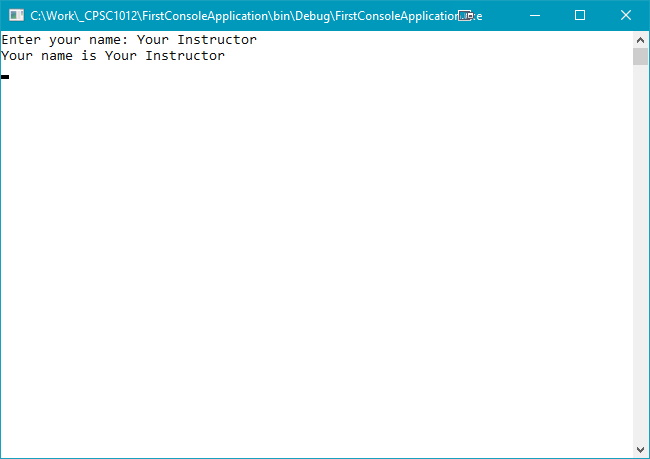

You will need to press **Enter** to close the console window.

### Back in Visual Studio
If you have the **Output** window in Visual Studio, you can examine it to see something like:<br>
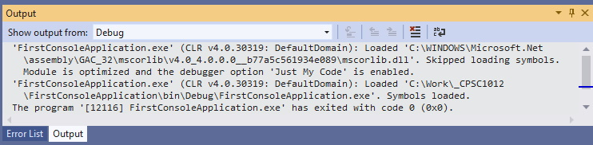

It is not very useful, but it does show you that you ran your code in debug mode, and that Visual Studio created a file called **FirstConsoleApplication.exe** which is created in the following folder:<br>
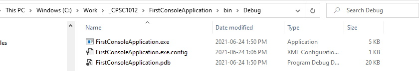

### Optional Output Code
There are two different means of outputting text and the value of the variable. Which one you use is a personal preference.

#### Paramaterized String Output
Below your original output code, `Console.WriteLine("Your name is " + yourName);` add the following code line:

```csharp
Console.WriteLine("Your name is {0}", yourName);
```

The `{0}` represents the first variable after the comma. If you had multiple variables to display on one code line you would have the parameters as `{0}` `{1}` `{2}` and so on. _Note these paramters are for just the code line you are writing; subsequent code lines, with parameters, restart the numbering sequence._

Run your code again to see:<br>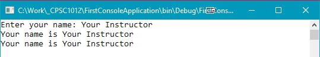

The two output lines should exactly the same. This way avoids have to use the `+` symbol to concatenate, or _join_, complex output statements.

#### Interpolated String
Add the following code line below your last `Console.WriteLine()` code:

```csharp
Console.WriteLine($"Your name is {yourName}");
```

Here the `$` symbol tells the compiler to treat the string in `Console.WriteLine()` as a literal string, and thus `{yourName}` is automatically read. Run your code again to see the following:<br>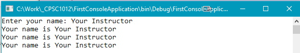

You can now use the variable name instead of a parameter count. The choice of which method is up to you.

## The Difference Between `Write` and `WriteLine`
Did you notice that the code has both `Console.Write()` and `Console.WriteLine()`? What is the difference? In your `//input` section you used `Console.Write()`. The user input was entered on the same console line as the prompt. This is the **preferred** method of inputting data.

In your `//output` section you used `Console.WriteLine()`. Notice that each output statement was shown on separate console output lines. This is the **preferred** method of outputting data.

## Summary
Congratulate yourself! You successfully created your first Console application.

#### [Sequence Home](index.md)
#### [CPSC1012 Home](../)