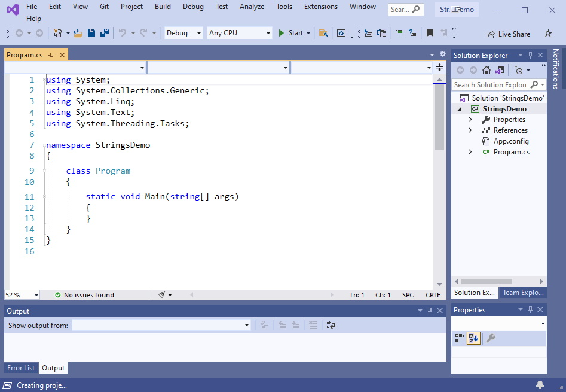
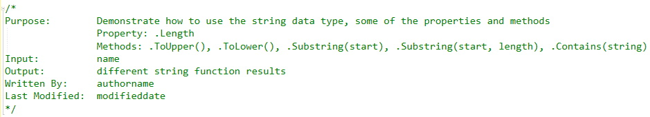
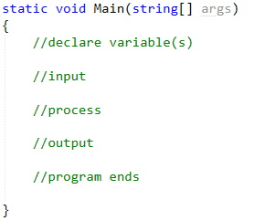
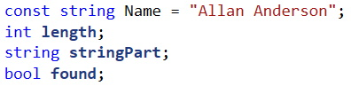
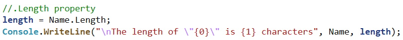
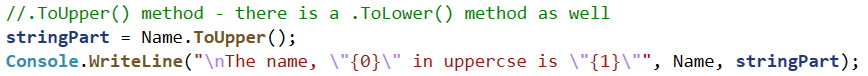
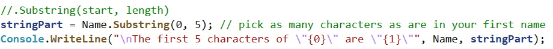
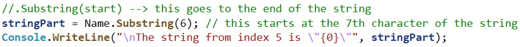
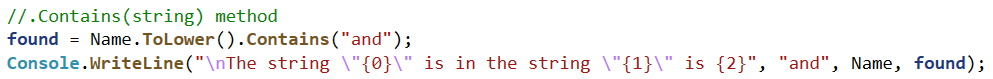
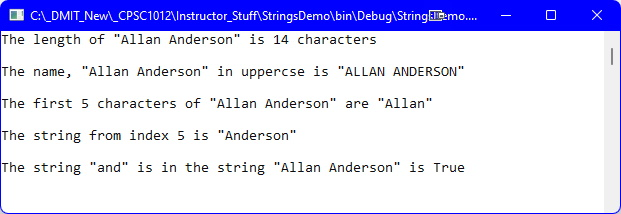

## Introduction
This topic will demonstrate some of the common properties and methods of the `String` class:
* Property:
  * `.Length`
* Methods:
  * `.ToUpper()`
  * `.ToLower()`
  * `.Substring(start)` and `.Substring(start, length)`
  * `.Contains(string)`

## Strings Demo
Create a C# Console application called **StringsDemo**. 

### Steps
1.  Add the code comment block (replace **authorname** with your name, and **modifieddate** with the date you write this code): 

2.  Add the comment structure inside the `static void Main(string[] args)` method: 

3.  Start by adding the following code below the first comment line inside the `Main()` method: 
 
_Note: There is a constant declared and initialized as you do not want to change the value of `Name` in this demo. Additionally, you can repalce the value of `Name` with your own name._
4.  First, you will explore the `.Length` property of a string. Add the following code below code you enetered in step 3 above: 

5.  Next, you will explore the `.ToUpper()` method by adding the followig code: 
 
_Note: You can replace the `.ToUpper()` with `.ToLower()` to see the value of `Name` in all lowercase letters._
6.  In this next part, you will explore the `.Substring()` method. There are two _overloads_ for this method. The first is extracting a portion inside the string by stating a **start** and a **length** of the portion of the string. Add the following code: 

7.  The other overload of the `.Substring()` method just uses a **start**ing point and will select the portion of the string from there to the end of the string. Add the following code: 

8.  Lastly, you will explore the `.Contains()` method. This method returns a boolean (**T**rue or **F**alse) depending on whether the _search_ string is contained in the given string. Add the following code: 

9.  Finally, add the `Console.ReadLine();` code line below the code entered above.

The output from this demo should look like: 

_Note: It is important to note that the first character of a string is at position **0**._

#### [Sequence Home](index.md)
#### [CPSC1012 Home](../)