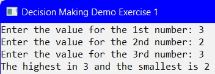

## Introduction
This topic introduces you to some fundamental coding practices for decision structure. There are several variations:
*  If-Then
*  If-Then-Else
*  Nested If-Then-Else
*  If-Else If

## Demo Problem
To demonstrate a decision structure, you will create a console application that determines the highest and smallest number from three inputted values.

### Input Variables
You will need three numeric (integer data type) variables:
*  `number1`
*  `number2`
*  `number3`

### Output Variables
You will need two numeric (integer data type) variables:
*  `highest`
*  `smallest`

### User Input
You will need the following code to get user input for this problem: 

### Process Steps
The logic to solve this problem is shown below:
1.  Compare `number` to `number2`; find the highest and smallest of the first two numbers: 
 
_In this step we are not concered with the value of `number3`, that will come soon._
2.  Now compare the `highest`, which was determined above, with `number3`: 
 
_In this step we are not concerned with `smallest`, that will come soon._
3. Finally, you will need to find the `smallest` value by comparing the `smallest` to `number3`: 
 
_Question: Will this last decision structure always work?_

### Test Plan
Even though you have coded a _solution_ to the problem does not mean the solution is always going to work. Therefore, before executing the solution you need to create a test plan to outline all possible scenarios.

| Scenario | Highest | Smallest | Y/N |
| -------- | ------- | -------- | --- |
| number1 = 1 number2 = 2 number3 = 3 | 3 | 1 |  |
| number1 = 2 number2 = 3 number3 = 1 | 3 | 1 |  |
| number1 = 3 number2 = 1 number3 = 2 | 3 | 1 |  |
| number1 = 3 number2 = 2 number3 = 3 | 3 | 2 |  |

_Question: Are there other scenarios that can be tested?_

### Execute Solution
When you execute the solution, you will test **all** the scenarios of your Test Plan. The results are shown below: 
 
 
 

From these results, return to your Test Plan:

| Scenario | Highest | Smallest | Y/N |
| -------- | ------- | -------- | --- |
| number1 = 1 number2 = 2 number3 = 3 | 3 | 1 | Y |
| number1 = 2 number2 = 3 number3 = 1 | 3 | 1 | Y |
| number1 = 3 number2 = 1 number3 = 2 | 3 | 1 | Y |
| number1 = 3 number2 = 2 number3 = 3 | 3 | 2 | Y |

#### [Decisions Home](index.md)
#### [CPSC1012 Home](../)