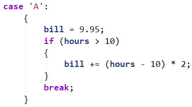
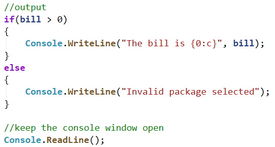
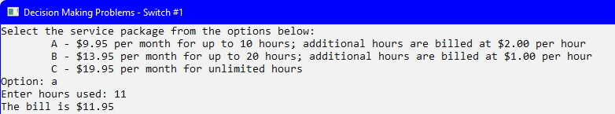
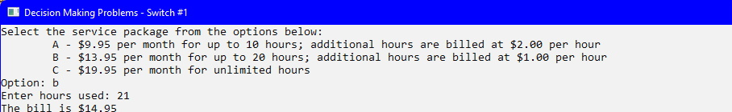

## Introduction
This topic introduces you to some fundamental coding practices for decision structure where the values being compared are **discreet** and **known**. Typical data types used, which will always be **discreet** are `int` and `char`.

## Demo Problem
Calculate the bill for internet service based on the table below:

| Package | Cost Calculation |
| ------- | ---------------- |
| A | $9.95 per month for up to 10 hours; additional hours are billed at $2.00 per hour |
| B | $13.95 per month for up to 20 hours; additional hours are billed at $1.00 per hour |
| C | $19.95 per month for unlimited hours |

### Input Variables
*  `package` (char data type)
*  `hours` (int data type)

### Output Variables
*  `bill` (double data type)

### User Input

If the user enters `A` or `B` then prompt the user for the number of additional hours: 

### Switch Structure
This problem can be solved using an `if-then-else` structure but as the type of `package` is known and discreet, a `switch` structure can be used instead. 

Inside the switch structure add the following tests:
1. Test for package A: 

2. Test for package B: 

3. Test for package C and add a `default` case: 
 
_Note: the `default` case is used in case the user does not enter a valid character for the `switch(package)`. Is there another option to account for this?_

### Output
Add the following code for the output: 

### Test Plan
Even though you have coded a _solution_ to the problem does not mean the solution is always going to work. Therefore, before executing the solution you need to create a test plan to outline all possible scenarios.

| Scenario | Hours | Bill | Y/N |
| -------- | :---: | ---: | --- |
| A | 9 | 9.95 |  |
| A | 10 | 9.95 |  |
| A | 11 | 11.95 |  |
| B | 19 | 13.95 |  |
| B | 20 | 13.95 |  |
| B | 21 | 14.95 |  |
| C | N/A | 19.95 |  |
| D | N/A| ?? |   |

### Execute Solution
When you execute the solution, you will test **all** the scenarios of your Test Plan. The results are shown below: 
 
 
 
 
 
 
 

From these results, return to your Test Plan:

| Scenario | Hours | Bill | Y/N |
| -------- | :---: | ---: | --- |
| A | 9 | 9.95 | Y |
| A | 10 | 9.95 | Y |
| A | 11 | 11.95 | Y |
| B | 19 | 13.95 | Y |
| B | 20 | 13.95 | Y |
| B | 21 | 14.95 | Y |
| C | N/A | 19.95 | Y |
| D | N/A| ?? | Y |

#### [Decisions Home](index.md)
#### [CPSC1012 Home](../)