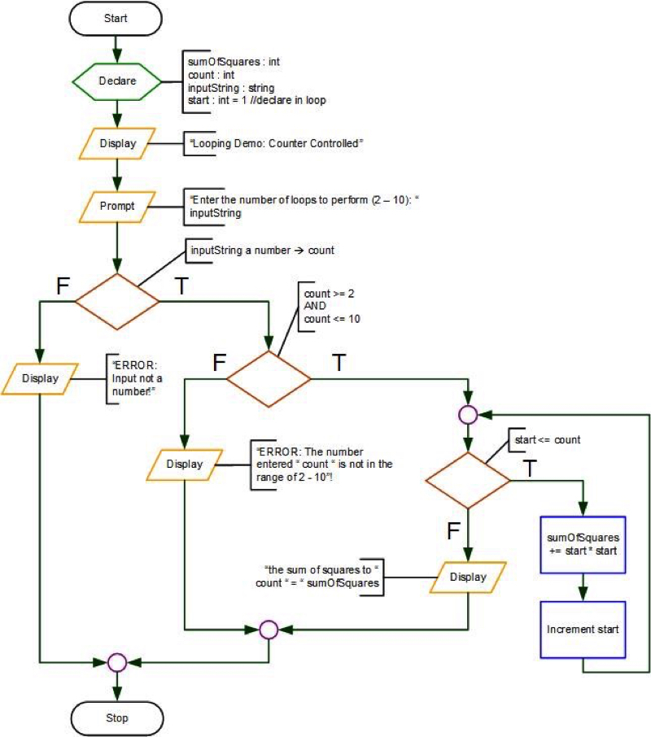
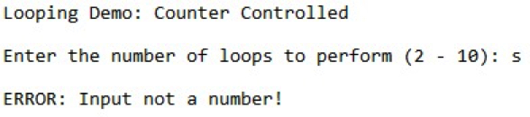
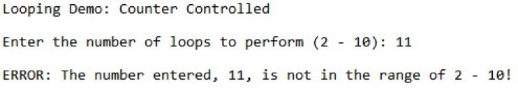
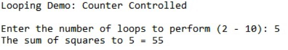

## Introduction
For problems that can use loops over a definite number of iterations, the preferred structure is called a **for-loop**.

```csharp
for(init; test; change)
{
    //loop code goes here
}
```

For example, given the problem:<br>
>Find the sum of the squares of the integers from 1 to mySquare, where mySquare is input by the user, e.g., user enters 4 then the code returns 30 (1x1 + 2x2 + 3x3 + 4x4 = 30).

Using this problem the **for-loop** code could look like:

```csharp
for(int start = 1; start <= mySquare; start++)
{
    //loop code goes here
}
```

### For-Loop Code Explained
In this loop, you initialize a [**local-scope** variable](#scope), `start`, to start at **1**. Next, this variable is tested against `mySquare` to see if is in range (`start <= mySquare`), if it is, then the code enters the loop, if not, the loop exits. If the code is in the loop, the code below `//loop code goes here` will execute. Once all the code executes, then the increment, `start++` executes. After the increment/change, the variable `start` is once again tested against `mySquare`. This process is repeated un the test fails, the variable `start`, is out of range and the loop exits.

## Sum Of Squares
A sample flowchart for the problem above is:<br>


Follow the steps below to solve/code this problem:
1. Create a new Visual Studio solution called **SumOfSquares**.
2. Add the code comment block (replace **authorname** with your name, and **modifieddate** with the date you write this code):
3. Add the comment structure inside the `static void Main(string[] args)` method:
4. Modify the `//declare variable(s)` code to look like:
5. Next, modify the `//input` block of code to look like:
6. Next, modify the `//process` block to look like:
7. Next, modify the `//output` block to look like:
8. Finally, as you will be running your code in **Debug** mode, modify the `//program ends` block to look like:

### Testing
The sample outputs below are from sample runs of the completed solution:
#### Invalid Input:

#### Invalid Range:

#### Correct Output:


## <a ID="scope">Variable Scope</a>
When you initialize a variable, like `int start = 1` in the previous example, the variable `start` is **not** available to any code outside the **for-loop**. You could rewrite the **for-loop** code to be:

```chsarp
int start = 1;
for(;start <= mySquare; start++)
{
    //loop code goes here
}
```

In this code sample, the variable `start` is initialized before the **for-loop** and thus is available to the code after the **for-loop**. _Also notice the change in the **for-loop** syntax._

#### [Looping Home](index.md)
#### [CPSC1012 Home](../)