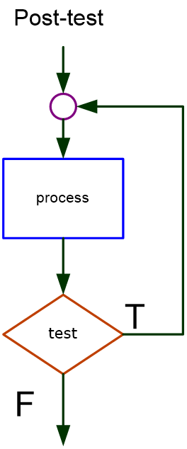

## Introduction
This section builds on the concepts of the **[Simple Sequence Structure](../02-sequence/02-sequence.md)** and **[Decision Structures](../03-decisions/03-decisions.md)**. Like Decision Structures, a **Looping Structure** relies on a **boolean test**. Unlike Decision Structures, the **boolean test** is used as an entry or exit condition of the Looping Structure, i.e., a repeating block of code. The Looping Structure is used to surround code that needs to run repeatedly until the exit condition is met. These concepts will be used throughout this course.

There are only 2 logic, flowchart, structures for loops, **Pre-test** and **Post-test**. These will be explored in the [coding topics](#topics) below.

### Pre-test Loop


```csharp
while(test)
{
    Process1;
    Process2;
}
```
A pre-test loop (While loop) has the test before the process. This means that the process executes 0 or more times. In the factorial example, if the user enters a 0 or 1 the process never executes.  

### Post-test Loop


```csharp
do
{
    Process1;
    Process2;
}
while(test);
```

A post-test loop (sometimes called a do-until loop) has the test after the process. This means that the process executes 1 or more times.

## <a ID="topics">Coding Topics</a>
[While Loop](while.md)<br>
[Do Loop](do-loop.md)<br>
[For Loop](for-loop.md)<br>
[Totals & Sentinel Values](sentinels.md)<br>
[Nested Loops](nested.md)

## Deciding Which Loop to Use
**CONCEPT**: Although most repetitive algorithms can be written with any of the three types of loops, each works best in different situation.

## Common Errors to Avoid
*  Using the increment (`++`) or decrement (`--`) operator in the wrong mode.
*  Forgetting to enclose the bool expression in a `while` loop or a `do-while` loop inside parentheses.
*  Placing a semicolon at the end of a `while` or `for` loop’s header.
*  Forgetting to write the semicolon at the end of the `do-while` loop.
*  Forgetting to enclose multiple statements in the body of a loop in braces.
*  Using commas instead of semicolons to separate the initialization, test, and update expression in a for loop.
*  Forgetting to write code in the body of a `while` or `do-while` loop that modifies the loop control variable.
*  Using a sentinel value that can also be a valid data value.
*  Forgetting to initialize an accumulator to zero.

#### [CPSC1012 Home](../)