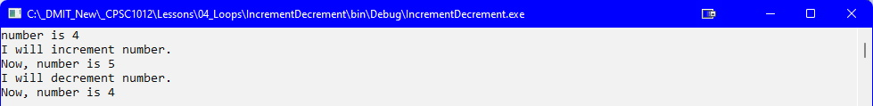
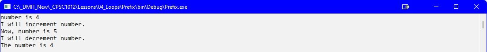
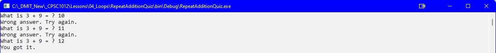
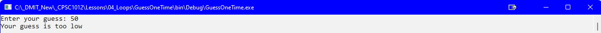
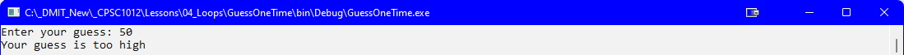
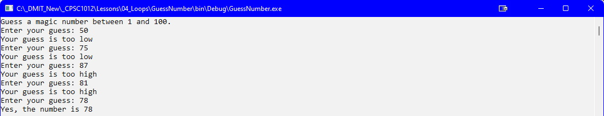

## Introduction
This topic introduces you to some fundamental coding practices for the **while** structure. The **while** coding structure is often referred to as an **event-driven loop**. This coding structure is a _repetition structure_ that allows a programmer to specify some actions are to be repeated while a condition remains true. 

The syntax for the **while** loop is:

```csharp
while (loop-continutation-condition)
{
    //loop body
}
```

For example:

```csharp
static void Main(string[] args)
{
    int number = 1;

    while (number <= 5)
    {
        Console.WriteLine("Hello");
        number++;
    }
}
```

## Increment & Decrement Operators
**CONCEPT**: `++` and `–-` are operators that add and subtract one from their operands. To increment a value means to increase it by one.

The following statements increment the variable `number`:

```csharp
number = number + 1;
number += 1;
number++;
```

To decrement a value means to decrease it by one. The following statements decrement the variable `number`:

```chsarp
number = number -1;
number -= 1;
number--;
```

### Prefix vs. Postfix Modes
When the increment and decrement operator are used in statements that do more than just increment or decrement. For example:

```csharp
number = 4;
Console.WriteLine(number++); // 4
```

When the increment and decrement operator are used in statements that do more than just increment or decrement. For example:

```csharp
number = 4;
Console.WriteLine(++number); // 5
```

### IncrementDecrement.cs

```csharp
int number = 4; // numbers starts out with 4

// Display the value in number.
Console.WriteLine($"number is {number}");
Console.WriteLine($"I will increment number.");

// Increment number
number++;
// Display the value in number again.
Console.WriteLine($"Now, number is {number}");
Console.WriteLine($"I will decrement number.");

// Decrement number
number--;

// Display the value in number once more.
Console.WriteLine($"Now, number is {number}");
```



### Prefix.cs

```csharp
int number = 4; // numbers starts out with 4

// Display the value in number.
Console.WriteLine($"number is {number}");
Console.WriteLine($"I will increment number.");

// Increment number
++number;

// Display the value in number again.
Console.WriteLine($"Now, number is {number}");
Console.WriteLine($"I will decrement number.");

// Decrement number
--number;

// Display the value in number once more.
Console.WriteLine($"The number is {number}");
```



### RepeatAdditionQuiz.cs

```csharp
static void Main(string[] args)
{
    Random rand = new Random();
    int number1 = rand.Next(1, 10);
    int number2 = rand.Next(1, 10);
    int correctAnswer= number1 + number2;
    Console.Write($"What is {number1} + {number2} = ? ");
    int userAnswer= int.Parse(Console.ReadLine());
    while (userAnswer!= correctAnswer)
    {
        Console.WriteLine("Wrong answer. Try again.");
        Console.Write($"What is {number1} + {number2} = ? ");
        userAnswer= int.Parse(Console.ReadLine());
    }
    Console.WriteLine("You got it.");

    Console.ReadLine();
}//eom
```



### GuessNumberOneTime.cs

```csharp
// Generate a random number to be guessed
Random rand = new Random();
int number = rand.Next(1, 101);

// Prompt the user to guess the number
Console.Write("Enter your guess: ");

int guess = int.Parse(Console.ReadLine());
if (guess == number)
{
    Console.WriteLine("Yes, the number is " + number);
}
else if (guess > number)
{
    Console.WriteLine("Your guess is too high");
}
else
{
    Console.WriteLine("Your guess is too low");
}
```

<br>
<br>


### GuessNumber.cs

```csharp
// Generate a random number to be guessed
Random rand = new Random();
int number = rand.Next(1, 101);

Console.WriteLine("Guess a magic number between 1 and 100.");
int guess = -1;

while (guess != number)
{
    // Prompt the user to guess the number
    Console.Write("Enter your guess: ");
    guess = int.Parse(Console.ReadLine());
    if (guess == number)
    {
        Console.WriteLine("Yes, the number is " + number);
    }
    else if (guess > number)
    {
        Console.WriteLine("Your guess is too high");
    }
    else
    {
        Console.WriteLine("Your guess is too low");
    }
}
```



## Loop Design Strategies
The key to designing a loop is to identify the code that needs to be repeated and write a condition for terminating the loop.

### Steps
1. Identify the statements to be repeated
2. Wrap these statements in a loop as follows:

    ```csharp
    while (true)
    {
        // Statements
    }
    ```

3. Code the ***loop-continuation-condition*** and add appropriate statements for controlling the loop:

    ```csharp
    while (loop-continuation-conditions)
    {
        // Statements

        // Additional statements for controlling the loop
    }
    ```

### Exercise: While Loop
Write a program named **Analysis** to track the number of students that pass or fail an examination for 10 students.

Here is a sample run:

```
Enter result (1=pass, 2= fail): 1
Enter result (1=pass, 2= fail): 2
Enter result (1=pass, 2= fail): 2
Enter result (1=pass, 2= fail): 2
Enter result (1=pass, 2= fail): 2
Enter result (1=pass, 2= fail): 2
Enter result (1=pass, 2= fail): 1
Enter result (1=pass, 2= fail): 1
Enter result (1=pass, 2= fail): 1
Enter result (1=pass, 2= fail): 1

Passed: 5
Failed: 5
```

## Input Validation
**CONCEPT**: The `while` loop can be used to create input routines that repeat until acceptable data is entered.

### SoccerTeam.cs

```csharp
const int MinPlayers= 9; // min players per team
const int MaxPlayers= 15; // max players per team
int players;      // number of available players
int teamSize;     // number of players per team
int teams;        // number of teams
int leftOver;     // number of leftover players
string userInput; // to hold user input value

// Get the number of players per team
Console.WriteLine("Enter the number of players per team:");
userInput= Console.ReadLine();
teamSize= int.Parse(userInput);

// Validate the number entered
// teamSize is between MinPlayersand MaxPlayers
while (teamSize< MinPlayers|| teamSize> MaxPlayers)
{
    Console.WriteLine($"The number must be at least {MinPlayers} and no more than {MaxPlayers}.");
    Console.WriteLine("Enter the number of players per team.");
    userInput= Console.ReadLine();
    teamSize= int.Parse(userInput);
}

// Get the number of available players
Console.WriteLine("Enter the number of available players:");
userInput= Console.ReadLine();
players = int.Parse(userInput);

// Validate the number entered
// players > 0
while (players <= 0)
{
    Console.WriteLine("Enter 1 or greater.");
    userInput= Console.ReadLine();
    players = int.Parse(userInput);
}

// Calculate the number of teams
teams = players / teamSize;
// Calculate the number of leftover players
leftOver= players % teamSize;
// Display the results (teams, leftOver)
Console.WriteLine($"There will be {teams} teams with {leftOver} players left over.");
```

#### [Looping Home](index.md)
#### [CPSC1012 Home](../)