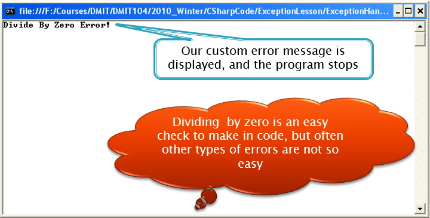
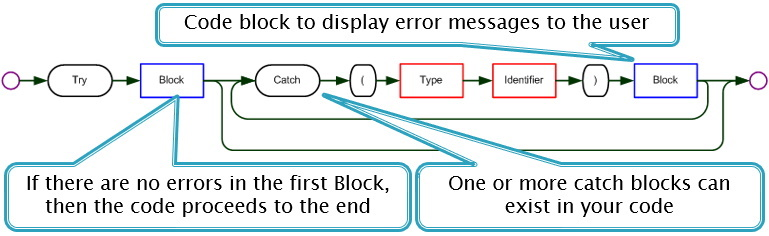

## Introduction
**CONCEPT**: An exception is an unexpected condition or error in the program. Most can be handled with proper coding (logically). Occasionally methods cannot continue:
*  A file does not exist [cannot find the file]
*  A physical device is not available [database does not exist]
*  Input data is not valid [validate your input (using a loop)]
*  Arithmetic error such as dividing by zero [validate input]
*  Converting text to a number

## Conventional Error Handling
Pass an error code as a return value:
*  The return code must be checked to see if the value coming back is acceptable or not [works but more work – old style]
*  Extra logic is required

Exit the program:
*  The user may not want to have the program quit on him/her [have a continue loop to let the user try again]

Crash - ***BAD***:
*  There is nothing worse than a program crashing; it is worse than the program coming to an end

## Blue Screen of Death
This _infamous_ Windows error is a result of an exception that was not expected or handled correctly. Exceptions, when they happen, are handled in the following order:
1. The program code: programmers do their best to anticipate all possible error conditions.
2. The _virtual machine_: if the program does handle all possible errors, then the environment the code is running in must check it.
3. The OS: when the error is severe enough to get past the _VM_ then the OS must handle the error or crash the OS (Blue Screen of Death)

## Uncaught Exception
Consider the code below:

```csharp
class UncaughtException
{
    public static void Main(string[] args)
    {
        // declare variables
        int numerator = 10;
        int denominator = 0;
        Console.WriteLine(numerator / denominator); // causes an exception
        Console.WriteLine("This text will not display");
    }
}
```


## Handle Error Logically

```csharp
class HandleErrorWithLogic
{
    public static void Main(string[] args)
    {
        // declare variables
        int numerator = 10;
        int denominator = 0;
        // use a decision to check if the division can proceed
        if (denominator != 0)
        {
            Console.WriteLine(numerator / denominator); // causes an exception
        }
        else
        {
            Console.WriteLine("Divide By Zdero Error!");
        }
    }
}
```



## Try-Catch
The Try-Catch is similar in coding structure to an If-Then-Else. Logically it looks like:<br>


Consider the following code:

```csharp
class TryCatchHandling
{
    public static void Main(string[] args)
    {
        // declare variables
        int numerator = 10;
        int denominator = 0;
        try
        {
            Console.WriteLine(numerator / denominator);
        }
        catch (Exception ex) // General exception type
        {
            Console.WriteLine("ERROR: " + ex.Message);
        }
    }
}
```


## Try-Catch-Finally
_**Note**: This is an optional concept.

You may want to include a condition that must happen, even if an exception is caught (such as closing a file or database connection); this is called a finally block.<br>


Consider the following code:

```csharp
class TryCatchFinally
{
    public static void Main(string[] args)
    {
        // declare variables
        int numerator = 10;
        int denominator = 0;
        try
        {
            Console.WriteLine(numerator / denominator);
        }
        catch (Exception ex) // General exception type
        {
            Console.WriteLine("ERROR: " + ex.Message);
        }
        finally
        {
           Console.WriteLine("This is the finally block ...");
        }
    }
}
```


## Specific Exceptions
One can always use the Exception class but often it is useful to use specific exceptions (the specific exceptions inherit from `Exception`). When using specific exceptions their catch blocks are placed first in order of the detail the exceptions are thrown.

Consider the following code:

```csharp
class SpecificExceptions
{
    public static void Main(string[] args)
    {
         // declare variables
        int numerator = 10;
        int denominator = 0;
        try
        {
            Console.WriteLine(numerator / denominator);
        }
        catch(DivideByZeroException ex)
        {
            Console.WriteLine("DIVISION ERROR: " + ex.message);
        }
        catch(ArithmeticException ex)
        {
            Console.WriteLine("MATH ERROR: " + ex.Message);
        }
        catch (Exception ex)
        {
            Console.WriteLine("GENERAL ERROR: " + ex.Message);
        }
    }
}
```

**Note**: The order the exceptions are caught from the most to the least specific (general).

#### [CPSC1012 Home](../)