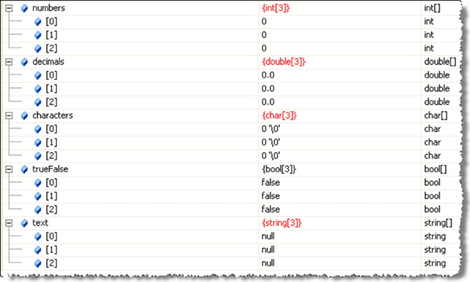

## Introduction
The first type of array you will learn is the 1D array (it is the most common).

## Objectives
At the end of this lesson you will be able to:
1. Declare a 1D array
2. Load a 1D array
3. Display a 1D array

## How to Create an Array?
There are some things you need to know before you can create an array:
* What type of data will be stored: **each element of the array must be of the same type of data**
* How many elements: **normally once an array is created it cannot be made to hold more** elements than it was originally designed to hold

Once you know about an array you can give it a name: **the naming follows the same naming conventions that we use for variables**

### Array Syntax

Pseudo Code | Data Type | #Of Elements | C# Syntax
Declare age[6] As int | int | 6 | `int[] age = new int[6]`;
Declare mark[25] As double | double | 25 | `double[] mark = new double[25];`
Declare name[100] As string | string | 100 | `string[] name = new string[100];`
Declare gender[75] As char | char | 75 | `char[] gender = new char[75];`

## Load Data Into an Array
There are several ways to load data:
1. Declare the array with known data
2. User/Program entered data
3. From an external source such as a file (covered later)

Except for declaring the array with known data, the loading of data into an array involves looping; therefore, the size becomes very important

### Default Array Values
Each type of array, once declared, has default values for each element:<br>


### Logical (filled) Size vs. Physical Size
* An array can be either completely full of data, or be only partially filled
* When an array is declared, given both size and data type, the computer only allocates a block of memory but does not give the elements any data; we must do that manually or programmatically
* Physical Size: the physical, declared, size of the array
* Logical (filled) Size: the number of elements with actual, known, data
* `Logical Size <= Physical Size`

### Manually Load Data
We can declare, and initialize, an array with pre-defined, known, data as shown below:

```csharp
string[] dayOfWeek = {"SUN", "MON", "TUE", "WED", "THU", "FRI", "SAT"};
```

OR

```csharp
int[] monthNumber = { 1, 2, 3, 4, 5, 6, 7, 8, 9, 10, 11, 12 };
```

**Question**: How many elements are in each of these arrays?

### Program Generated Array
Load an array with consecutive integer values:

```csharp
// program generated array
int[] someNumbers = new int[10];
for (int index = 0; index < 10; index++)
{
    someNumbers[index] = index;
}
```

**Question**: What does the data in this array look like?

### User Entered Data
You can have the user enter the data (the example below assumes the existence of the `GetInteger()` method:

```csharp
// user entered data
int[] userEntered = new int[5];
for (int index = 0; index < 5; index++)
{
 userEntered[index] = GetInteger("Enter an integer number: ");
}
```

## Coding Practice
Coming soon...

#### [Arrays Home](index.md)
#### [CPSC1012 Home](../)